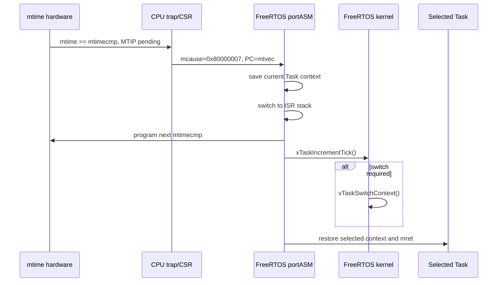

# FreeRTOS Tick 與 Machine Timer Interrupt

FreeRTOS tick是全系統的週期性時間基準，不是每個Task各自擁有的timer。Kernel利用tick更新delay timeout、解除blocked Tasks、驅動time slicing與software timer service。

本專案使用CPU內建的64-bit `mtime/mtimecmp` MMIO產生machine timer interrupt。

## 1. 目前時間參數

| 項目 | 目前值 |
|---|---:|
| `configCPU_CLOCK_HZ` | 50,000,000 Hz |
| `configTICK_RATE_HZ` | 1,000 Hz |
| 每tick timer increments | 50,000 |
| Tick period | 1 ms |
| `TickType_t` | 32-bit unsigned |
| `mtime` | 64-bit |
| `mtimecmp` | 64-bit |

公式：

```text
uxTimerIncrementsForOneTick = configCPU_CLOCK_HZ / configTICK_RATE_HZ
                            = 50,000,000 / 1,000
                            = 50,000
```

此公式目前整除。若未來clock與tick rate不能整除，official port的integer division會造成小量頻率誤差，需要累積補償或其他timer策略。

## 2. Hardware timer map

| 位址 | Register |
|---:|---|
| `0x4000_0020` | `mtime[31:0]` |
| `0x4000_0024` | `mtime[63:32]` |
| `0x4000_0028` | `mtimecmp[31:0]` |
| `0x4000_002C` | `mtimecmp[63:32]` |

[`machine_irq_sources.v`](../../machine_irq_sources.v) 每個`core_clk`讓 `mtime += 1`，不因Task blocked、pipeline stall或CPU沒有retire instruction而停止。當：

```text
mtime >= mtimecmp
```

timer pending變成1。只有 `mstatus.MIE=1` 且 `mie.MTIE=1` 時，CPU才接受cause 7 machine timer interrupt。

完整MMIO write限制見 [MMIO.md](../02-memory-io/MMIO.md)；64-bit register由兩個32-bit aligned words組成。

## 3. Scheduler啟動時如何設定第一個tick

`xPortStartScheduler()` 呼叫weak `vPortSetupTimerInterrupt()`；目前使用official port預設實作：

1. 從 `mhartid` 取得hart 0；
2. `pullMachineTimerCompareRegister = 0x40000028 + hart * 8`；
3. 以 high-low-high方法穩定讀取64-bit `mtime`；
4. `ullNextTime = current_mtime + 50,000`；
5. 寫入 `mtimecmp`；
6. 預先把 `ullNextTime`再加50,000，準備下一次interrupt；
7. enable `mie.MTIE`與`mie.MEIE`。

High-low-high讀法避免RV32讀兩個word期間low word rollover，組出不一致的64-bit時間。

## 4. 為何64-bit compare要特殊寫法

RV32沒有單一64-bit store。Timer handler更新 `mtimecmp` 時使用：

```text
mtimecmp.low  = 0xFFFF_FFFF
mtimecmp.high = next.high
mtimecmp.low  = next.low
```

先把low寫成最大值，可避免只更新一半時產生短暫過小的compare值，誤觸發額外interrupt。然後更新future `ullNextTime += 50,000`。

本專案MMIO register直接接受aligned32-bit `SW`；不要用byte/halfword store拼timer值。

## 5. Tick trap流程



Port先安排下一個compare，再呼叫kernel。這可讓pending condition解除，避免一返回就因舊compare再次trap。

## 6. `xTaskIncrementTick()` 做什麼

Kernel每tick主要處理：

- 增加global tick count；
- 檢查delayed list，將到期Tasks移到ready list；
- 處理timeout；
- 在preemptive模式判斷是否有更高priority Task ready；
- 在time slicing啟用時，判斷同priority是否需要輪轉；
- 通知timer service機制處理software timer期限。

它回傳nonzero才需要 `vTaskSwitchContext()`。所以tick interrupt不等於每1 ms必定換Task。

## 7. Delay API的語意

### 相對delay

```c
vTaskDelay(pdMS_TO_TICKS(100));
```

Task從呼叫當下blocked至少約100 ticks。若Task每次工作時間不固定，週期也會跟著漂移：

```text
period ≈ work_time + delay_time
```

### 固定週期

```c
TickType_t last = xTaskGetTickCount();
for (;;) {
    do_work();
    xTaskDelayUntil(&last, pdMS_TO_TICKS(100));
}
```

`xTaskDelayUntil()` 以先前wake time為基準，比 `vTaskDelay()` 更適合週期性Task。若工作已超過deadline，可能不block，讓程式察覺overrun。

目前1 tick恰好1 ms，但仍建議使用 `pdMS_TO_TICKS()`，避免未來改tick rate後magic number失效。

## 8. Blocking timeout

Queue／Semaphore／StreamBuffer API的最後參數通常也是tick數：

```c
if (xQueueReceive(queue, &item, pdMS_TO_TICKS(50)) == pdPASS) {
    /* 收到資料 */
} else {
    /* 50 ms timeout */
}
```

常見值：

| 值 | 意義 |
|---:|---|
| `0` | 不等待，立即成功或失敗 |
| `N` | 最多block N ticks |
| `portMAX_DELAY` | 目前因`INCLUDE_vTaskSuspend=1`可視為無限等待 |

Block期間Task不消耗CPU；scheduler會執行其他ready Task或Idle Task。這與busy loop不一樣。

## 9. Tick與preemption

例如：

```text
Task A priority 2: vTaskDelay(10)
Task B priority 1: running
```

第10個tick讓A ready後，`xTaskIncrementTick()`要求switch；handler返回時直接恢復A。B不必主動呼叫yield。

若A/B同為priority 2且都一直ready，`configUSE_TIME_SLICING=1`使tick可在兩者間輪轉。若高priority Task永不block，低priority Task可能長期starvation；tick不會強迫高priority讓低priority執行。

## 10. Critical section對tick的影響

`taskENTER_CRITICAL()`清除global MIE。`mtime`仍持續增加，timer pending也會變成1，但CPU要等critical section離開才接受interrupt。

結果：

- tick ISR延遲；
- UART external IRQ也延遲；
- delay／timeout的software觀察時間出現jitter；
- UART單byteholding register可能overrun。

Timer compare以既定 `ullNextTime + 50,000` 更新，而不是以ISR實際進入時間重新起算。短暫延遲可維持長期phase；若interrupt被關閉太久，compare可能仍落在過去，返回後出現連續timer interrupts追趕時間。

## 11. Tick count wrap

32-bit tick在1 kHz約：

```text
2^32 / 1000 ≈ 4,294,967 s ≈ 49.7 days
```

FreeRTOS delay list與官方time API設計會處理tick wrap，但application自己比較時間時應使用unsigned subtraction：

```c
if ((TickType_t)(now - start) >= interval) {
    /* elapsed */
}
```

不要用 `now >= start + interval` 寫長期runtime邏輯，因為加法wrap時容易錯。

## 12. Runtime stats不是tick

`configGENERATE_RUN_TIME_STATS=1`，本專案的 `portGET_RUN_TIME_COUNTER_VALUE()` 直接讀 `mtime` low 32-bit。它解析度是50 MHz count，不是1 kHz tick：

```text
runtime counter resolution = 20 ns（名義值）
32-bit wrap ≈ 85.9 s
```

因此 `uxTaskGetSystemState()` 的runtime totals適合短期profile；長時間觀測需要處理32-bit wrap。Tick count與runtime counter不可混為同一單位。

## 13. Software timer

Software timer不會建立hardware timer register，也不在timer ISR內直接執行callback。Tick使timer到期後，由FreeRTOS Timer service Task執行callback：

| 設定 | 值 |
|---|---:|
| `configUSE_TIMERS` | 1 |
| Timer Task priority | 4 |
| Timer queue length | 8 |
| Timer Task stack | 512 words |

Callback應短、不可長時間block，否則會延遲其他software timers與timer command queue。

## 14. Tickless idle

目前沒有啟用 `configUSE_TICKLESS_IDLE`，所以即使只有Idle Task，machine timer仍每1 ms產生tick。這有利於bring-up與可預期simulation，但不適合最低功耗設計。

若未來加入tickless idle，需要port實作sleep、重新計算`mtimecmp`、補tick、處理UART wakeup與測試長sleep wrap；不是只加一個macro即可。

## 15. 除錯方法

### Tick完全不動

檢查：

1. `configCPU_CLOCK_HZ`與實際core clock；
2. `mtime`是否增加；
3. `mtimecmp`是否被寫到未來；
4. `mie.MTIE`與`mstatus.MIE`；
5. `mtvec`是否指向FreeRTOS trap handler；
6. `mcause`是否為`0x80000007`；
7. timer MMIO是否使用aligned `SW`。

### Tick太快／太慢

最常見是 `configCPU_CLOCK_HZ`寫成100 MHz但實際MIG `ui_clk`為50 MHz，會造成tick約差2倍。不要只看板載oscillator頻率；要看`machine_irq_sources`所在clock domain。

### Scheduler啟動後立刻exception

檢查first Task stack alignment/context、`mstatus`、trap handler address、RISC-V port header選擇與linker。Preflight simulation是最小重現：

```powershell
./tools/run_rtos_preflight_sim.ps1 -FreeRTOSRoot $FreeRTOSRoot -ToolchainBin $ToolchainBin
```

## 16. 相關驗證

- `preflight`確認tick count非0，並讓兩個Task經Queue交換資料；
- `smoke`持續輸出tick與producer/consumer事件；
- `platform`測software timer、delay、runtime stats與stack high-water mark；
- RTL regression驗證machine timer、CSR interrupt與trap路徑。

