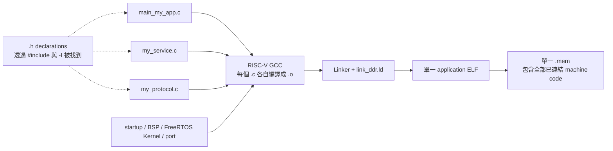

# 新增一個 RTOS Application

本專案不要求所有軟體都使用 Console。要執行自己的 C/FreeRTOS application，可以建立新的 `main()` source，再讓共用 build tool自動加入 startup、FreeRTOS kernel、RISC-V port、UART、heap、hooks與linker script。

本文件提供兩條路徑：

1. 不修改工具，直接用 `-MainSource` 建立 custom application。
2. 功能穩定後，把它加入 `build_rtos_app.ps1` 成為內建 `-App` profile。

FreeRTOS API的選擇先看 [RTOS_APPLICATION_API_GUIDE.md](RTOS_APPLICATION_API_GUIDE.md)，整體分層見 [APPLICATION_SYSTEM_ARCHITECTURE.md](APPLICATION_SYSTEM_ARCHITECTURE.md)。

## 新增程式的完整路線


第一次新增程式先走 `-MainSource`，不需要修改共用工具；確認可重複使用後才加入內建profile。

## 1. Application 的最小責任

新的 `main()` 通常要：

1. 初始化需要的driver。
2. 建立Queue/semaphore/timer等objects。
3. 建立Tasks。
4. 檢查所有必要object建立結果。
5. 呼叫`vTaskStartScheduler()`。
6. Scheduler若意外返回，進入明確fatal path。

Runner還需要application在真正ready後輸出唯一marker，例如：

```text
MY_APP_READY
```

## 2. 建立 source file

建立：

```text
OS/rtos/src/main_my_app.c
```

可從下列完整範例開始：

```c
#include <stdint.h>

#include "FreeRTOS.h"
#include "queue.h"
#include "task.h"
#include "uart.h"

#define APP_QUEUE_LENGTH          4u
#define PRODUCER_STACK_WORDS      384u
#define CONSUMER_STACK_WORDS      384u

typedef struct AppMessage {
    uint32_t sequence;
    uint32_t value;
} AppMessage_t;

static StaticQueue_t app_queue_tcb;
static AppMessage_t app_queue_storage[APP_QUEUE_LENGTH];
static QueueHandle_t app_queue;

static StaticTask_t producer_tcb;
static StaticTask_t consumer_tcb;
static StackType_t producer_stack[PRODUCER_STACK_WORDS];
static StackType_t consumer_stack[CONSUMER_STACK_WORDS];

static void fatal(const char *reason) __attribute__((noreturn));

static void fatal(const char *reason)
{
    taskDISABLE_INTERRUPTS();
    rtos_uart_write("[MY_APP] FATAL reason=");
    rtos_uart_write_line(reason);
    for (;;) {
        __asm volatile ("nop");
    }
}

static void producer_task(void *arg)
{
    AppMessage_t message = { 0u, 0u };
    (void)arg;

    for (;;) {
        message.sequence++;
        message.value = message.sequence * 2u;

        if (xQueueSend(app_queue, &message, portMAX_DELAY) != pdPASS) {
            fatal("queue_send");
        }
        vTaskDelay(pdMS_TO_TICKS(1000));
    }
}

static void consumer_task(void *arg)
{
    AppMessage_t message;
    (void)arg;

    /* Marker放在Task中，證明scheduler已真正開始執行。 */
    rtos_uart_write_line("MY_APP_READY");

    for (;;) {
        if (xQueueReceive(app_queue, &message, portMAX_DELAY) != pdPASS) {
            fatal("queue_receive");
        }

        rtos_uart_write("MY_APP_DATA sequence=");
        rtos_uart_write_u32(message.sequence);
        rtos_uart_write(" value=");
        rtos_uart_write_u32(message.value);
        rtos_uart_write("\n");
    }
}

int main(void)
{
    TaskHandle_t producer;
    TaskHandle_t consumer;

    rtos_uart_write_line("MY_APP_BOOT");

    app_queue = xQueueCreateStatic(
        APP_QUEUE_LENGTH,
        sizeof(AppMessage_t),
        (uint8_t *)app_queue_storage,
        &app_queue_tcb
    );
    if (app_queue == NULL) {
        fatal("queue_create");
    }

    producer = xTaskCreateStatic(
        producer_task,
        "my_prod",
        PRODUCER_STACK_WORDS,
        NULL,
        2u,
        producer_stack,
        &producer_tcb
    );
    consumer = xTaskCreateStatic(
        consumer_task,
        "my_cons",
        CONSUMER_STACK_WORDS,
        NULL,
        2u,
        consumer_stack,
        &consumer_tcb
    );
    if (producer == NULL || consumer == NULL) {
        fatal("task_create");
    }

    vTaskStartScheduler();
    fatal("scheduler_return");
}
```

這個範例沒有使用Console parser。它只有自己的producer、consumer、Queue與UART輸出，仍是完整FreeRTOS application。

## 3. Stack 與 priority

```text
384 words * 4 bytes = 1536 bytes per Task
```

不要把`384`誤認成bytes。先用保守stack上板，跑最壞路徑後以`uxTaskGetStackHighWaterMark()`量測，再決定是否縮小。

兩個Tasks同為priority 2，啟用time slicing。Producer送出後delay 1秒，consumer大多時間block等待Queue，因此CPU可執行Idle/其他Tasks。

若consumer處理比producer慢，Queue最多保留4筆，第5筆會使producer因`portMAX_DELAY` block，形成backpressure，而不是丟資料。

## 4. 只編譯 custom application

```powershell
cd C:/cpu_design

./tools/build_rtos_app.ps1 `
  -App my_app `
  -MainSource OS/rtos/src/main_my_app.c `
  -BuildDir build_rtos_apps/my_app `
  -OutName rtos_my_app
```

`-App my_app`只是用來命名build context；因為同時提供`-MainSource`，不要求`my_app`已存在於內建profiles。

產物：

```text
build_rtos_apps/my_app/rtos_my_app.elf
build_rtos_apps/my_app/rtos_my_app.bin
build_rtos_apps/my_app/rtos_my_app.mem
build_rtos_apps/my_app/rtos_my_app.dis
build_rtos_apps/my_app/rtos_my_app.map
```

## 5. 一鍵 preflight + build + 上板

```powershell
./tools/run_rtos_app.ps1 `
  -Port COM5 `
  -App my_app `
  -MainSource OS/rtos/src/main_my_app.c `
  -BuildDir build_rtos_apps/my_app `
  -OutName rtos_my_app `
  -TargetMarker MY_APP_READY
```

Runner會：

1. Build preflight。
2. Build `main_my_app.c` target。
3. 上傳並執行preflight。
4. 等`RTOS_PREFLIGHT_PASS`。
5. Reload到bootloader。
6. 上傳`rtos_my_app.mem`。
7. 等`MY_APP_READY`。
8. 進入interactive monitor。

如果省略`-App my_app`、只給`-MainSource`，runner會自動使用`App=custom`，預設輸出到`build_rtos_apps/custom`。顯式命名通常更容易管理多個application。

## 6. `OutName` 與 `TargetMarker`

### `OutName`

決定產物共同檔名：

```text
-OutName rtos_weather
  -> rtos_weather.elf/.bin/.mem/.dis/.map
```

它不會自動改UART文字，也不需要等於Task name。

### `TargetMarker`

是target經UART輸出的唯一ready字串：

```c
rtos_uart_write_line("WEATHER_APP_READY");
```

```powershell
-TargetMarker WEATHER_APP_READY
```

建議marker：

- 大寫、ASCII、固定不變。
- 與其他profile不重複。
- 在driver/object/Task初始化成功且scheduler真正運行後才印。
- 不把一般debug句子當marker。
- 另定義`APP_PASS`與`[APP] FATAL reason=...`供probe使用。

## 7. 加入額外 `.c` source

先記住兩個不同動作：

| 動作 | 寫在哪裡 | 作用 |
|---|---|---|
| `#include "my_service.h"` | C source 內 | 讓compiler看見函式、型別與常數的「宣告」 |
| `-ExtraSource my_service.c` | build command | 把函式的「實作」編譯並link進最終firmware |

因此，只有 `#include` 通常不夠。若header宣告了一個函式，而實作位於另一個 `.c`，該 `.c` 也必須加入 `-ExtraSource`；否則最後link時會出現 `undefined reference`。

### 7.1 建議的 application 資料夾

新的application及其專用helper可放在同一個資料夾：

```text
apps/
└─ my_app/
   ├─ main_my_app.c       # 唯一的 main()
   ├─ my_service.h        # 對外宣告
   ├─ my_service.c        # 實作
   ├─ my_protocol.h
   └─ my_protocol.c
```

同一資料夾使用雙引號include時，compiler會先搜尋目前source所在的資料夾，所以不需要額外設定 `-I`。

例如 `my_service.h` 的內容可以是：

```c
#ifndef MY_SERVICE_H
#define MY_SERVICE_H

#include <stdint.h>

uint32_t my_service_scale(uint32_t input);

#endif
```

`my_service.c` 提供實作：

```c
#include "my_service.h"

uint32_t my_service_scale(uint32_t input)
{
    return input * 2u;
}
```

`main_my_app.c` 使用它：

```c
#include "FreeRTOS.h"
#include "task.h"
#include "uart.h"

#include "my_service.h"

static void worker_task(void *arg)
{
    uint32_t result;
    (void)arg;

    result = my_service_scale(21u);
    rtos_uart_write("result=");
    rtos_uart_write_u32(result);       /* 輸出42。 */
    rtos_uart_write("\n");

    for (;;) {
        vTaskDelay(pdMS_TO_TICKS(1000u));
    }
}
```

header不會變成另一個Task；`my_service_scale()`只是由`worker_task`呼叫的一般C函式，會在該Task的context與stack上執行。

### 7.2 把所有實作檔加入建置

對上面的資料夾執行：

```text
apps/my_app/main_my_app.c
apps/my_app/my_service.c
apps/my_app/my_protocol.c
```

```powershell
./tools/run_rtos_app.ps1 `
  -Port COM5 `
  -App my_app `
  -MainSource apps/my_app/main_my_app.c `
  -ExtraSource @(
    "apps/my_app/my_service.c",
    "apps/my_app/my_protocol.c"
  ) `
  -OutName rtos_my_app `
  -TargetMarker MY_APP_READY
```

這裡：

- `-MainSource`只能指定一個提供`main()`的source。
- `-ExtraSource`可放多個 `.c` 或 `.S`；每個有用到的實作檔都要列出。
- `.h`只由 `#include` 引用，不要放進 `-ExtraSource`。
- 所有source最後會link成一個`rtos_my_app.elf`，再轉成同一份`rtos_my_app.mem`；不會為每個`.c`各上傳一份`.mem`。

如果只想先build、暫時不上板，將上面命令改成：

```powershell
./tools/build_rtos_app.ps1 `
  -App my_app `
  -MainSource apps/my_app/main_my_app.c `
  -ExtraSource @(
    "apps/my_app/my_service.c",
    "apps/my_app/my_protocol.c"
  ) `
  -OutName rtos_my_app
```

### 7.3 Header在其他資料夾時

`-ExtraSource`只把source加入compiler command，不會自動新增header include directory。Header可：

- 與引用它的source放在同一資料夾，使用`#include "my_service.h"`；這是新custom application最簡單的做法。
- 放在目前工具已自動加入的include path：`OS/rtos/config`、`OS/rtos/src`、`game`、FreeRTOS kernel include與RISC-V port include。
- 使用相對於引用source的路徑，例如`#include "../../drivers/my_service.h"`；路徑太深時不建議這樣維護。
- 將application加入內建profile，並在`CFlags`加入自己的`-I<include-directory>`；適合共用library或第三方library。

例如library配置為：

```text
libs/my_sensor/
├─ include/my_sensor.h
└─ src/my_sensor.c
```

內建profile除了把`.c`放進`Extra`，還要加入header搜尋路徑：

```powershell
"my_app" = @{
  Main = "apps\my_app\main_my_app.c"
  Extra = @(
    "libs\my_sensor\src\my_sensor.c"
  )
  CFlags = @(
    "-I$(Join-Path $repoRoot 'libs\my_sensor\include')"
  )
}
```

之後application可直接寫：

```c
#include "my_sensor.h"
```

目前command line沒有通用`-IncludeDir`參數，因此custom app若有許多獨立include資料夾，建議在開發初期先把相關`.c/.h`放在同一application資料夾；結構穩定後再依第12節建立profile。

### 7.4 Source、header與最終 `.mem` 的關係



`.h` 不會單獨編譯，也不會單獨出現在上傳清單；它提供宣告給各 `.c`。真正需要放進 `-ExtraSource` 的是有函式定義或資料定義的 `.c`，最後所有 object files 由 linker 合成同一份 `.mem`。

常見錯誤可用下表快速判斷：

| 錯誤 | 通常缺少什麼 |
|---|---|
| `fatal error: my_service.h: No such file or directory` | `#include`路徑或`-I` header搜尋路徑不正確 |
| `undefined reference to my_service_scale` | 宣告找到了，但`my_service.c`未放進`-ExtraSource`，或函式名稱不一致 |
| `multiple definition of main` | 把第二個含`main()`的source誤放進`-ExtraSource` |
| host／Windows library link失敗 | library不是以RV32 `rv32im_zicsr`、`ilp32`及本專案freestanding環境編譯 |

## 8. Build tool自動加入什麼

Custom application不需在命令列重複列出：

```text
OS/rtos/src/startup.S
OS/rtos/src/uart.c
OS/rtos/src/perf_counters.c
OS/rtos/src/freertos_hooks.c
OS/rtos/src/rtos_heap.c
OS/rtos/src/minilibc.c
FreeRTOS list/queue/event_groups/stream_buffer/tasks/timers
heap_4
RISC-V port.c / portASM.S
```

也自動加入FreeRTOS、port、project RTOS source與`game` include paths，使用`OS/rtos/link_ddr.ld`。

## 9. 什麼不會自動加入

`board_control.c`不是custom common source。若application要支援`reload`：

```c
#include "board_control.h"

/* 命令處理中 */
rtos_uart_write_line("RELOADING");
rtos_board_request_image_reload();
```

Build時加入：

```powershell
-ExtraSource OS/rtos/src/board_control.c
```

Lua sources、VGA framebuffer source與profile-specific flags也不會因名稱自動加入。尤其如果執行：

```powershell
-App lua -MainSource some_other_main.c
```

`-MainSource`會覆蓋profile main，且目前build logic不套用Lua profile extra sources/CFlags；不要用這種方式期待自動得到Lua VM。

## 10. 初始化 UART RX interrupt

若還不清楚Application為何不用直接呼叫ISR、`rtos_uart_getc()`如何收到ISR搬入的byte，或何時才需要為新模組寫Driver ISR，先讀 [ISR_TASK_API_BOUNDARY.md](../04-freertos/ISR_TASK_API_BOUNDARY.md)。

只輸出UART不需建立RX Task；`rtos_uart_write_line()`在scheduler前後都可polling使用。

需要接收時，在建立RX Task前：

```c
if (rtos_uart_rx_interrupt_init() == 0) {
    fatal("uart_rx_init");
}
```

RX Task：

```c
static void rx_task(void *arg)
{
    char value;
    uint32_t overrun;
    (void)arg;

    for (;;) {
        if (rtos_uart_getc(&value, portMAX_DELAY, &overrun) != 0) {
            if (overrun != 0u) {
                /* 記錄/回報hardware overrun。 */
            }
            handle_byte(value);
        }
    }
}
```

不要自己在application另寫第二個machine external interrupt entry；目前[`freertos_hooks.c`](../../OS/rtos/src/freertos_hooks.c)會把UART external IRQ交給`rtos_uart_handle_external_interrupt()`。

若新增新的硬體IRQ source，需要擴充RTL interrupt source、project interrupt dispatch/ack與driver，再由`...FromISR()` API把事件送給Task；不是只新增一個ISR名稱，也不是在Task手動呼叫ISR。完整步驟與按鍵模組範例見 [ISR_TASK_API_BOUNDARY.md](../04-freertos/ISR_TASK_API_BOUNDARY.md)。

## 11. 使用 FreeRTOS API

一般C function可以完全不呼叫RTOS API，並在某個Task中被呼叫。需要下列能力時才使用API：

| 需求 | API |
|---|---|
| 另一個獨立執行流程/priority/stack | `xTaskCreateStatic()` |
| Tasks間傳資料 | Queue |
| ISR喚醒Task | `...FromISR()` + notification/Queue/StreamBuffer |
| 保護共享resource | Mutex |
| 週期性block | `vTaskDelay()`／`xTaskDelayUntil()` |
| 等多種事件 | Event Group／Queue set |
| 延後短callback | Software timer |

如果整個application只有一個Task，普通C函式都在該Task順序執行也完全合法；FreeRTOS不會把每個函式「視為一個Task」。

## 12. 新增內建 profile

當application名稱、sources與flags已穩定，可在 [`build_rtos_app.ps1`](../../tools/build_rtos_app.ps1) 的`$profiles`加入：

```powershell
"my_app" = @{
  Main = "OS\rtos\src\main_my_app.c"
  Extra = @(
    "OS\rtos\src\board_control.c",
    "drivers\my_service.c"
  )
  CFlags = @(
    "-DMY_APP_FEATURE=1",
    "-I$(Join-Path $repoRoot 'drivers')"
  )
}
```

之後可直接：

```powershell
./tools/build_rtos_app.ps1 -App my_app
```

以及：

```powershell
./tools/run_rtos_app.ps1 `
  -Port COM5 `
  -App my_app `
  -TargetMarker MY_APP_READY
```

目前build script沒有通用`-CFlags`參數；需要profile-specific include path或define時，加入內建profile最清楚。

## 13. 讓 runner 自動知道 marker

不修改runner時，每次傳`-TargetMarker`即可。

若要像Console/Lua一樣自動選marker，可在 [`run_rtos_app.ps1`](../../tools/run_rtos_app.ps1) 的marker判斷加入：

```powershell
} elseif (($App -eq "my_app") -or ($targetName -match "rtos_my_app")) {
  $TargetMarker = "MY_APP_READY"
}
```

這是便利功能，不影響firmware內容。Marker仍必須由application UART輸出。

## 14. 只上傳既有 `.mem`

Build完成後可：

```powershell
./tools/run_rtos_app.ps1 `
  -Port COM5 `
  -Mem ./build_rtos_apps/my_app/rtos_my_app.mem `
  -TargetMarker MY_APP_READY
```

Runner仍會建立preflight。若兩份image都已有：

```powershell
./tools/run_rtos_app.ps1 `
  -Port COM5 `
  -PreflightMem ./build_rtos_apps/preflight/rtos_preflight.mem `
  -Mem ./build_rtos_apps/my_app/rtos_my_app.mem `
  -TargetMarker MY_APP_READY
```

## 15. Build產物怎麼檢查

### `.map`

確認：

- Application symbols真的被link。
- `.bss`、Task stacks、Queue storage與heap位置。
- Image沒有超過8 MiB DDR。
- 是否有意外的大型global。

### `.dis`

確認：

- `main`、Task entry、marker函式存在。
- MMIO access與CSR指令是否符合預期。
- 遇到trap時可用PC對照assembly。

### `.elf`

保留給symbol/debug/objdump，不是UART bootloader直接上傳格式。

### `.mem`

Bootloader使用的32-bit word hex image。

## 16. 編譯成功不等於運行成功

最低驗證層次：

1. Build成功，無unresolved symbol。
2. Preflight PASS。
3. Target印`MY_APP_READY`。
4. 每項command/workflow有success marker。
5. Invalid input/Queue full/timeout path有可觀察結果。
6. Stack high-water與heap minimum合理。
7. 重複上板、reload與長時間執行。

## 17. 建立 application probe

可參考 [`rtos_console_probe.py`](../../tools/rtos_console_probe.py)：

```python
CHECKS = (
    ("ping", b"MY_APP_PONG"),
    ("status", b"MY_APP_STATUS"),
    ("work 100", b"MY_APP_WORK_PASS"),
)
```

Probe應：

- 對UART輸入做適當pacing。
- 每個操作等待明確marker與timeout。
- 偵測fatal/assert/exception marker。
- 成功後回exit code 0。
- 不只sleep固定秒數後假設成功。

## 18. 建立 simulation script

可複製 [`run_rtos_console_sim.ps1`](../../tools/run_rtos_console_sim.ps1) 的結構，修改：

```text
-App my_app
MEMFILE path
MaxCycles
expected MY_APP_READY/MY_APP_PASS marker
failure marker [MY_APP] FATAL
```

Simulation的`CpuClockHz`必須匹配testbench clock。現有simulation scripts通常傳100 MHz；實板build預設50 MHz。

## 19. 常見 build/link 問題

### `Unknown RTOS app`

沒有內建profile也沒有`-MainSource`。傳入source或新增profile。

### `Required file not found`

檢查相對路徑是否從repository root解析、`FreeRTOSRoot`是否指向`FreeRTOS-Kernel`本身。

### Undefined reference

使用了另一個`.c`的function但沒放進`-ExtraSource`，或profile extra sources缺少。

### Header not found

`-ExtraSource`不等於`-I`。調整header位置/include path，或在profile CFlags加`-I`。

### Multiple definition of `main`

把另一個`main_*.c`誤放進`-ExtraSource`。一份firmware只能有一個`main()`。

### LOAD segment RWX warning

目前簡化的embedded linker layout可能讓load segment同時具有read/write/execute flags。它不一定表示build失敗，但也反映目前沒有MMU/PMP page permission隔離；仍應確認section/map符合設計，不能把warning當作application memory safety。

## 20. 常見 runtime 問題

### Marker timeout

依序判斷：

1. 是否看到`MY_APP_BOOT`。
2. 是否在object/task建立前fatal。
3. Marker是否拼字完全一致。
4. Marker是否在永遠不會被schedule的low-priority Task。
5. High-priority Task是否永久busy loop。
6. Stack是否overflow。
7. Timer/tick是否前進。

### UART input drop

- 是否呼叫`rtos_uart_rx_interrupt_init()`。
- RX Task priority是否足夠且能快速回到block。
- 是否在critical section長輸出。
- 查看hardware overrun/stream drop counters。
- Host是否需要pacing。

### Low-priority Task不執行

通常是某個higher-priority Task一直Ready且不block。Priority不會自動公平分給較低priority。

### Dynamic allocation失敗

查看`heap_free/heap_min`、物件最大allocation與fragmentation pattern；固定核心object改static。

## 21. 從 custom 到正式 profile 的完成條件

- `main`與extra sources路徑穩定。
- READY/PASS/FAIL marker已定義。
- Priority/Queue容量/timeout有文件。
- Stack high-water與heap minimum已量測。
- Build與至少一個simulation/board probe通過。
- Reload或下一次上板流程可恢復。
- 新增profile與runner marker後，Quick Start/Feature Status同步更新。
- Build outputs保持在`build_*`，由`.gitignore`排除，不commit generated ELF/MEM/MAP/DIS。
