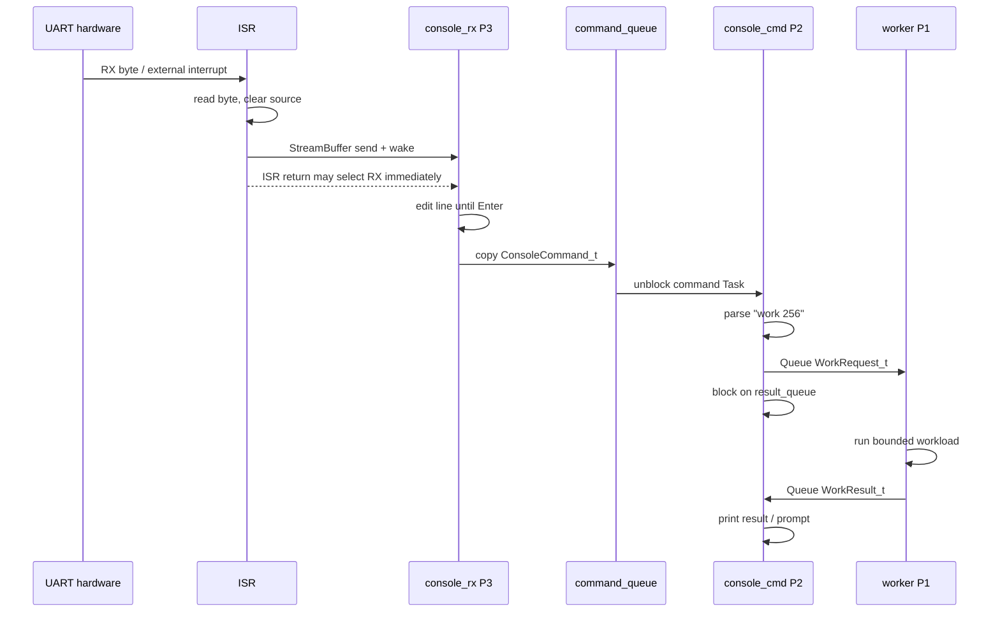
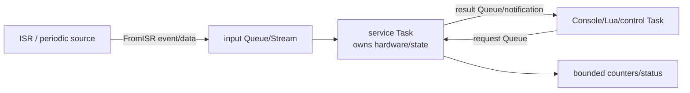

# Application 如何與 FreeRTOS 互動

本文件不重複列出所有 FreeRTOS API，而是追蹤本專案的 application code 如何透過 API 變成 Task state、Queue data、interrupt wakeup 與 context switch。API 的獨立語法範例見 [FREERTOS_API_EXAMPLES.md](../04-freertos/FREERTOS_API_EXAMPLES.md)；若不清楚「目前是在Task還是ISR」、UART資料要從哪裡接收，先讀 [ISR_TASK_API_BOUNDARY.md](../04-freertos/ISR_TASK_API_BOUNDARY.md)。

## 1. `main()`、Task 與一般 C function

Firmware reset 後，`startup.S` 呼叫 application `main()`。這時 scheduler 尚未執行：

```c
int main(void)
{
    create_queues();
    initialise_uart_irq();
    create_tasks();
    vTaskStartScheduler();
    fatal("scheduler_return");
}
```

`main()` 本身不會自動變成 FreeRTOS Task。Scheduler 啟動後，CPU 只在 Ready Tasks、ISR與kernel/port之間執行。

Task 呼叫一般 C function 時，該 function仍在同一個 Task context：

```text
worker Task
  -> run_workload()
  -> calculate_checksum()
  -> return to worker Task
```

只有 `xTaskCreate...()` 建立的 entry function 才是獨立 Task。普通 function 不使用 RTOS API 也完全可以執行，只是它不會因此得到新的 stack或priority。

## 2. Scheduler 如何看 application

Kernel 不理解「Console」或「Lua」這些產品概念，只看到：

- Task handle、priority與state。
- Ready/delayed/blocked/suspended lists。
- Queue/semaphore/Event Group wait lists。
- Tick timeout。
- ISR 通知的 wakeup要求。

Application 的架構是由「哪些 Task 等哪些 object」形成，而不是由檔名或 class hierarchy形成。

## 3. Blocking 是最重要的互動

以 Console worker 為例：

```c
xQueueReceive(work_queue, &request, portMAX_DELAY);
```

Queue empty 時：

1. Kernel 把 worker 從 Running/Ready 移到 Queue 的 blocked wait list。
2. Scheduler 選另一個 Ready Task。
3. Worker 不消耗 CPU，也不是在 while loop中輪詢。
4. Command Task送入 request時，kernel把 worker移回 Ready。
5. 若 worker priority高於目前 Task，API/port可能立即切換；本例 worker priority較低，通常等 command Task block/yield後執行。

Application 使用 RTOS 的核心價值不只是「多個函式輪流跑」，而是能用 blocking object表示等待原因。

## 4. Console 的完整互動時序



此處有三種 RTOS interaction：

- ISR-to-Task：StreamBuffer `FromISR` API。
- Task-to-Task data：Queue copy。
- Scheduling：block/unblock 與priority決定誰執行。

## 5. UART byte 為何不是一個 Task

Hardware byte arrival 是 event，不是 Task。專案在啟動時只建立一個長期存在的 RX Task：

```text
Task建立一次
  -> block等待StreamBuffer
  -> byte到達被喚醒
  -> 處理資料
  -> 再次block
```

每個 byte都建立/刪除 Task 會浪費 TCB、stack、heap與scheduler成本，也難以處理burst。ISR + buffer + persistent Task 是較正常的 embedded pattern。

## 6. ISR 與 Task API 的邊界

完整的初學者說明、目前UART真實呼叫路徑、`rtos_uart_getc()`／`try_getc()`差異，以及新增硬體Driver的ISR範例，集中在 [ISR_TASK_API_BOUNDARY.md](../04-freertos/ISR_TASK_API_BOUNDARY.md)。本節保留設計規則摘要。

判斷依據不是「是否使用外部模組」，而是CPU執行到該行時的caller context：由Task一路呼叫進來就使用普通API；由硬體interrupt進入trap/ISR路徑才使用`FromISR` API。Application使用目前UART時不需要自己寫ISR，只要在唯一RX Task呼叫`rtos_uart_getc()`。

ISR 可做：

```c
BaseType_t higher = pdFALSE;
xStreamBufferSendFromISR(stream, &byte, 1, &higher);
portYIELD_FROM_ISR(higher);
```

ISR 不可：

- `vTaskDelay()`。
- 使用普通 blocking `xQueueSend()`。
- take/give mutex。
- `malloc()`。
- 執行大型 parser或Lua VM。
- 長時間 polling UART TX。

原因不是語法限制，而是 ISR正在所有 Tasks之上、共用有限 ISR stack，且目前 trap handler不設計 nested interrupts。ISR愈長，tick與其他external events延遲愈大。

## 7. Priority 如何影響資料流

Console priority：

```text
RX P3 > command P2 > worker/heartbeat P1 > Idle P0
Timer service P4
```

這表示輸入到達時優先把 hardware/software RX buffer清空；解析完成後 command處理；background workload最後執行。

但 higher priority不是「永遠應該先做完所有工作」。RX Task每次處理後必須重新 block，否則會讓 command/worker starvation。設計 priority時同時要確認每個 high-priority loop有明確 blocking point。

## 8. Queue copy 與 ownership

Console 使用：

```c
ConsoleCommand_t command;
xQueueSend(command_queue, &command, 0);
```

Kernel 複製完整 struct，所以：

- Producer送出後可重用local buffer。
- Consumer得到自己的item copy。
- Queue storage必須是 `length * sizeof(item)`。
- 大型 struct每次copy會增加CPU與memory bandwidth。

若改傳 pointer：

```c
Buffer *ptr;
xQueueSend(queue, &ptr, timeout);
```

Queue 只複製 address。Application必須定義誰配置、誰釋放、send失敗誰回收、consumer完成後能否重用。沒有ownership規則時，pointer Queue很容易造成use-after-free或leak。

## 9. Shared state 與 mutex

Platform兩個 worker共享 `shared_counter`：

```c
xSemaphoreTake(test_mutex, portMAX_DELAY);
shared_counter++;
xSemaphoreGive(test_mutex);
```

`volatile` 只要求 compiler執行load/store，不提供互斥或atomicity。真正保護來自 mutex。

選擇：

- 只有一個Task擁有資料：不需要mutex，其他Tasks透過Queue請求。
- 多Tasks短時間讀寫同一resource：mutex。
- Task與ISR共享單一flag/counter：需分析atomic access，通常使用notification/Queue/短critical section。
- Multi-register MMIO原子序列：極短critical section或driver ownership。

## 10. Event 與 data 的區別

| 需求 | 合適 object |
|---|---|
| 傳一筆有內容的工作 | Queue |
| 傳連續bytes | StreamBuffer |
| 告訴一個Task「發生一次」 | Task notification／binary semaphore |
| 表示N個資源/完成事件 | Counting semaphore |
| 等多個boolean條件 | Event Group |
| 等多個Queue/semaphore任一ready | Queue set |
| 保護共享resource | Mutex |

Platform同時使用Event Group與counting semaphore，因為兩者回答不同問題：Event Group確認 A/B/stream/timer 四種條件都完成；counting semaphore保留兩個worker completion數量並驗證Queue set。

## 11. Time interaction

Application常見三種時間需求：

### 延後再執行

```c
vTaskDelay(pdMS_TO_TICKS(100));
```

Task block 100 ms，週期是work time加delay。

### 固定週期

```c
TickType_t last = xTaskGetTickCount();
for (;;) {
    sample();
    xTaskDelayUntil(&last, pdMS_TO_TICKS(10));
}
```

適合固定phase service。

### 非Task callback

Software timer expiry由Timer service Task執行callback。Callback應發notification/Queue，不應做完整大型工作。

Lua `rtos.sleep()` 本質上是在Lua Task中分段呼叫 `vTaskDelay()`，所以同樣使用kernel tick與blocked state。

## 12. Platform 的同步屏障

Coordinator要等四種工作全部完成：

```c
bits = xEventGroupWaitBits(
    events,
    EVENT_ALL_RESULTS,
    pdFALSE,
    pdTRUE,
    timeout
);
```

等待期間Coordinator block，workers/dynamic Task/Timer Task可以執行。最後一個bit出現時，kernel把Coordinator移到Ready；因它priority 3高於workers P2，會優先恢復Coordinator。

這就是API、priority與context switch共同形成的application control flow。

## 13. Lua 的雙Queue互動

Lua profile有兩種完全不同的訊息：

```text
lua_command_queue:
  RX Task -> Lua Task
  傳 REPL/script 的source metadata

lua_input_queue:
  RX Task -> 正在執行 rtos.read_line() 的 Lua Task
  傳使用者互動文字
```

為何不共用一個Queue：

- Command會開始一段VM execution。
- Input是execution期間某個C binding正在等待的資料。
- 兩者生命週期與busy規則不同。
- 分開可避免普通input被誤認成新script。

## 14. Lua API 呼叫如何進入FreeRTOS

Lua source：

```lua
rtos.sleep(1000)
```

執行路徑：

```text
Lua VM辨識global rtos與field sleep
  -> 呼叫lua_rtos_libs.c的rtos_sleep(lua_State*)
  -> luaL_checkinteger / range validation
  -> vTaskDelay(slice)
  -> Lua Task變Blocked
  -> scheduler執行RX/heartbeat/Idle
  -> tick喚醒Lua Task
  -> C binding返回0個Lua results
  -> VM繼續下一個Lua instruction
```

詳細binding ABI與新增API方法見 [LUA_FREERTOS_BRIDGE.md](LUA_FREERTOS_BRIDGE.md)。

## 15. Heap interaction

Application可有三類memory：

- Static globals/TCB/stack：linker配置，不經heap。
- FreeRTOS dynamic objects：直接使用`pvPortMalloc()`。
- C/Lua allocations：mini libc `malloc/realloc/free`包裝FreeRTOS heap。

Lua table/string/state與source buffer都會影響同一個 `heap_free/heap_min`。若C Task也大量malloc，它與Lua互相競爭同一個2 MiB pool。

Application應決定：

- 固定核心objects用static allocation。
- 大小/數量真正在runtime變動者才dynamic。
- 所有dynamic API檢查失敗。
- 記錄minimum-ever heap，而不是只看目前free。

## 16. Output 與 real-time interaction

目前 UART TX是polling。Task呼叫：

```c
rtos_uart_write_line("message");
```

會等UART可接受每個byte。長輸出造成：

- 該Task長時間保持Running。
- 同priority Task的執行受到tick/time slicing影響。
- Lower-priority Task延後。
- 若在critical section輸出，連tick/UART RX ISR都被延後。

因此：

- ISR不print。
- Critical section不print長字串。
- 高頻資料使用counter/aggregate，按命令再顯示。
- 大量log可考慮TX Queue + dedicated logger Task。

## 17. Fatal、recoverable error 與 marker

Application需要分級：

| 類型 | 例子 | 建議處理 |
|---|---|---|
| 使用者輸入錯誤 | unknown command、Lua syntax error | 回報並返回prompt |
| 資源暫時不可用 | Queue full、timeout | counter/drop/retry/錯誤回傳 |
| 啟動必要物件失敗 | Queue/Task/UART init failure | 印fatal marker並停止 |
| Kernel/CPU exception | assert、stack overflow、illegal instruction | trap diagnostics並停止 |
| Test assertion | Platform expected condition不成立 | `[PLATFORM] FAIL reason=...` |

Runner/probe依賴stable marker判斷，不應只靠「看起來有輸出」。新application也應定義READY/PASS/FAIL marker。

## 18. Reload 與Task生命週期

`vTaskDelete()` 只刪除一個Task；其他Tasks與firmware繼續。

`rtos_board_request_image_reload()` 則：

- 等TX idle。
- 寫MMIO。
- Hardware reset CPU並接管DDR。
- 所有Task、Queue、heap與globals一起消失。
- 下一份`.mem`重新從startup開始。

Application若只需重新開始某個worker，應設計Task/Queue reset；若要替換整份software image，才使用board reload。

## 19. 建議的application dataflow

對新功能可採：



優點：

- Hardware ownership集中。
- ISR短小。
- Queue明確定義資料ownership。
- Console與Lua不直接碰driver內部狀態。
- 容易加入timeout、drop counters與probe marker。

## 20. 設計檢查表

新增或檢查application時逐項回答：

1. 每個Task的唯一責任是什麼？
2. 每個high-priority Task在哪裡block？
3. Queue傳copy還是pointer；ownership是誰？
4. ISR是否只用`FromISR` API並處理yield flag？
5. Timeout後是drop、retry、degrade還是fatal？
6. 哪些資料需要mutex；能否改成single owner？
7. Stack depth是words還是bytes；量過high-water mark嗎？
8. Dynamic allocation failure有處理嗎？
9. UART log會不會破壞deadline或RX latency？
10. READY/PASS/FAIL marker能否讓runner/probe可靠判定？
11. Reload與單一Task reset的語意是否分清楚？
12. Simulation、board probe與long-run test各涵蓋什麼？
