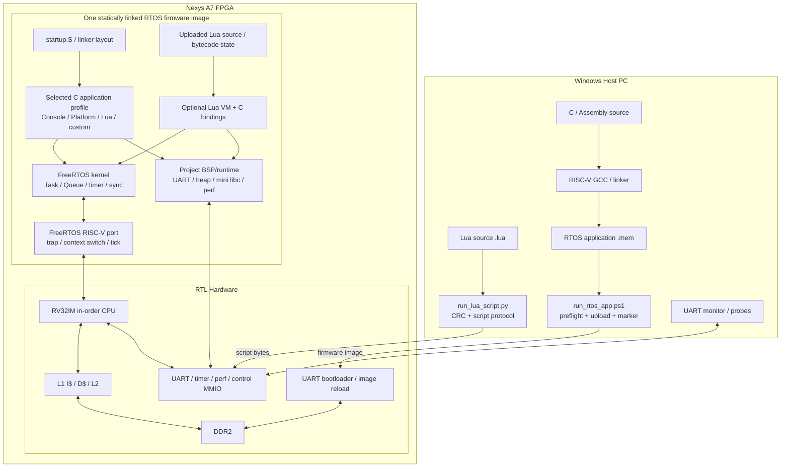
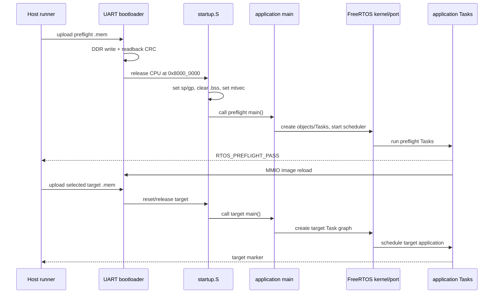

# Application 層完整系統架構

本文件從 PC 工具、FPGA 硬體、RISC-V CPU、FreeRTOS、C application 到 Lua script，說明整個專案如何分層。重點是釐清「application 在 FreeRTOS 上執行」的真正意思：目前沒有 process loader、ELF runtime loader 或獨立 address space；C application、FreeRTOS kernel、driver 與 port 在 build 時靜態連結成同一份 `.mem`，Lua 則是在其中一個 firmware profile 內提供動態腳本層。

## 1. 一張圖看完整架構



## 2. 硬體、RTOS 與 application 的責任

| 層 | 主要責任 | 不負責什麼 |
|---|---|---|
| FPGA RTL | 實作 CPU、cache、DDR、UART、timer、interrupt、MMIO | 不理解 C Task、Queue 或 Lua 語法 |
| CPU ISA/CSR | 執行 RV32IM machine code、precise trap、`mret/ecall` | 不知道哪個 Task 是 Console 或 Lua |
| FreeRTOS port | 保存/恢復 registers、tick timer、trap 到 kernel 的橋接 | 不定義 application command 或 game logic |
| FreeRTOS kernel | 排程 Task、管理 Queue/timer/synchronization/heap API | 不自動建立使用者功能 |
| BSP/runtime | UART driver、board reload、counter API、mini libc | 不決定 application workflow |
| C application | 建立 Task/Queue、定義 priority、資料流、錯誤政策 | 不重新實作 CPU context switch |
| Lua VM profile | 在一個 C application 中解析/執行 Lua、暴露受限 `rtos.*` | 不是第二個 OS，也沒有硬體隔離 |
| Lua script | 動態應用邏輯、文字互動、資料處理 | 不直接新增 RISC-V machine code 或任意 FreeRTOS Task |

## 3. 一份 `.mem` 到底包含什麼

以 Console profile 為例，`rtos_console.mem` 包含：

```text
startup.S
main_console.c
uart.c
perf_counters.c
freertos_hooks.c
rtos_heap.c
minilibc.c
FreeRTOS tasks/queue/event/stream/timers
heap_4
RISC-V port.c / portASM.S
libgcc helpers
```

以 Lua profile 為例，還會加入 Lua 5.4.8 parser/VM、精簡 libraries、script protocol 與 Lua/RTOS bridge。

所以 `.mem` 不是「只放你的 main」、也不是「先上傳 RTOS，之後再另外載入 C 程式」。對 C application 而言，每個 profile 都是包含 kernel 與 application 的完整 firmware image。

## 4. 為什麼可以有不同 application profile

[`tools/build_rtos_app.ps1`](../../tools/build_rtos_app.ps1) 對所有 profile 共用 startup、BSP、FreeRTOS kernel 與 RISC-V port，但選擇不同 `main` 與 extra sources：

| Profile | Main source | 用途 | Runner marker |
|---|---|---|---|
| `smoke` | `main.c` | Producer/consumer Queue 長時間 smoke | `RTOS_SMOKE_PASS` |
| `preflight` | `main_preflight.c` | 上板前短版 CPU/tick/Queue/reload 自測 | `RTOS_PREFLIGHT_PASS` |
| `console` | `main_console.c` | UART 命令、worker、performance counters | `APP_READY` |
| `platform` | `main_platform.c` | FreeRTOS objects 與 allocator 綜合自測 | `RTOS_PLATFORM_PASS` |
| `lua` | `main_lua.c` | Lua VM、REPL、script service | `LUA_RTOS_READY` |
| `vga_demo` | `main_vga_demo.c` | RTOS VGA demonstration | `[VGA] task=L start` |
| `vga_queue_demo` | `main_vga_queue_demo.c` | Queue-driven VGA pipeline | `[PIPE] task=P producer start` |
| custom | 使用者 `-MainSource` | 任意新的 C RTOS application | 使用者 `-TargetMarker` |

每次只選一個 `main()`。不同 profile 不會在同一份 firmware 中同時各跑一份，除非你主動把它們的功能重新整合進同一個 main/task graph。

## 5. Boot 到 application 的執行順序



`main()` 在 scheduler 啟動前執行，適合建立 object、初始化 driver 與 Task。`vTaskStartScheduler()` 成功後不應返回；真正長期工作放在 Tasks。

## 6. Application 並不是 host OS process

在 Linux/Windows 中，application 通常是 OS loader 建立的 process；本專案不同：

- 沒有 filesystem-based executable loader。
- 沒有 per-process virtual address space。
- 沒有 userspace/system-call privilege boundary。
- Kernel、driver 與 application 都在 RISC-V machine mode。
- Application 可以在 C 中存取相同 globals、heap 與 MMIO。
- 一個錯誤 pointer 可以破壞 kernel 或其他 Task。

「跑在 FreeRTOS 上」表示 Task 由 FreeRTOS scheduler 管理並使用其 API，不代表像桌面 OS 一樣被隔離。

## 7. C application 與 FreeRTOS 的結合點

C application 透過幾類介面與 RTOS 互動：

```text
建立執行單位: xTaskCreateStatic / xTaskCreate
傳遞資料:     Queue / StreamBuffer
通知事件:     task notification / semaphore / Event Group
保護共享資源: mutex / recursive mutex / critical section
時間:         vTaskDelay / xTaskDelayUntil / software timer
記憶體:       pvPortMalloc / malloc wrapper / static arrays
診斷:         tick / stack watermark / heap minimum / runtime stats
ISR bridge:    ...FromISR APIs + portYIELD_FROM_ISR
```

Application 不直接呼叫 context-switch assembly；當 API 導致 Task block、yield 或喚醒更高 priority Task 時，kernel/port 自動完成切換。

若要從一個實際 API 一路追蹤到 RISC-V machine code、CSR、MMIO、interrupt 與 FPGA RTL，請搭配 [RTOS 軟體 API 如何連到 CPU 與 FPGA 硬體](../04-freertos/SOFTWARE_HARDWARE_INTERFACE.md)。該文件也會區分「只操作 DDR 中 Kernel 資料結構的 API」與「直接操作 MMIO 的板級 driver」。

## 8. Interrupt 資料路徑

以 UART RX 為例：

```text
USB-UART byte
  -> UART RTL holding register
  -> machine external interrupt
  -> FreeRTOS trap handler保存Task context
  -> project ISR讀取byte
  -> xStreamBufferSendFromISR()
  -> 必要時喚醒高priority RX Task
  -> portYIELD_FROM_ISR()
  -> RX Task解析line/protocol
```

UART 輸入不是「每個 byte 建立一個 Task」。Hardware/ISR 只把資料放入既有 software buffer，既有 RX Task 被 scheduler 喚醒後處理。

## 9. Console 的 application graph

```text
UART ISR
  -> RX StreamBuffer
  -> console_rx (priority 3)
  -> command_queue
  -> console_cmd (priority 2)
       -> status/perf/echo
       -> work_queue
       -> worker (priority 1)
       -> result_queue
  + heartbeat (priority 1)
```

這是典型 command/worker architecture。詳細命令與限制見 [CONSOLE_APP.md](CONSOLE_APP.md)。

## 10. Platform 的 application graph

```text
coordinator (priority 3)
  -> starts worker A/B (priority 2)
  -> sends StreamBuffer pattern to dynamic Task
  -> starts one-shot software timer
  -> triggers external interrupt
  -> waits Event Group all-bits
  -> consumes two completion semaphore events through Queue Set
  -> checks Task state/runtime/stack
  -> RTOS_PLATFORM_PASS
```

這是 test coordinator architecture，不是一般 user application。詳細測試範圍見 [PLATFORM_APP.md](PLATFORM_APP.md)。

## 11. Lua 在 RTOS 上的位置

Lua profile 仍然先是一個 C/FreeRTOS application：

```text
FreeRTOS scheduler
  + lua_rx Task      -> UART / upload protocol / line editor
  + lua Task         -> owns lua_State and executes VM
  + lua_heart Task   -> liveness
  + Idle/Timer Tasks -> kernel services
```

在 `lua` Task 裡面：

```text
Lua source
  -> luaL_loadbuffer()
  -> Lua VM instructions
  -> lua_pcall()
  -> VM calls C binding when script uses rtos.sleep()/print()/...
  -> C binding calls FreeRTOS/BSP
```

所以「RTOS 上面接 Lua」不是把 Lua 放到 FreeRTOS kernel 裡，而是建立一個使用 FreeRTOS 服務的 Lua VM application。更細的 binding 路徑見 [LUA_FREERTOS_BRIDGE.md](LUA_FREERTOS_BRIDGE.md)。

## 12. 三種應用開發方式

### 直接寫 C、完全不用 FreeRTOS API

可以用 bare-metal build flow，或在 RTOS firmware 的 `main()` 裡執行一般 C。但如果在啟動 scheduler 前進入永久 loop，FreeRTOS 永遠不會開始；如果在某個 Task 中呼叫純 C function，它就只是該 Task call stack 的一部分。

純 C function 不會自動變成 Task：

```c
static uint32_t calculate(uint32_t input) {
    return input * 2u;
}

static void worker_task(void *arg) {
    uint32_t result = calculate(21u); /* 在 worker Task context 中執行。 */
    (void)result;
    for (;;) { vTaskDelay(1000u); }
}
```

### 寫新的 C/FreeRTOS application

建立新的 `main_my_app.c`，選擇 Tasks、Queues、priority 與 marker，重新編譯 `.mem`。這提供最佳效能、完整 C/RTOS API 與最直接的 hardware access，但每次改 C 都需重建並重傳 target image。

### 寫 Lua script

先保持 `rtos_lua.mem` 在板上，只上傳 `.lua`。修改速度最快，不必重建 firmware，但只可使用目前 exposed Lua/`rtos` APIs，執行速度與記憶體效率低於原生 C。

## 13. C 與 Lua 的選擇

| 需求 | 建議 |
|---|---|
| ISR、driver、MMIO、精確 latency | C/FreeRTOS |
| 建立 Task、Queue、mutex、timer | C/FreeRTOS；目前 Lua沒有直接 create API |
| 大量固定演算法或效能敏感 loop | C |
| 快速修改遊戲規則、文字 UI、狀態機 | Lua |
| 使用者可上傳邏輯但不重建 firmware | Lua |
| 需要新 hardware feature 給 script | C driver + 安全 Lua binding + Lua |
| 完全不需要 scheduler/inter-task功能 | Bare-metal C 也可 |

常見混合設計是把 real-time driver/worker留在 C Tasks，把高階 policy留給 Lua，兩者以受控 Queue/binding 交換資料。

## 14. Memory architecture

```text
DDR 8 MiB firmware region
  .text/.rodata    kernel + app + optional Lua VM machine code
  .data/.bss       globals, static TCBs, stacks, Queue storage
  startup stack    64 KiB
  FreeRTOS heap    2 MiB
      dynamic Tasks/objects
      mini-libc malloc/realloc
      Lua state/tables/strings/source buffer
```

Static Task stack 不使用 heap；dynamic Task 與 Lua allocator 使用 heap。所有層共用這個 address space，所以 `heap_min` 是整體 runtime 壓力的重要指標。

## 15. Time architecture

- Hardware `mtime` 每個 core clock增加。
- `mtimecmp` 每 50,000 counts 產生 1 kHz FreeRTOS tick（50 MHz 實板）。
- Kernel 用 tick 管理 delay/timeout/time slicing。
- Console heartbeat、Lua heartbeat 都用 1000-tick delay。
- Lua script timeout 也基於 FreeRTOS tick。
- Performance runtime stats直接讀較高解析度的 `mtime` low word。

Application 應使用 `pdMS_TO_TICKS()`；Lua `rtos.sleep(ms)` 在目前 1 kHz 組態中直接以同數值 ticks分段 delay。

## 16. UART 同時承擔的角色

目前 UART 是：

- Bootloader image transport。
- Application log output。
- Console commands。
- Lua REPL。
- Lua script control header與raw payload。
- 自動 probe介面。

同一時間的 bytes 必須由當前 firmware/profile 按其 protocol解釋。不能在 Lua payload receiving phase 同時把普通 terminal文字插入；也不能讓兩個 PC process同時開 COM port。

## 17. Reload lifecycle

```text
application running
  -> command reload / rtos.reload / runner auto-reload
  -> wait UART TX idle
  -> write launcher reset MMIO
  -> CPU reset, hardware owns DDR
  -> bootloader accepts next image
  -> DDR content replaced
  -> new firmware starts from reset
```

Reload 是整份 C/RTOS firmware replacement，不是只刪除一個 Task。Lua 的 `@lua stop` 則只停止當前 script，保留 Lua firmware與 VM service。

## 18. Debug 與驗證層次

| 層次 | 工具／marker | 能回答的問題 |
|---|---|---|
| Firmware build | ELF/MEM/MAP/DIS | Source、linker、依賴與容量是否正確 |
| Preflight | `RTOS_PREFLIGHT_PASS` | 當次上板的基本 CPU/DDR/tick/Queue/reload是否可用 |
| Profile boot sim | Console/Lua simulation | RTL 中能否啟動到 application ready |
| Platform sim/board | `RTOS_PLATFORM_PASS` | 多種 FreeRTOS object能否共同運作 |
| Application probe | Console/Lua/Platform probes | 真實 UART互動與功能 marker |
| Script CRC/guard | ACCEPTED/PASS/TIMEOUT/LIMIT | Script完整性與有界執行 |
| Perf counters | Console `perf` | CPU/cache/pipeline瓶頸 |

不要用某一層 PASS 取代所有層。例如 preflight PASS 不能證明 Lua script語法正確，Lua script PASS 也不能證明所有 CPU ISA edge cases。

## 19. 如何擴充完整系統

若未來要新增板載 I/O、VGA、sensor或其他軟體，推薦分層：

```text
RTL/MMIO register
  -> C driver (read/write/ISR ack)
  -> C service Task (ownership, Queue, timeout)
  -> C application API
  -> optional Lua binding
  -> Lua policy/UI script
```

不要讓多個 Tasks與Lua隨意直接操作同一組 MMIO。由一個 driver/service Task 擁有 hardware，其他使用者經 request Queue或受控函式呼叫，較容易 debug、量測與做錯誤恢復。
