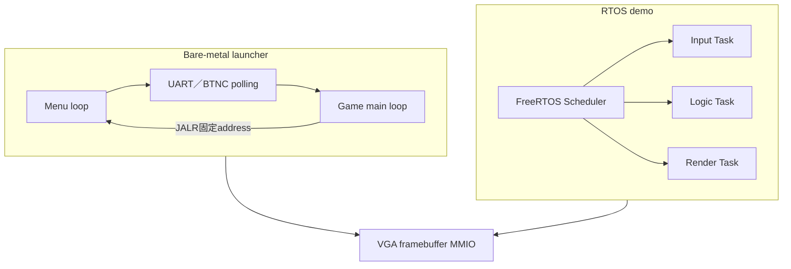
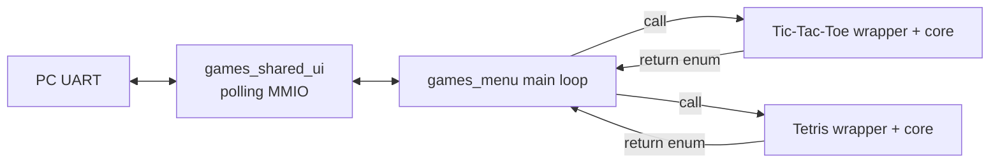
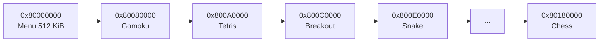
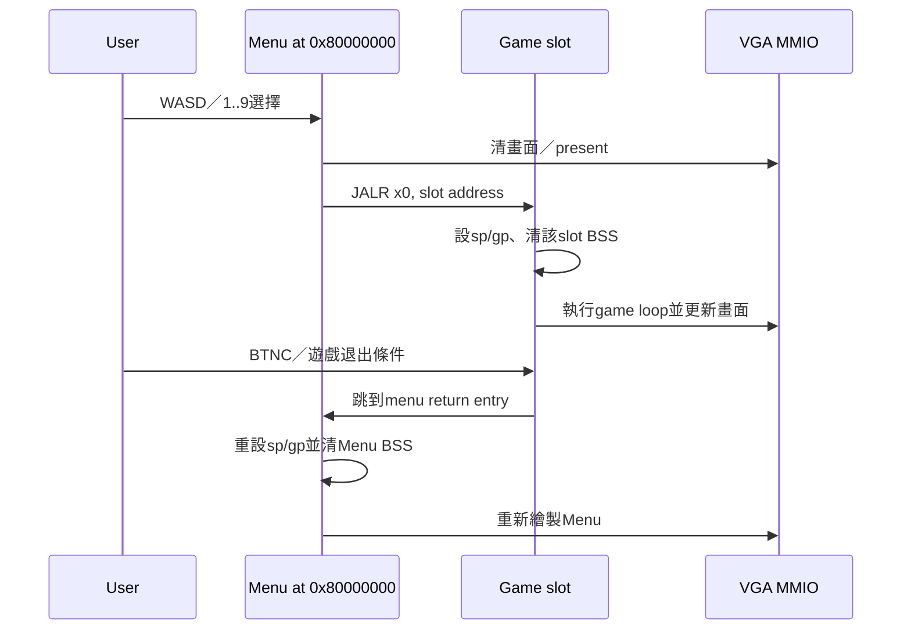

# Bare-metal VGA Games 與 Slot Launcher

本文件說明`game/`中的bare-metal文字遊戲與VGA遊戲、`make vga-games-menu`產生的多slot launcher，以及它和FreeRTOS Application的差異。

先記住：

> `mem_vga_games_menu.mem`是bare-metal程式集合，不包含FreeRTOS Scheduler、Task、Queue或UART ISR。它直接以polling讀UART／按鍵、寫VGA MMIO，並用固定DDR地址在Menu與各遊戲之間跳轉。

## 1. Bare-metal與RTOS Application差異

| 項目 | Bare-metal VGA game | RTOS VGA demo |
|---|---|---|
| 建置入口 | `Makefile`／`build_vga_slot_suite.py` | `build_rtos_app.ps1` |
| Startup | `tools/crt0.S`／`launcher_slot_crt0.S` | `OS/rtos/src/startup.S`＋FreeRTOS Port |
| Scheduler | 無 | 有 |
| Task／Queue | 無 | `vga_demo`、`vga_queue_demo`使用 |
| UART RX | 直接polling MMIO | ISR→StreamBuffer→RX Task |
| VGA | `vga_fb.c`直接MMIO | 同類Driver由RTOS Task呼叫 |
| 切換功能 | `JALR`跳到固定slot address | Scheduler切Task或重新上傳image |

兩者最後都會編譯成RV32 machine code並使用同一顆CPU、DDR與VGA RTL；差異是軟體架構。



## 2. 目前可建置遊戲

| Make target | 主要source | 輸出MEM |
|---|---|---|
| `make vga-games-menu` | Menu＋9個slot images | `TEST_FILES/mem_vga_games_menu.mem` |
| `make tetris-vga` | `game/Tetris_vga.c` | `TEST_FILES/mem_tetris_vga.mem` |
| `make gomoku-vga` | `game/Gomoku_vga.c` | `TEST_FILES/mem_gomoku_vga.mem` |
| `make breakout-vga` | `game/Breakout_vga.c` | `TEST_FILES/mem_breakout_vga.mem` |
| `make snake-vga` | `game/Snake_vga.c` | `TEST_FILES/mem_snake_vga.mem` |
| `make mines-vga` | `game/Mines_vga.c` | `TEST_FILES/mem_mines_vga.mem` |
| `make bomber-vga` | `game/Bomber_vga.c` | `TEST_FILES/mem_bomber_vga.mem` |
| `make sokoban-vga` | `game/Sokoban_vga.c` | `TEST_FILES/mem_sokoban_vga.mem` |
| `make pacman-vga` | `game/Pacman_vga.c` | `TEST_FILES/mem_pacman_vga.mem` |
| `make chess-vga` | `game/Chess_vga.c` | `TEST_FILES/mem_chess_vga.mem` |

`make games-menu`是文字／共用遊戲menu的另一條bare-metal target，不等於VGA slot launcher。

### 2.1 單一文字遊戲image

根目錄直接執行`make`時，預設會把[`game.c`](../../game/game.c)的Tic-Tac-Toe建成`TEST_FILES/mem_game.mem`。[`Tetris.c`](../../game/Tetris.c)則是獨立的UART文字版Tetris，可用一般Make參數建置：

```powershell
make SRC=game/Tetris.c `
  OUT_NAME=tetris `
  MEM_OUT=TEST_FILES/mem_tetris.mem mem
```

這兩個程式都各自擁有`main()`與直接UART MMIO helper；它們不是FreeRTOS Task，也不會回到下面的共用menu。適合用來展示最小bare-metal程式，或在不引入Scheduler時驗證CPU、DDR與UART。

### 2.2 `games-menu`文字遊戲架構

`make games-menu`會產生`TEST_FILES/mem_games_menu.mem`。它把下列source link成**同一個**位於`0x8000_0000`的bare-metal image，不使用固定slot跳轉：

| 層次 | Source | 作用 |
|---|---|---|
| Launcher | [`games_menu.c`](../../game/games_menu.c) | 顯示`1/2/q`menu，呼叫選定遊戲函式 |
| 共用UART UI | [`games_shared_ui.c`](../../game/games_shared_ui.c)、[`games_shared_ui.h`](../../game/games_shared_ui.h) | polling收字元、送字元、清畫面與短延遲 |
| Tic-Tac-Toe wrapper | [`game_tictactoe_menu.c`](../../game/game_tictactoe_menu.c) | 設定標題與返回menu選項 |
| Tic-Tac-Toe core | [`game_tictactoe_core.c`](../../game/game_tictactoe_core.c) | 棋盤、合法落子、勝負判定 |
| Tetris wrapper | [`game_tetris_menu.c`](../../game/game_tetris_menu.c) | 設定UART Tetris profile |
| Tetris core | [`game_tetris_core.c`](../../game/game_tetris_core.c) | 方塊、碰撞、消行、文字畫面與輸入 |



案例：輸入`1`時，`games_menu.c`直接呼叫`game_tictactoe_run()`；遊戲回傳`GAME_RUN_MENU`後，普通C函式return回到menu loop。這和VGA slot launcher的`JALR x0`完全不同：文字menu與兩個遊戲都在同一個ELF，不需要重新設定`sp/gp`或跳到另一段DDR origin。

## 3. Slot記憶體配置

[`build_vga_slot_suite.py`](../../tools/build_vga_slot_suite.py) 為每個image產生自己的linker script，將它link到固定DDR address：

| Image | Origin | Reserved length |
|---|---:|---:|
| Menu | `0x8000_0000` | `0x0008_0000`＝512 KiB |
| Gomoku | `0x8008_0000` | `0x0002_0000`＝128 KiB |
| Tetris | `0x800A_0000` | 128 KiB |
| Breakout | `0x800C_0000` | 128 KiB |
| Snake | `0x800E_0000` | 128 KiB |
| Mines | `0x8010_0000` | 128 KiB |
| Bomber | `0x8012_0000` | 128 KiB |
| Sokoban | `0x8014_0000` | 128 KiB |
| Pacman | `0x8016_0000` | 128 KiB |
| Chess | `0x8018_0000` | 128 KiB |



`Reserved length`是link region上限，不代表每個game一定占滿128 KiB。Builder會檢查實際binary是否超過slot；超過就停止，而不是靜默覆蓋下一個遊戲。

## 4. 為什麼需要每個slot各自link

程式中的function pointer、global data address、`gp`、stack top與branch/jump target都依link address決定。不能把原本link在`0x8000_0000`的同一binary任意複製到`0x800A_0000`後期待正常執行。

Builder對每個slot：

```text
產生該origin專用linker script
  → 編譯slot startup與game sources
  → Link成該address的ELF
  → 檢查image size不超過region
  → objcopy成binary
  → 依origin-base offset放入combined binary
  → combined binary轉成.mem
```

未使用區間以0 padding保留，使UART bootloader寫入後，每個slot位於預期DDR offset。

## 5. Menu如何啟動遊戲

[`vga_games_menu.c`](../../game/vga_games_menu.c) 將選擇轉成固定address，再呼叫：

```c
launcher_jump_to_address(LAUNCHER_TETRIS_ADDR);
```

[`launcher_jump.c`](../../game/launcher_jump.c) 的核心是：

```c
__asm__ volatile(
    "jalr x0, 0(%0)\n"
    :
    : "r"(addr)
    : "memory"
);
```

`JALR x0`表示不保存普通return address，直接把PC改成slot入口。這不是function call後用`ret`回來；slot必須有自己的返回Menu機制。



## 6. Slot startup與返回Menu

一般slot使用 [`launcher_slot_crt0.S`](../../tools/launcher_slot_crt0.S)：

```text
_start
  → 設定該slot __stack_top
  → 設定gp
  → 清該slot .bss
  → launcher_slot_before_main()
  → call game main()
  → launcher_slot_after_main()
  → jump回Menu
```

Menu的 [`launcher_menu_return.S`](../../game/launcher_menu_return.S) 在回來時重新設定Menu `sp/gp`並清Menu BSS，再進入`launcher_menu_reentry()`。這避免沿用game stack或舊Menu global state。

大部分遊戲另由[`launcher_slot_boot.c`](../../game/launcher_slot_boot.c)提供進入／離開slot時的共用輸入整理與返回流程。Gomoku原始`main()`介面不同，因此builder以`-Dmain=gomoku_vga_slot_entry`重新命名，再由[`gomoku_slot_wrapper.c`](../../game/gomoku_slot_wrapper.c)包成相同的slot生命週期。這些wrapper不會改變遊戲邏輯；它們只讓不同程式都遵守「進slot前初始化、離開後回Menu」的launcher contract。

## 7. UART輸入為何不是ISR

Bare-metal game的 [`games_shared_ui.c`](../../game/games_shared_ui.c) 直接讀：

```c
#define UART_RX_DATA   (*(volatile unsigned int *)0x40000008u)
#define UART_RX_STATUS (*(volatile unsigned int *)0x4000000Cu)
```

Blocking輸入：

```c
while ((UART_RX_STATUS & 1u) == 0u) {
}
return (int)(UART_RX_DATA & 0xFFu);
```

Nonblocking輸入：

```c
if ((UART_RX_STATUS & 1u) == 0u) {
    return -1;
}
return (int)(UART_RX_DATA & 0xFFu);
```

這是polling：CPU反覆執行MMIO `LW`，沒有FreeRTOS Task Blocked、StreamBuffer或UART ISR。Menu會在poll之間執行短pause，仍是單一主迴圈。

## 8. VGA framebuffer路徑

遊戲使用 [`vga_fb.c`](../../game/vga_fb.c)：

```text
game logic
  → vga_fb_put_pixel／fill／present
  → CPU執行address arithmetic與MMIO LW/SW
  → 0x5000_0000 VGA framebuffer window
  → VGA subsystem掃描display bank
  → RGB/HSYNC/VSYNC pins
```

它與RTOS demo可以共用相同C Driver概念，但在bare-metal中沒有Mutex或Renderer Task；單一game loop通常是framebuffer唯一writer。

## 9. 建置完整Launcher

在專案根目錄：

```powershell
make vga-games-menu
```

等價主要工具為：

```powershell
python .\tools\build_vga_slot_suite.py `
  --out-mem TEST_FILES/mem_vga_games_menu.mem `
  --out-bin build_os/vga_slot_suite/vga_games_menu_slots.bin
```

成功後至少確認：

```powershell
Get-Item .\TEST_FILES\mem_vga_games_menu.mem
Get-ChildItem .\build_os\vga_slot_suite\*.elf
Get-ChildItem .\build_os\vga_slot_suite\*.map
```

每個slot的`.map`可用來檢查origin、symbol與size；combined `.mem`才是上傳到DDR的檔案。

## 10. 上板

先確定目前bitstream包含VGA top與constraints。接著：

```powershell
.\tools\run_rtos_app.ps1 `
  -Port COM5 `
  -Mem .\TEST_FILES\mem_vga_games_menu.mem `
  -TargetMarker "VGA launcher ready." `
  -TargetTimeout 60 `
  -Monitor interactive
```

雖然工具名稱是`run_rtos_app.ps1`，`-Mem`模式的target可以是bare-metal image。Runner仍先上傳RTOS preflight確認CPU／DDR／UART路徑，再rearm並上傳指定MEM；target本身不會因此變成FreeRTOS程式。

目前現有launcher MEM約1.5 MiB，實際大小會隨遊戲code改變。115200 baud、8N1 raw上限約11.5 KiB/s，光傳輸就可能超過2分鐘，再加sync、chunk、CRC與切換時間；應以檔案大小與runner進度為準，不要使用固定秒數判斷卡住。

## 11. Menu操作案例

啟動marker：

```text
VGA launcher ready.
Use WASD or 1-9 to select, space to launch.
Press BTNC inside a game to return here.
```

| 輸入 | 動作 |
|---|---|
| `W/A/S/D` | 在3×3 menu移動選擇 |
| `1..9` | 直接選取並啟動對應slot |
| Space | 啟動目前選擇 |
| Enter（終端機送出CR／`\r`時） | 啟動目前選擇；單獨LF／`\n`不啟動 |
| BTNC | 遊戲中要求返回Menu |

案例：

```text
上傳完成並看到Menu
  → 按1
  → Menu印出Launching TETRIS...
  → CPU跳到0x800A0000
  → Tetris slot重設自己的stack/BSS並執行
  → 按BTNC
  → 跳回Menu return entry
  → Menu重新初始化並顯示
```

## 12. 新增第10個遊戲時要修改什麼

目前Menu UI、slot constants與builder list都是9個遊戲設計。新增遊戲至少要同步：

1. 在`build_vga_slot_suite.py`的`IMAGES`加入新origin、length、startup與sources。
2. 在`launcher_slots.h`加入address constant。
3. 在Menu title、selection範圍、layout與launch switch加入項目。
4. 確認slot不重疊且image不超過reserved length。
5. 確認該game使用正確`-march`與必要runtime helpers。
6. 確認退出後會走`launcher_slot_after_main()`或明確Menu jump。
7. 重建combined image並測試Menu→Game→Menu。
8. 更新本文件、操作手冊與實板expected marker。

不要只把一個新`.bin`接在combined image尾端；如果Menu不知道address或binary沒有link到該origin，跳轉後不會正確執行。

## 13. 常見問題

### Marker正常但螢幕沒畫面

先檢查bitstream top、VGA constraints、螢幕input source與pixel clock，再查framebuffer MMIO。UART marker只證明CPU軟體有執行，不證明VGA實體輸出正確。

### 遊戲啟動後立刻回Menu

檢查UART殘留字元、按鍵edge狀態與input barrier。Slot pre-main會drain輸入並暫時忽略button polls，就是為了避免上一個Menu按鍵被新遊戲立即解讀。

### 某個slot跳轉後當機

查該slot `.map`與`.dis`：

- `_start`是否等於預定origin。
- `sp/gp`是否使用該slot linker symbols。
- image size是否超過128 KiB。
- source是否需要RV32M但被以RV32I編譯，或反之。
- startup與Menu return symbol是否正確。

### Upload看起來很久

先看MEM實際byte數與runner進度。Combined image包含slot間padding；文字`.mem`檔案大小不是UART實際binary byte數，應以word行數×4估算payload。

## 14. 驗證清單

- `make vga-games-menu`成功。
- 所有slot ELF/MAP都生成且未overflow。
- combined MEM能通過runner CRC/readback。
- 出現`VGA launcher ready.`。
- Menu WASD、1..9、Space可操作。
- 9個slot都至少啟動一次。
- 每個遊戲能透過BTNC或定義的退出路徑回Menu。
- 返回Menu後stack/BSS狀態正常，能再啟動另一遊戲。
- UART burst輸入不會造成無限重複切換。
- VGA畫面無明顯bank切換撕裂或錯誤palette。

## 15. 延伸文件

- [VGA.md](../02-memory-io/VGA.md)：VGA RTL、palette、double buffer與MMIO。
- [BOARD_OPERATION_GUIDE.md](../00-overview/BOARD_OPERATION_GUIDE.md)：實際上板命令與COM ownership。
- [C_TO_RISCV_MACHINE_CODE.md](../03-build-boot/C_TO_RISCV_MACHINE_CODE.md)：C、link address、ABI與machine code。
- [VGA_RTOS_DEMOS.md](VGA_RTOS_DEMOS.md)：對照RTOS Task／Queue版本的VGA demo。
- [MEMORY_MAP.md](../02-memory-io/MEMORY_MAP.md)：DDR與VGA address map。
