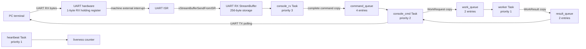

# RTOS Console Application

RTOS Console 是本專案第一個正式的互動式 FreeRTOS application。它不是 FreeRTOS 本身，也不是所有 application 都必須依賴的 shell；它是一個示範如何把 UART interrupt、Task、Queue、worker、狀態統計與硬體效能計數器組合在一起的完整 firmware profile。

主要實作位於 [`OS/rtos/src/main_console.c`](../../OS/rtos/src/main_console.c)。通用上板流程請搭配 [RTOS_APP_RUNNER.md](../03-build-boot/RTOS_APP_RUNNER.md) 閱讀。

## 1. Console 可以做什麼

上板後可以透過 115200-baud UART 輸入命令：

- 確認 scheduler 與 tick 是否仍在前進。
- 查看 UART、Queue、heap 與 Task 數量。
- 顯示目前配置的 Task 角色。
- 將工作經 Queue 交給 worker Task。
- 控制及讀取 24 組硬體效能計數器。
- 要求硬體回到 UART bootloader，準備上傳下一個 `.mem`。

Console 適合展示與 debug，但它不會自動替其他 C application 建立 Task。若要執行另一個軟體，可以建立自己的 `main()`；方法見 [ADDING_NEW_RTOS_APP.md](ADDING_NEW_RTOS_APP.md)。

## 2. 啟動方式

```powershell
cd C:/cpu_design
./tools/run_rtos_app.ps1 -Port COM5 -App console
```

Runner 會先建立並執行 preflight，再上傳 Console。成功時可看到：

```text
RTOS_CONSOLE_BOOT
APP_READY
RTOS Console ready. Type 'help'.
rtos>
```

`APP_READY` 是 runner 等待的 target marker。看到它表示 Queue、UART RX 與四個 application Task 已建立，scheduler 也已開始執行；它不代表每個互動命令都已逐一測過。

若只想編譯：

```powershell
./tools/build_rtos_app.ps1 -App console
```

預設產物位於 `build_rtos_apps/console/`：

```text
rtos_console.elf
rtos_console.bin
rtos_console.mem
rtos_console.dis
rtos_console.map
```

## 3. 軟體架構



UART ISR 只接收 byte、放入 StreamBuffer 並在需要時喚醒 `console_rx`。命令解析、字串輸出與 workload 都在 Task context 執行，不在 ISR 中執行。

## 4. Task 配置

| Task | Priority | Stack | 工作 |
|---|---:|---:|---|
| `console_rx` | 3 | 384 words = 1536 bytes | 從 UART StreamBuffer 取 byte、編輯目前行、提交完整命令 |
| `console_cmd` | 2 | 512 words = 2048 bytes | 解析命令、輸出狀態、控制 performance counters |
| `worker` | 1 | 384 words = 1536 bytes | 從 work Queue 收 request、執行 bounded workload、回傳 result |
| `heartbeat` | 1 | 256 words = 1024 bytes | 每 1000 ticks 增加 liveness counter |
| Timer service | 4 | 512 words | FreeRTOS 系統 Task；此 application 沒有建立自己的 software timer |
| Idle | 0 | 256 words | FreeRTOS idle 與動態資源 cleanup |

四個 application Task 都使用 `xTaskCreateStatic()`，其 TCB 與 stack 位於靜態記憶體。Console 仍會配置再釋放 1 byte，讓 `heap_4` 完成 lazy initialization，使 `status` 能正確回報 heap 容量。

## 5. Queue 配置

| Queue | 長度 | Item | Producer | Consumer |
|---|---:|---|---|---|
| `command_queue` | 4 | 64-byte `ConsoleCommand_t` | `console_rx` | `console_cmd` |
| `work_queue` | 2 | `WorkRequest_t` | `console_cmd` | `worker` |
| `result_queue` | 2 | `WorkResult_t` | `worker` | `console_cmd` |

Queue 傳送的是結構副本，不是指向 RX Task 區域陣列的 pointer。因此 RX Task 提交命令後可以立刻重用自己的 line buffer。

`console_rx` 對 `command_queue` 採 nonblocking send。若使用者輸入速度遠高於 command Task 的處理速度，Queue 滿時會增加 `command_drop` 並輸出：

```text
ERR command queue full
```

## 6. 輸入行處理

目前命令行 buffer 是 64 bytes，其中最後一個 byte 保留給 `\0`，所以最多保留 63 個可列印字元。

RX Task 支援：

- `CR`、`LF` 或 `CRLF` 送出命令。
- Backspace `0x08`。
- Delete key 若 terminal 傳出單一 `0x7F`，會當作 backspace。
- ASCII 可列印字元 `0x20..0x7E`。

Console 沒有完整的游標式 line editor。方向鍵通常會送出多 byte ANSI escape sequence，Console 只忽略不可列印的 ESC，但後續的 `[`、`D` 等可能被當成普通字元。因此需要左右移動、Home、End 與游標位置 Delete 時，應使用 Lua REPL；它有專門的 escape-sequence parser。

輸入超過 63 字元時，該行會進入 overflow 狀態，按 Enter 後整行丟棄並輸出：

```text
ERR line too long
```

## 7. 命令總表

| 命令 | 作用 |
|---|---|
| `help` | 顯示命令列表 |
| `ping` | 顯示目前 tick，確認 command Task 能回應 |
| `status` | 顯示 liveness、Queue、UART、heap 與 Task 統計 |
| `tasks` | 顯示預先配置的 Task 名稱、priority 與角色 |
| `echo <text>` | 經 RX Queue 與 command Task 回送文字 |
| `work [iterations]` | 將 1..100000 次 workload 交給 worker；預設 1000 |
| `perf`／`perf show` | 取得硬體 counter snapshot 並顯示分析摘要 |
| `perf raw` | 顯示全部硬體 counter 原始值 |
| `perf reset` | counter 歸零並開始量測 |
| `perf start` | 開始／繼續量測 |
| `perf stop` | 停止、snapshot 並顯示摘要 |
| `perf test [n]` | 對內建 workload 做一次受控量測；範圍 1..100000 |
| `reload` | 等 UART TX 完成後，透過 MMIO 回到 bootloader |

命令名稱必須是完整 word。例如 `pingx` 不會被視為 `ping`。命令後允許空白與參數，但需要沒有參數的命令目前不會逐一拒絕多餘參數；應依 `help` 中的格式使用。

## 8. `ping` 與 heartbeat

```text
rtos> ping
PONG tick=12345
```

`ping` 證明 UART RX、external interrupt、StreamBuffer、RX Task、command Queue 與 command Task 都能走完一輪。tick 持續增加則表示 machine timer interrupt 仍在運作。

Heartbeat Task 每 1000 ticks 執行一次：

```c
vTaskDelay(1000u);
heartbeat_count++;
```

目前 1 tick = 1 ms，所以正常約每秒增加一次。Heartbeat 不會主動印 log，避免 UART TX 影響效能；由 `status` 查詢即可。

## 9. `status` 欄位

範例形式：

```text
STATUS tick=... heartbeat=... commands=... lines=...
STATUS jobs=.../... last=0x........ cmdq=... workq=...
STATUS rx_overrun=... stream_drop=... irq=... line_overflow=... command_drop=...
STATUS heap_free=... heap_min=... tasks=...
```

| 欄位 | 意義 |
|---|---|
| `tick` | FreeRTOS tick count |
| `heartbeat` | Heartbeat Task 已完成的週期數 |
| `commands` | command Task 已取出的命令數 |
| `lines` | RX Task 成功放入 command Queue 的行數 |
| `jobs=completed/queued` | worker 完成與成功排入的工作數 |
| `last` | 最近一次 worker workload 的 32-bit 結果 |
| `cmdq`／`workq` | 查詢當下 Queue 中的 item 數量 |
| `rx_overrun` | UART hardware RX holding register 被新 byte 覆蓋的次數 |
| `stream_drop` | ISR 無法放入 software StreamBuffer 的 byte 數 |
| `irq` | UART RX external interrupt 處理次數 |
| `line_overflow` | 超過 63 字元而被丟棄的輸入行數 |
| `command_drop` | command Queue 已滿而被丟棄的命令數 |
| `heap_free` | 目前 FreeRTOS heap 可用 bytes |
| `heap_min` | 啟動以來最低可用 heap bytes |
| `tasks` | Kernel 當下 Task 總數，包含系統 Task |

`uxQueueMessagesWaiting()` 只是一個瞬間診斷值，不應拿來作 application 同步判斷。

## 10. `work N` 的真正含義

```text
rtos> work 256
WORK queued id=1 iterations=256
WORK done id=1 result=0x........
```

處理流程：

1. command Task 解析 `N`。
2. 建立包含 `id` 與 `iterations` 的 `WorkRequest_t`。
3. 將 request 副本 nonblocking 地放入 `work_queue`。
4. worker Task 被喚醒並執行 rotate／XOR workload。
5. workload 每 256 iterations 主動 `taskYIELD()`。
6. worker 將 `WorkResult_t` 放入 `result_queue`。
7. command Task 等待 result，取得後印出結果。

這展示了 Queue worker pattern，但目前 command Task 在送出 request 後會等待該 result，因此 UART 介面一次只完成一個互動工作；它不是平行提交多個 job 的 job server。若要真正 pipeline 多個 request，需要讓 command Task 不等待、另外建立 result printer 或維護多個 outstanding IDs。

## 11. Performance counter 命令

`perf show` 會先做 atomic snapshot，再計算 IPC、frontend/backend stall、branch prediction、I-Cache 與 D-Cache 等摘要。`perf raw` 則逐項輸出 24 組 64-bit counter。

最容易重複的測試是：

```text
perf test 10000
```

它會：

1. reset 並開始 counters。
2. 在 command Task 執行與 `work` 相同的 bounded workload。
3. 停止並 snapshot。
4. 印出 `PERF_TEST`、摘要與 `PERF_TEST_PASS`。

`perf test` 在 command Task 自己執行，`work` 則在 worker Task 執行；兩者適合觀察不同排程路徑。完整 counter ABI 請見 [PERFORMANCE_COUNTER_REGISTERS.md](../02-memory-io/PERFORMANCE_COUNTER_REGISTERS.md)。

## 12. `reload` 與關閉 monitor

`reload` 會呼叫 `rtos_board_request_image_reload()`：

1. 等 UART TX shift 完成。
2. 對 launcher reset MMIO 寫入 1。
3. 硬體接管 DDR 並 reset CPU。
4. bootloader 等待下一份 image。

這和在 PC 按 `Ctrl+C` 不同。`Ctrl+C` 通常只停止 PowerShell/Python monitor，FPGA 上的 Console 仍繼續執行；重新開啟 terminal 後仍可輸入命令。

## 13. 自動 probe

Console 已有實板 probe：

```powershell
python ./tools/rtos_console_probe.py --port COM5
```

它依序檢查：

```text
ping
status
tasks
echo console-probe
work 256
perf test 256
```

每個命令都等待特定 marker。執行 probe 前要先停止占用 COM port 的互動 monitor。

只測 performance workload：

```powershell
python ./tools/rtos_console_probe.py --port COM5 --perf-only --perf-iterations 10000
```

## 14. RTL simulation

```powershell
./tools/run_rtos_console_sim.ps1
```

simulation 會重新編譯 Console，以模擬用 100 MHz `configCPU_CLOCK_HZ` 執行 RTL，等待 `APP_READY` 並拒絕 fatal/assert/timeout marker。它證明啟動、scheduler 與 Console Task 能運作，但目前 simulation script 不會模擬輸入完整命令集合；實際命令由 board probe 補足。

## 15. 已知限制與擴充方向

- Console line editor 只有行尾 Backspace／Delete，沒有游標式編輯與 history。
- UART TX 使用 polling；大量 `perf raw` 或 log 會占用呼叫 Task。
- command Task 等待 worker result，互動命令處理是序列化的。
- `tasks` 顯示的是固定說明，不是 `uxTaskGetSystemState()` 的即時完整表格。
- 沒有 authentication、檔案系統或網路 shell。
- 命令 parser 是 application-specific `if/else`，不是通用註冊表。

若新 application 只需要 UART 命令中的一小部分，不必複製整個 Console；可直接使用 [`uart.h`](../../OS/rtos/src/uart.h) 與需要的 FreeRTOS objects，建立更符合自身資料流的 Task。
