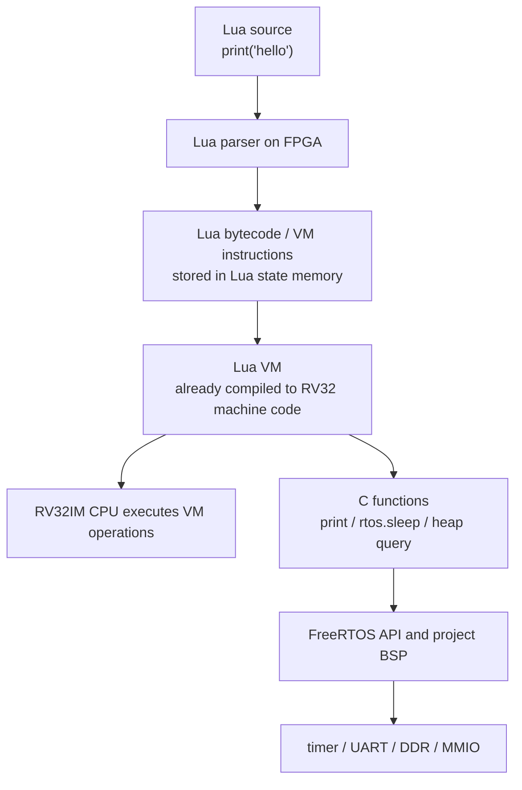
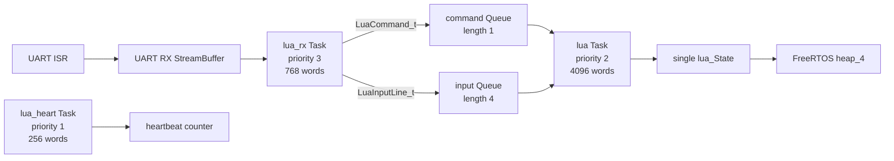

# Lua on FreeRTOS 架構

本專案的 Lua 不是作業系統，也不是把 Lua source 轉換成新的 RISC-V machine code。它是編進 `rtos_lua.mem` 的 Lua 5.4.8 parser、bytecode VM 與 C runtime；FreeRTOS 負責排程 Lua Task、UART RX Task 與 heartbeat Task，CPU 則執行早已由 RISC-V GCC 編譯完成的 Lua VM machine code。

主要入口位於 [`OS/rtos/src/main_lua.c`](../../OS/rtos/src/main_lua.c)。Lua/平台介面位於 [`lua_rtos_libs.c`](../../OS/rtos/src/lua_rtos_libs.c)、[`lua_rtos_port.c`](../../OS/rtos/src/lua_rtos_port.c) 與 [`lua_rtos_config.h`](../../OS/rtos/src/lua_rtos_config.h)。

## 1. 三層程式的關係



以 `1 + 1` 為例：

1. UART RX Task 收到字串 `1 + 1`。
2. Lua Task 先嘗試把它包成 `return 1 + 1`。
3. Lua parser 產生 VM 能執行的內部 instruction/bytecode。
4. Lua VM 的 RISC-V machine code逐步解譯這些 VM instructions。
5. CPU 執行加法與 VM 控制流程。
6. REPL 將結果印成 `=> 2`。

過程不會產生一段新的原生 RISC-V 加法程式，也不會呼叫外部 compiler。

## 2. `.bit`、`.mem` 與 `.lua`

| 產物 | 包含內容 | 何時更新 |
|---|---|---|
| FPGA `.bit` | CPU、Cache、DDR、UART、timer、MMIO 等硬體 | 修改 RTL/XDC/IP 後 |
| `rtos_lua.mem` | startup、FreeRTOS、driver、Lua VM、Lua C libraries、Lua application Tasks | 修改 C/Assembly/Lua VM port 後 |
| `.lua` | 使用者腳本原始碼 | 修改腳本功能後 |

必須先把 `rtos_lua.mem` 上傳一次，板上才有 Lua VM。之後只改 `.lua` 時，可以重複上傳腳本，不必重新編譯 `.mem`，也不必重建 FPGA bitstream。

完全斷電後 DDR 內容會消失，仍需重新燒錄／啟動必要硬體並上傳 `.mem`；腳本也要重新傳送，除非未來加入非揮發性儲存。

## 3. Firmware build 組成

```powershell
./tools/build_rtos_app.ps1 -App lua
```

Lua profile 額外編入：

- Lua 5.4.8 core/parser/VM。
- Base library。
- Coroutine library。
- Table library。
- UTF-8 library。
- 本專案精簡 `string` library。
- 本專案精簡 `math` library。
- 本專案 `rtos` library。
- UART script protocol 與 RTOS integration。

Compiler flags 包含：

```text
-DLUA_32BITS=1
-DNDEBUG
-include OS/rtos/src/lua_rtos_config.h
```

在 RV32 target 上，Lua 使用 32-bit integer 與 single-precision floating-point number 組態。這能降低 code/RAM 需求，但數值範圍與精度不同於一般 64-bit PC Lua；需要精確 64-bit 整數或 double 精度的演算法不能直接假設結果相同。

## 4. 刻意保留與移除的 Lua libraries

| Library | 狀態 | 說明 |
|---|---|---|
| Base | 有 | `print`、`assert`、`error`、`type`、`tonumber`、`pairs`、`pcall` 等 |
| Coroutine | 有 | Lua coroutine library；仍在同一個 Lua Task 中執行，不會自動變成 FreeRTOS Task |
| Table | 有 | table insert/remove/sort/concat 等目前編入版本提供的功能 |
| UTF-8 | 有 | Lua UTF-8 library |
| String | 精簡版 | 只提供本文件第 10 節列出的函式 |
| Math | 精簡版 | 只提供本文件第 10 節列出的函式 |
| `rtos` | 專案自訂 | tick、sleep、heap、UART input、reload 等 |
| IO | 無 | 沒有檔案系統與 `io.open()` |
| OS | 無 | 沒有 host process、environment、wall-clock OS API |
| Package | 無 | 沒有一般 `require()` module loader 或 filesystem search path |
| Debug | 無 | application 沒有公開完整 debug library |

因此 Lua 能做遊戲邏輯、文字互動、資料處理、狀態機與 RTOS 查詢，但目前不能直接讀檔、開 socket、啟動程序或載入任意外部 native module。

## 5. Task 架構



| Task | Priority | Stack | 角色 |
|---|---:|---:|---|
| `lua_rx` | 3 | 768 words = 3072 bytes | 解析 UART line editing、control header 與 script payload |
| `lua` | 2 | 4096 words = 16 KiB | 唯一操作主要 `lua_State`、compile/load/execute Lua |
| `lua_heart` | 1 | 256 words = 1024 bytes | 每 1000 ticks 增加 heartbeat |
| Timer service | 4 | 512 words | FreeRTOS 系統 Task；Lua profile本身未建立 software timer |
| Idle | 0 | 256 words | FreeRTOS idle/cleanup |

只有 Lua Task 操作主要 `lua_State`。RX Task 不直接呼叫 Lua parser/VM，而是透過 Queue 傳命令；這避免同一個 state 被兩個 FreeRTOS Task 同時存取。

## 6. Command Queue 與 input Queue

### Command Queue

Command Queue 長度為 1，item 包含：

- REPL 或完整 script 類型。
- source length。
- timeout milliseconds。
- instruction limit。

系統用 `lua_execution_busy` 與 phase 拒絕第二個同時執行的 script，因此目前是一個序列化 Lua service，不是同時執行多個 Lua program 的 VM pool。

### Input Queue

`rtos.read_line()` 等待互動輸入時，RX Task 會把完整行複製到長度 4 的 input Queue。`RTOS_LUA_INPUT_LINE_BYTES=128` 包含結尾 `\0`，所以每行最多127 bytes；超過限制時輸出 `LUA_INPUT_TOO_LONG`。

只有當 Lua 正在 running 且 `rtos.read_line()` 明確等待時，普通輸入行才會進 input Queue；否則 busy 期間普通行會得到：

```text
LUA_BUSY use @lua stop or @lua status
```

## 7. Lua state 與 heap

Lua 使用 `luaL_newstate()` 建立一個 state。Lua allocator 經本專案 mini libc 的 `malloc/realloc/free`，最後使用 FreeRTOS `heap_4` 的 2 MiB heap。

Script source buffer 第一次需要時以：

```text
LUA_SCRIPT_MAX_BYTES + 1 = 65537 bytes
```

動態配置，之後重複使用。Script 執行完會執行 full garbage collection，但不會銷毀並重建整個 `lua_State`。

這代表：

- REPL 與後續 script 共享同一個 global environment。
- Script 建立的 global variable 可能在下一次執行仍存在。
- Local variable 在 chunk 結束後若沒有其他 reference，才可由 GC 回收。
- Full GC 不等於清除所有 globals。

若需要每份 script 完全隔離，未來要為每次執行建立新 state、清理 environment，或明確建立 sandbox table。

## 8. 啟動 self-test

Lua Task 建立 state 後，不會立刻輸出 READY，而是依序執行：

1. Script protocol parser 與 CRC32 test。
2. Table、loop、string、math、heap 與 `print` boot script。
3. REPL statement path test。
4. REPL error recovery後的第二次執行測試。

成功 marker：

```text
LUA_SCRIPT_PROTOCOL_PASS
LUA_FLOAT_PASS
LUA_SELFTEST_PASS
LUA_REPL_RECOVERY_PASS
LUA_VERSION Lua 5.4
LUA_HEAP_READY free=... min=...
LUA_RTOS_READY
lua>
```

Runner 對 Lua 使用較長的 60-second target timeout，因為 parser、floating-point、allocator 與 recovery self-test 在 50 MHz 實板上比一般 Console 啟動慢。

## 9. REPL 執行路徑

輸入：

```text
6 * 7
```

Lua Task 先嘗試：

```lua
return 6 * 7
```

若 load 成功，結果會顯示：

```text
=> 42
```

若 expression load 失敗，會丟棄該 syntax error，再以原始內容作 statement chunk：

```lua
local x = 10; print(x)
```

因此 REPL 同時支援 expression 與單行 statement。單次 REPL 最長 383 bytes，預設 timeout 5000 ms、instruction limit 1,000,000。

## 10. 目前可用的精簡 libraries

### `string`

```text
string.len
string.sub
string.upper
string.lower
string.reverse
string.rep
string.byte
string.char
```

String method 語法也可使用：

```lua
print(("fpga"):upper())
```

### `math`

```text
math.abs
math.floor
math.ceil
math.sqrt
math.min
math.max
math.pi
```

這不是標準 Lua math/string library 的完整集合。移植 PC 腳本時，應先查腳本是否使用未編入的函式，例如 pattern matching、trigonometric functions 或 random。

## 11. `rtos` library

| Lua API | 回傳／作用 |
|---|---|
| `rtos.tick()` | 回傳目前 FreeRTOS tick |
| `rtos.heap_free()` | 回傳目前可用 heap bytes |
| `rtos.heap_min()` | 回傳啟動以來最低可用 heap bytes |
| `rtos.tasks()` | 回傳目前 Task 數量 |
| `rtos.heartbeat()` | 回傳 Lua heartbeat count |
| `rtos.irq_count()` | 回傳 UART RX interrupt count |
| `rtos.sleep(ms)` | block Lua Task 0..60000 ms；每 50 ms 檢查 stop/timeout |
| `rtos.read_line([timeout_ms])` | 等待輸入行；預設 30000 ms，範圍 0..60000 |
| `rtos.ping()` | UART 印出 PONG 並回傳 tick |
| `rtos.status()` | UART 印出 tick/heap/heartbeat/IRQ |
| `rtos.reload()` | 要求硬體回到 UART bootloader；不返回 Lua |
| `rtos.platform` | 字串 `FreeRTOS RV32 Platform v1` |

`rtos.sleep()` 會呼叫 `vTaskDelay()`，因此 Lua Task 不占用 CPU，RX 與 heartbeat Task 可以繼續執行。這是 Lua 與 FreeRTOS 直接整合的例子。

`rtos.read_line()` timeout 時回傳兩個值：

```lua
local text, reason = rtos.read_line(5000)
if text == nil then
    print(reason) -- "timeout"
end
```

## 12. Execution guard

每次 REPL/script 都在 `lua_pcall()` 外加 guard。Lua hook 每 100 個 VM instructions 檢查：

- Host/使用者是否送出 stop。
- FreeRTOS tick 是否到達 deadline。
- Instruction count 是否達到上限。

Script tool 預設：

```text
timeout          = 10,000 ms
instruction limit = 2,000,000
```

Target 接受範圍：

```text
timeout          = 1..600,000 ms
instruction limit = 100..100,000,000
```

終止 marker：

```text
LUA_SCRIPT_STOPPED
LUA_SCRIPT_TIMEOUT
LUA_SCRIPT_LIMIT
```

Guard 不是硬體 sandbox：

- Hook 只能在 VM 回到可檢查點時介入。
- 有問題的 native C function 若永久不返回，Lua instruction hook 無法中斷它。
- Lua 與其他 Tasks 共用同一個 CPU、address space 與 FreeRTOS heap。
- 沒有 MMU/PMP 把 Lua memory 與 kernel memory作硬體隔離。

目前公開給 Lua 的 C functions 都是受限且有界的設計，`rtos.sleep/read_line` 也會分段檢查 abort。

## 13. UART line editor

Lua REPL 支援：

- Left／Right。
- Home／End。
- Backspace。
- Delete 的 ANSI `ESC [ 3 ~`。
- 在游標位置插入字元。

Up／Down 與未支援 CSI keys 會被完整吃掉，不會把尾端的 `A/B` 等字元加入命令。這正是 Lua REPL 不再出現方向鍵變成 `k`、`[` 或其他符號的原因。

目前沒有 command history；Up／Down 只會被忽略。

## 14. Coroutine 不等於 FreeRTOS Task

Lua coroutine 是 Lua VM 內部的 cooperative execution context。它：

- 仍由同一個 `lua` FreeRTOS Task 執行。
- 不會取得獨立 FreeRTOS priority。
- 不會因 `coroutine.create()` 自動在另一顆 CPU 或另一個 Task 上平行執行。
- Lua Task 被 preempt 時，所有 coroutine 都一起停止執行。

若需要真正與 UART RX、其他 driver 或 worker 以 FreeRTOS priority 並行，應在 C application 建立新的 FreeRTOS Task，再透過 Queue/notification 與 Lua Task 溝通。

## 15. 錯誤恢復

Syntax/runtime error 由 `lua_pcall()` 捕捉，輸出：

```text
LUA_ERROR ...
LUA_SCRIPT_ERROR ...
```

之後清空 Lua value stack、恢復 idle phase 並重新顯示 prompt。正常的 Lua error 不應讓 FreeRTOS 或 VM firmware 整體停止。

下列則是 fatal：

```text
[LUA] FATAL ...
[LUA] PANIC ...
[LUA] abort
[RTOS] exception ...
```

Fatal path 會關閉 interrupt並停止，通常代表 state 建立失敗、未保護的 Lua panic、C runtime abort 或 CPU/RTOS exception，不只是使用者腳本語法錯誤。

## 16. 目前邊界

- 同一時間只執行一個 REPL chunk 或 script。
- 一個共享的 `lua_State`，沒有不同使用者／script 隔離。
- 沒有檔案系統、網路、package loader 或持久化 script。
- Lua number 是 single precision；大型整數與精密浮點計算需特別驗證。
- Lua source 最大 65536 bytes。
- Script 執行速度是 interpreted VM，不等於原生 C workload。
- Lua API 只暴露目前 `rtos` library 中列出的安全介面，尚未加入 VGA、GPIO 或任意 MMIO。

腳本的實際上傳方法見 [LUA_SCRIPT_UPLOAD.md](LUA_SCRIPT_UPLOAD.md)，可直接使用的範例見 [LUA_APP_EXAMPLES.md](LUA_APP_EXAMPLES.md)。
