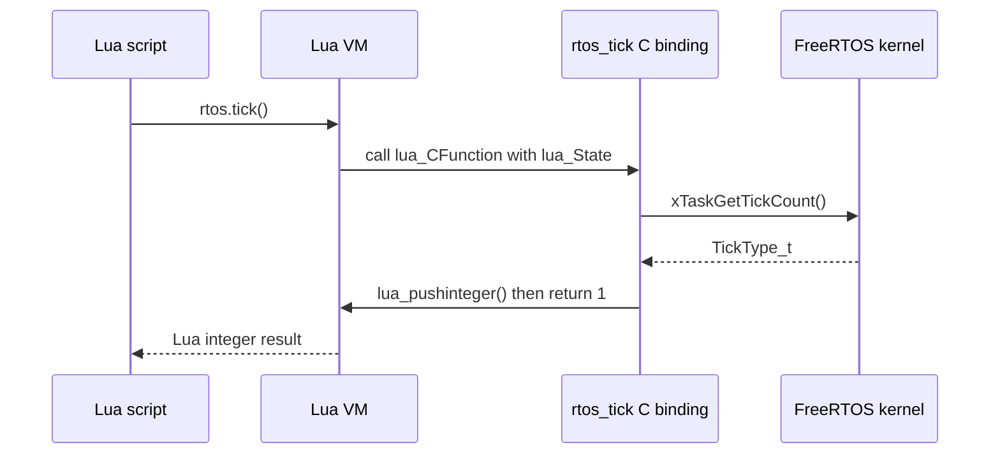
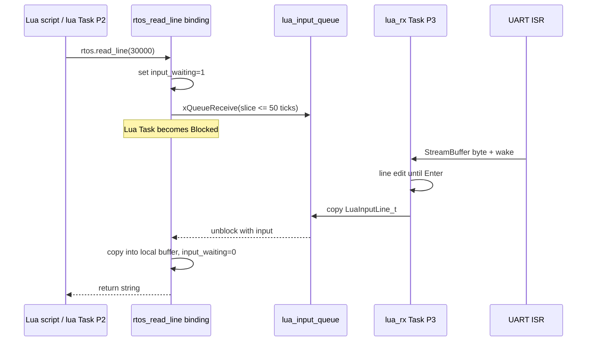
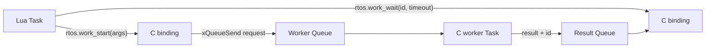

# Lua 與 FreeRTOS Bridge

本文件專門說明 Lua script 呼叫 `rtos.*` 時，Lua VM、C binding、FreeRTOS API與硬體之間如何傳遞參數、結果、blocking與錯誤。它也說明未來應如何安全新增 Lua API，而不是讓 Lua直接任意操作kernel或MMIO。

## 1. Bridge 在哪裡

| 檔案 | 責任 |
|---|---|
| [`main_lua.c`](../../OS/rtos/src/main_lua.c) | 建立Tasks/Queues/state、REPL、script protocol、execution guard |
| [`lua_rtos_libs.c`](../../OS/rtos/src/lua_rtos_libs.c) | 精簡string/math與`rtos` Lua C functions |
| [`lua_rtos_port.c`](../../OS/rtos/src/lua_rtos_port.c) | 數字轉換、UART輸出、float helpers、seed、C runtime adaptation |
| [`lua_rtos_config.h`](../../OS/rtos/src/lua_rtos_config.h) | 將Lua platform macros導向RTOS port，setjmp/longjmp等 |
| [`minilibc.c`](../../OS/rtos/src/minilibc.c) | `malloc/calloc/realloc/free`到FreeRTOS heap |
| [`uart.c`](../../OS/rtos/src/uart.c) | ISR-to-Task RX StreamBuffer與UART TX |
| [`board_control.c`](../../OS/rtos/src/board_control.c) | image reload MMIO |

## 2. Lua C function ABI

Lua C function形式：

```c
static int rtos_tick(lua_State *state)
{
    lua_pushinteger(state, (lua_Integer)xTaskGetTickCount());
    return 1;
}
```

規則：

- Lua arguments位於Lua stack index 1..N。
- C function用`luaL_check...()`驗證/取得參數。
- 結果用`lua_push...()`放回Lua stack。
- C return value是「回傳給Lua的結果個數」，不是一般status code。
- `return 0`表示Lua呼叫沒有回傳值。
- `luaL_error()`會longjmp回受保護的`lua_pcall()`，不是普通C return。

註冊表：

```c
static const luaL_Reg rtos_functions[] = {
    { "tick", rtos_tick },
    { "sleep", rtos_sleep },
    /* ... */
    { NULL, NULL }
};
```

`luaopen_rtos()`用`luaL_newlib()`建立table，因此Lua看到：

```lua
rtos.tick()
rtos.sleep(1000)
```

## 3. `rtos.tick()` 完整路徑



此API只讀kernel變數，不會block或context switch。

## 4. `rtos.sleep(ms)` 如何讓出CPU

Binding先做：

```c
lua_Integer milliseconds = luaL_checkinteger(state, 1);
luaL_argcheck(state,
    milliseconds >= 0 && milliseconds <= 60000,
    1,
    "expected 0..60000");
```

再分成最多50 ticks的slices：

```text
remaining=1100
  vTaskDelay(50) -> Lua Task Blocked
  wake/check abort
  ...
  final 50
```

分段原因：

- FreeRTOS可在Lua Task blocked期間排程RX與heartbeat。
- 每50 ms檢查stop與整體execution timeout。
- `@lua stop`不必等完整60-second sleep才生效。

`rtos.sleep()`不是建立software timer，也不是啟動另一個Lua coroutine；它block目前Lua FreeRTOS Task。

## 5. `rtos.read_line()` 的雙Task橋接



RX Task只把普通行送到input Queue，條件是：

```text
execution_busy == 1
input_waiting == 1
phase == running
```

Control line `@lua status/stop`仍優先被RX Task解析，不會被當成遊戲答案。

## 6. `rtos.status()` 與UART

`rtos.status()`直接從Lua Task呼叫polling UART functions，依序輸出tick、heap、heartbeat與IRQ。它沒有建立logger Task，也不經Queue。

這對低頻診斷很簡單，但新binding不應在高頻loop輸出大量資料。若Lua每毫秒呼叫一次長log，Lua Task會大量占用CPU/UART，還可能使RX更容易overrun。

## 7. `print()` 不等於RTOS API

`print()`來自Lua base library。Base library最後使用Lua平台macro：

```c
#define lua_writestring(s, l) rtos_lua_writestring((s), (l))
#define lua_writeline()       rtos_lua_writeline()
```

`rtos_lua_writestring()`再呼叫UART driver。因此：

```text
Lua print
  -> base library
  -> Lua platform output macro
  -> lua_rtos_port.c
  -> rtos_uart_putc/write
  -> UART MMIO
```

Lua可以print是因VM firmware內已經提供這條C bridge，不是Lua source被轉成C後才得到UART功能。

## 8. Memory allocator bridge

Lua core需要allocator建立state、table、string、closure與bytecode structures。Build中的流程：

```text
Lua lmem/lstate
  -> realloc()/free()
  -> project minilibc.c
  -> pvPortMalloc()/vPortFree()
  -> heap_4
  -> ucHeap[2 MiB]
```

`realloc()`會配置新block、複製舊資料、釋放舊block。這使Lua與C dynamic objects共享FreeRTOS heap。

新binding若需要temporary buffer：

- 小而有界可放Lua Task stack，但要考慮16 KiB stack與call depth。
- 大型/變長buffer用heap，必須檢查NULL並釋放。
- 最好用Lua userdata/string/table讓Lua GC管理，避免C pointer lifetime不清楚。
- 不可在ISR中操作Lua allocator。

## 9. Error bridge

Argument錯誤：

```c
luaL_argcheck(state, valid, 1, "expected 0..60000");
```

Runtime bridge錯誤：

```c
return luaL_error(state, "device timeout");
```

這些會被外層`lua_pcall()`捕捉，轉成`LUA_ERROR`或`LUA_SCRIPT_ERROR`並回prompt。

不要在可恢復的device timeout裡呼叫`taskDISABLE_INTERRUPTS()`或進fatal loop。Fatal只留給state/Queue/init不可能繼續的錯誤。

## 10. Execution guard 如何跨過binding

Lua instruction hook每100個VM instructions檢查stop/timeout/limit。但VM進入C binding後，hook不會在C function內自動執行。

所以可能blocking的binding必須自己合作：

```c
while (remaining != 0u) {
    if (rtos_lua_execution_should_abort()) {
        return luaL_error(state, "execution interrupted");
    }
    vTaskDelay(short_slice);
}
```

設計要求：

- Polling loop有明確上限。
- Blocking切成短slices並檢查abort。
- 不呼叫`portMAX_DELAY`後永遠沒有stop路徑。
- CPU-heavy C function自己定期檢查abort或限制input size。

否則script即使送`@lua stop`也可能卡在C binding內無法返回VM hook。

## 11. Thread safety 與 `lua_State` ownership

Lua C API不是因為用了FreeRTOS就自動thread-safe。目前規則是：

```text
只有lua Task可以呼叫主要lua_State的Lua C API
```

RX Task只操作plain C buffers、flags與Queues。ISR只操作UART StreamBuffer/counters。

禁止：

- ISR呼叫`lua_push...()`。
- Worker Task直接對相同state執行`lua_pcall()`。
- Timer callback改Lua globals。
- 另一Task在Lua Task執行時觸碰Lua stack。

若background Task有結果，應Queue回Lua Task，再由Lua Task將結果push到state。

## 12. 新增簡單只讀API

例如加入`rtos.uptime_seconds()`：

```c
static int rtos_uptime_seconds(lua_State *state)
{
    TickType_t ticks = xTaskGetTickCount();
    lua_pushinteger(
        state,
        (lua_Integer)(ticks / configTICK_RATE_HZ)
    );
    return 1;
}
```

在table加入：

```c
{ "uptime_seconds", rtos_uptime_seconds },
```

Lua：

```lua
print(rtos.uptime_seconds())
```

修改後必須重新build/upload `rtos_lua.mem`，因binding是C machine code的一部分；只改呼叫它的`.lua`才不需重建firmware。

## 13. 新增有參數API

例如受限整數計算：

```c
static int rtos_clamp(lua_State *state)
{
    lua_Integer value = luaL_checkinteger(state, 1);
    lua_Integer low = luaL_checkinteger(state, 2);
    lua_Integer high = luaL_checkinteger(state, 3);

    luaL_argcheck(state, low <= high, 2, "low must be <= high");
    if (value < low) value = low;
    if (value > high) value = high;
    lua_pushinteger(state, value);
    return 1;
}
```

Binding應先驗證所有range，才接觸hardware/heap。不要把Lua integer未檢查就cast成MMIO address、buffer length或Task priority。

## 14. 新增非同步worker bridge

若功能需要長時間C計算或driver等待，不要在binding中直接做完。推薦：



設計細節：

- Worker在`main_lua.c`啟動時建立，不從Lua任意create Task。
- Request/Result使用值copy或明確buffer ownership。
- `work_start` nonblocking或有限timeout，回傳request ID。
- `work_wait`分段等待並檢查Lua abort。
- Worker永遠不碰`lua_State`。
- Script stop時定義queued/running job是否取消、完成後result如何處理。

這比直接暴露`xTaskCreate()`給Lua更安全，也容易控制stack、priority與resource上限。

## 15. 為何不直接暴露全部FreeRTOS API

若Lua可任意：

- 選priority與stack size建立Task。
- 建立無上限Queue/timer。
- 傳raw C pointer。
- 進critical section後不退出。
- 寫任意MMIO address。

就可能造成heap耗盡、starvation、deadlock、memory corruption或整板失去回應。Lua的價值是快速調整高階邏輯，不是繞過embedded resource design。

Bridge應提供domain API，例如：

```text
display.draw_text(x, y, text)
sensor.read()
job.submit(value)
job.wait(id, timeout)
```

而不是直接提供：

```text
mmio.write(any_address, any_value)
rtos.create_task(any_pointer, any_stack, any_priority)
```

## 16. Driver/ISR橋接到Lua

外部event到Lua的安全路徑：

```text
hardware IRQ
  -> ISR read/ack
  -> FromISR Queue/notification
  -> C service Task處理與buffer
  -> Lua Task在binding中poll/wait service result
  -> Lua callback/policy在Lua Task內執行
```

不要從ISR直接「回呼Lua function」。ISR context、Lua allocator、longjmp/error與state ownership都不相容。

## 17. Binding API設計規格

每個新增API應在文件中定義：

| 項目 | 內容 |
|---|---|
| Lua名稱 | 例如`device.read(timeout_ms)` |
| Arguments | 型別、範圍、optional/default |
| Returns | 成功/timeout/error的確切values |
| Blocking | 最長多久、是否讓出CPU |
| Abort | Script stop/timeout何時生效 |
| Memory | 最大allocation與ownership |
| Concurrency | 哪個Task擁有driver/state |
| Hardware | 使用哪些MMIO/IRQ |
| Errors | `nil, reason`或Lua exception |
| Test markers | 可自動probe的success/failure marker |

## 18. `nil, reason` 與 exception 的選擇

可預期的結果，例如input timeout：

```lua
local line, reason = rtos.read_line(1000)
if line == nil then
    -- reason == "timeout"
end
```

Argument programmer error或execution被中斷則用Lua error：

```text
rtos.sleep(-1) -> argument error
script stop during read_line -> execution interrupted error + STOPPED marker
```

一致原則：正常運行中可處理的狀態用return values；違反API contract或整個execution guard事件用exception。

## 19. 新binding測試層次

1. C/unit層：argument/range/helper函式。
2. Lua boot self-test：最小成功path，失敗則不宣布READY。
3. REPL probe：正常回傳與錯誤後recovery。
4. Script probe：multiline、timeout、stop、large input。
5. Driver/board probe：實際IRQ/MMIO path。
6. Long-run：反覆呼叫後heap minimum、stack watermark與drop counters。

Self-test只放快速、deterministic且不依使用者輸入的檢查；大型/破壞性測試留在probe。

## 20. Bridge安全檢查表

- 只有Lua Task操作`lua_State`。
- 所有Lua參數先做type/range檢查。
- 不把Lua數值直接當pointer/MMIO address。
- Blocking有timeout、slice與abort check。
- ISR只送event/data，不呼叫Lua。
- Dynamic memory有最大值、NULL path與清理。
- Worker與Lua之間有明確ownership。
- Stop後queued/result state能恢復。
- API不允許script任意破壞scheduler priority/critical state。
- 正常錯誤回prompt，fatal才停止firmware。
- 修改C binding後重新build/upload Lua `.mem`。
