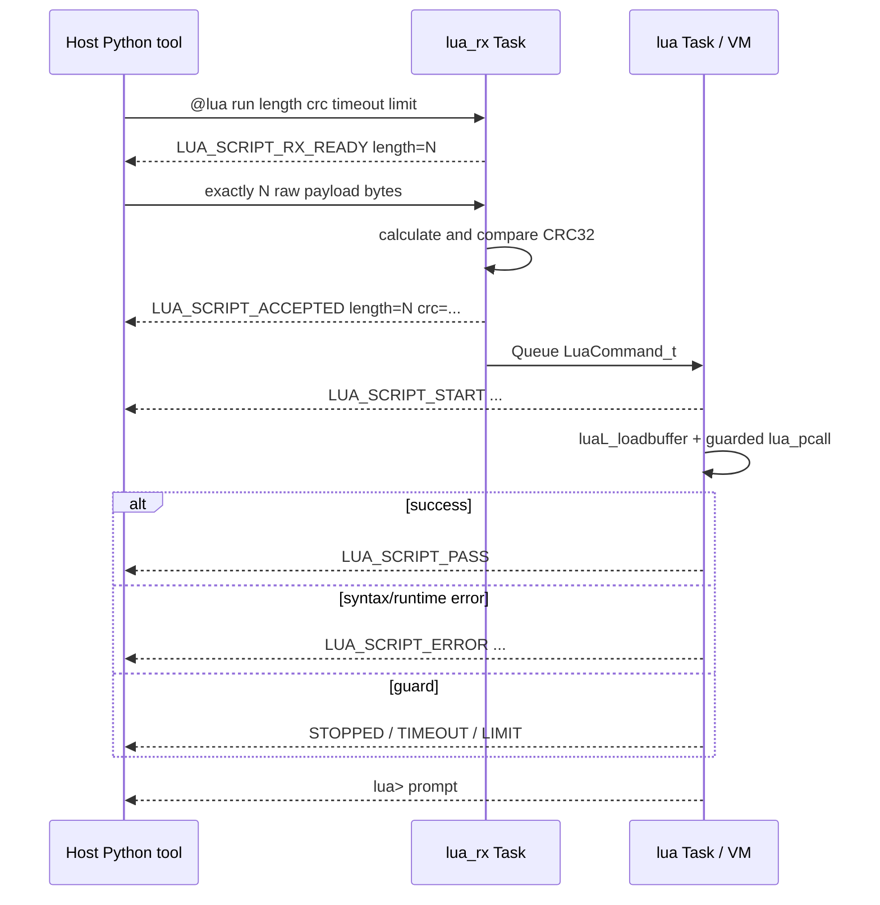
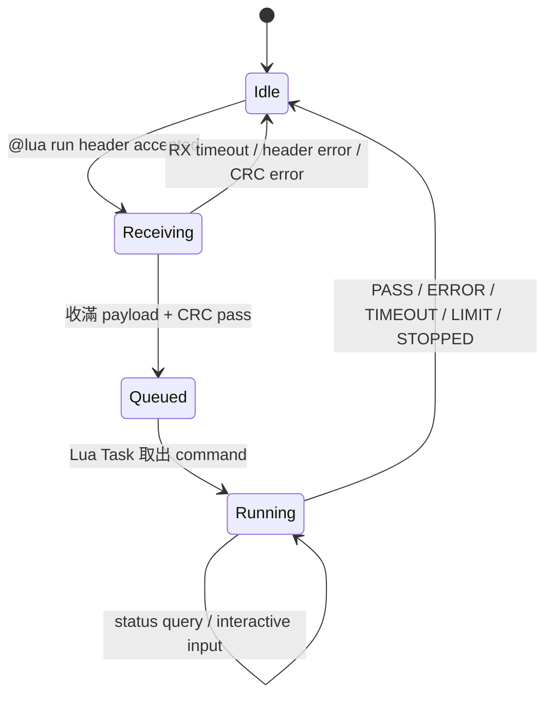

# Lua Script UART 上傳與執行

[`tools/run_lua_script.py`](../../tools/run_lua_script.py) 會把 PC 上的 `.lua` 原始碼透過 UART 傳給已經在 FPGA 上執行的 Lua/FreeRTOS firmware。它不會重新編譯 RTOS `.mem`，也不會把 Lua 轉成 RISC-V machine code；板上的 Lua VM 會接收、檢查、解析並執行腳本。

Lua runtime 架構與限制請先看 [LUA_ARCHITECTURE.md](LUA_ARCHITECTURE.md)。

## 1. 使用前提

先啟動 Lua profile：

```powershell
cd C:/cpu_design
./tools/run_rtos_app.ps1 -Port COM5 -App lua
```

等待：

```text
LUA_SCRIPT_PROTOCOL_PASS
LUA_SELFTEST_PASS
LUA_RTOS_READY
lua>
```

接著按 `Ctrl+C` 關閉 PC 端 runner monitor。這只釋放 COM port，不會停止 FPGA 上的 CPU、FreeRTOS 或 Lua VM。

如果不關閉 monitor，新的 Python process 通常會得到：

```text
Access is denied
PermissionError
COM5 is busy
```

同一時間只能有一個程式開啟同一個 COM port。

## 2. 最基本的上傳命令

```powershell
python ./tools/run_lua_script.py `
  --port COM5 `
  --file ./lua_apps/hello.lua
```

成功流程會看到類似：

```text
LUA_SCRIPT_RX_READY length=136
LUA_SCRIPT_ACCEPTED length=136 crc=0x........
LUA_SCRIPT_START length=136 timeout_ms=10000 instructions=2000000
SCRIPT_HELLO
Lua version Lua 5.4
tick ...
tasks ...
SCRIPT_HELLO_DONE
LUA_SCRIPT_PASS
lua>
```

Host tool 最後在 stderr 顯示：

```text
[LUA SCRIPT] PASS
```

## 3. 命令列參數

| 參數 | 預設 | 作用 |
|---|---:|---|
| `--port` | 必填 | Windows COM port，例如 `COM5` |
| `--baud` | 115200 | UART baud；需與硬體一致 |
| `--file` | 與 stop/status 三選一 | 要傳送的 Lua source file |
| `--stop` | 關閉 | 要求停止目前執行的 script |
| `--status` | 關閉 | 查詢 Lua script service 狀態 |
| `--timeout-ms` | 10000 | 板上 execution deadline；1..600000 ms |
| `--instruction-limit` | 2000000 | Lua VM instruction 上限；100..100000000 |
| `--detach` | 關閉 | 收到 script start 後立即關閉工具，不等待結果 |
| `--interactive` | 關閉 | Script 執行時轉送鍵盤輸入，供 `rtos.read_line()` 使用 |
| `--result-timeout` | execution timeout + 5 s | Host 等 final marker 的 wall-clock 上限 |
| `--char-delay` | 0.002 s | Control line 每個 byte 間的 delay |
| `--chunk-size` | 64 bytes | Payload 每次 UART write 的 chunk |
| `--chunk-delay` | 0.001 s | Payload chunks 間的 delay |

`--timeout-ms` 是 target 內由 FreeRTOS tick判斷的 script deadline；`--result-timeout` 是 PC 工具等待 UART marker 的時間。兩者不是同一個 timeout。

## 4. 上傳協定

Host 先計算 script bytes 的 CRC32，再送出 ASCII control line：

```text
@lua run <length> <crc32_hex> <timeout_ms> <instruction_limit>\r\n
```

例如 payload 是 ASCII `abc`：

```text
@lua run 3 352441C2 1000 10000
```

使用的是一般 CRC-32/IEEE 演算法：initial `0xFFFFFFFF`、reflected polynomial `0xEDB88320`、最後 XOR `0xFFFFFFFF`。Python 端使用 `zlib.crc32()`，target 端由 [`lua_script_protocol.c`](../../OS/rtos/src/lua_script_protocol.c) 重新計算。

完整時序：



Host 必須等 `LUA_SCRIPT_RX_READY` 才送 payload。這避免 header 還沒處理完成時大量 bytes 直接灌入 UART software buffer。

## 5. CRC 是何時計算

CRC 與 RTOS `.mem` 上傳的 image CRC 是兩個不同層次：

- Lua tool 讀取 `.lua` 檔時，在 PC 上對**準備傳送的 script bytes**計算一次。
- Target 收滿宣告的 length 後，在 FPGA/CPU 上從 `lua_source_buffer` 再計算一次。
- 兩者相同才輸出 `LUA_SCRIPT_ACCEPTED`。

它不是在 C firmware 編譯時固定寫入；每次執行 `run_lua_script.py --file ...` 都會依當下檔案內容重新計算。

CRC 能偵測 payload 傳輸錯誤，但不是加密、簽章或身份驗證。任何能使用 UART 的程式都能製作合法 CRC。

## 6. Payload 大小與接收 timeout

最大 source bytes：

```text
65536 bytes
```

這是實際檔案 byte 數，不是 Unicode 字元數或 Lua line 數。Tool 會只讀 `MAX+1` bytes，超出時在 PC 端直接拒絕。

Target 進入 receiving phase 後，每收到一個 payload byte就延長 2000 ms idle deadline。如果兩個 byte 之間超過約 2 秒，會輸出：

```text
LUA_SCRIPT_RX_TIMEOUT
```

此 timeout 用來從傳送程序中途終止、USB-UART 斷線或 host crash 中恢復。正常 pacing 不會接近這個上限。

## 7. Pacing 與 UART 不穩定

預設 control line 逐 byte 傳送，每 byte delay 2 ms；payload 以 64-byte chunks 傳送，每 chunk delay 1 ms。這是考量目前 UART hardware 只有 1-byte RX holding register，而 ISR 後方 software StreamBuffer 也有限。

若看到：

```text
[LUA] UART_RX_OVERRUN
LUA_SCRIPT_CRC_ERROR
LUA_SCRIPT_RX_TIMEOUT
```

可降低傳輸壓力：

```powershell
python ./tools/run_lua_script.py `
  --port COM5 `
  --file ./lua_apps/hello.lua `
  --char-delay 0.004 `
  --chunk-size 16 `
  --chunk-delay 0.004
```

調整方向：

- 增加 `--char-delay`：讓 control line 更保守。
- 減少 `--chunk-size`：每次寫入較少 payload。
- 增加 `--chunk-delay`：讓 ISR/RX Task 有更多時間清空 buffer。

工具目前不會自動 retry Lua payload；CRC failure 後可直接重新執行同一命令。

## 8. Execution timeout 與 instruction limit

較長的合法腳本可提高限制：

```powershell
python ./tools/run_lua_script.py `
  --port COM5 `
  --file ./lua_apps/system_monitor.lua `
  --timeout-ms 30000 `
  --instruction-limit 5000000
```

兩種限制用途不同：

- Timeout 限制從開始執行到結束的 FreeRTOS tick 時間，`rtos.sleep()` 與等待輸入也包含在內。
- Instruction limit 限制 Lua VM 執行工作量，可攔截沒有 sleep 的 tight loop。

例如：

```lua
while true do end
```

可能依較早到達的條件得到：

```text
LUA_SCRIPT_TIMEOUT
```

或：

```text
LUA_SCRIPT_LIMIT
```

不要只為了讓未知腳本「跑得過」而把兩者都設到最大；應先確認演算法有界，再配置合理上限。

## 9. Interactive script

使用 `rtos.read_line()` 的腳本需要把鍵盤輸入交給同一個上傳工具：

```powershell
python ./tools/run_lua_script.py `
  --port COM5 `
  --file ./lua_apps/guess_number.lua `
  --interactive `
  --timeout-ms 600000 `
  --instruction-limit 5000000
```

Tool 收到 `LUA_SCRIPT_START` 後繼續占用 COM port，將鍵盤送給板子並同步顯示 UART output。

Windows terminal 的 Left、Right、Home、End、Backspace 與 Delete 會經 [`uart_keys.py`](../../tools/uart_keys.py) 轉為 UART escape sequences。Input line 完成後由 RX Task 放入 Lua input Queue。

在 interactive session 按 `Ctrl+C` 時，工具不只結束自己，還會先送：

```text
@lua stop
```

然後等待 `LUA_SCRIPT_STOPPED`、timeout 或 limit marker。

## 10. Detach、status 與 stop

### Detach

```powershell
python ./tools/run_lua_script.py `
  --port COM5 `
  --file ./lua_apps/stop_test.lua `
  --timeout-ms 60000 `
  --instruction-limit 100000000 `
  --detach
```

收到 `LUA_SCRIPT_START` 後工具退出，script 仍在 FPGA 上執行。

### Status

```powershell
python ./tools/run_lua_script.py --port COM5 --status
```

回傳形式：

```text
LUA_SCRIPT_STATUS ready=1 busy=1 input_waiting=0 phase=running heartbeat=...
```

| Phase | 意義 |
|---|---|
| `idle` | 可接受 REPL 或新 script |
| `receiving` | 已接受 header，正在收 raw payload |
| `queued` | Payload 已驗證，等待 Lua Task 取命令 |
| `running` | Lua parser/VM 正在執行 chunk |



`--detach` 只讓 PC 工具在 `Running` 開始後離開，不會把板上狀態改回 `Idle`；稍後可以重新開 COM 用 `--status` 或 `--stop` 查詢與控制。

### Stop

```powershell
python ./tools/run_lua_script.py --port COM5 --stop
```

Busy 時先回：

```text
LUA_SCRIPT_STOP_REQUESTED
```

Lua execution hook 或可中斷的 `rtos.sleep/read_line` 看到 flag 後回：

```text
LUA_SCRIPT_STOPPED
```

若 service 已 idle，回傳：

```text
LUA_SCRIPT_IDLE
```

## 11. Final markers 與 exit code

| Target marker | Host 結果 |
|---|---|
| `LUA_SCRIPT_PASS` | exit code 0 |
| `LUA_SCRIPT_START` 且 `--detach` | exit code 0 |
| `LUA_SCRIPT_ERROR` | exit code 1 |
| `LUA_SCRIPT_STOPPED` | 一般 file run 視為非 PASS；`--stop` 操作本身成功 |
| `LUA_SCRIPT_TIMEOUT` | exit code 1 |
| `LUA_SCRIPT_LIMIT` | exit code 1 |
| Host serial/marker timeout | exit code 2 |
| Fatal marker | exit code 2 |

PowerShell 可查看：

```powershell
$LASTEXITCODE
```

不要只搜尋腳本自己印出的 `PASS` 字串；自動化應等待 protocol final marker `LUA_SCRIPT_PASS`。

## 12. 常見錯誤

### `LUA_SCRIPT_NOT_READY`

Lua boot self-test 尚未完成。等待 `LUA_RTOS_READY` 後重試。

### `LUA_SCRIPT_BUSY`

另一份 REPL/script 正在 receiving、queued 或 running。先查：

```powershell
python ./tools/run_lua_script.py --port COM5 --status
```

必要時送 `--stop`。

### `LUA_SCRIPT_HEADER_ERROR`

Control line 格式、數字範圍或 CRC hex 格式不合法。一般使用官方工具不需要手動組 header。

### `LUA_SCRIPT_CRC_ERROR`

Target 收到的 bytes 與 PC 計算內容不同。降低 pacing、確認 COM port/baud，然後重傳。

### `LUA_SCRIPT_RX_TIMEOUT`

Payload 中途停超過約 2 秒。確認 Python process 沒被暫停，或重傳。

### `LUA_SCRIPT_ALLOC_ERROR`

無法配置 65537-byte source buffer，通常是 FreeRTOS heap 不足或已破壞。先查 `rtos.heap_free()`／`rtos.status()`，若 runtime 不穩定則重新上傳 Lua firmware。

### `LUA_SCRIPT_QUEUE_ERROR`

Command Queue 無法接受已驗證的 script。正常 busy gate 應避免此情況；若出現，代表狀態／Queue 不一致，應保存輸出並重新啟動 runtime。

### `LUA_SCRIPT_ERROR`

Lua syntax 或 runtime error。VM 應回到 `lua>`，修正腳本後可直接重傳，不必重啟 FreeRTOS。

## 13. 手動 protocol 指令

可在 terminal 直接輸入：

```text
@lua status
@lua stop
reload
```

不建議手動上傳 `@lua run`，因為後面必須緊接精確 length 的 raw bytes，且 CRC 必須完全匹配；使用 Python tool 更可靠。

`reload` 會讓目前 Lua firmware離開並回到 bootloader。只想停止 script 時應用 `@lua stop`，不要用 `reload`。

## 14. 自動測試

Host-only unit tests，不需要板子：

```powershell
python -m unittest tools.test_lua_script_tool
```

它驗證 CRC vector、control line、ready/accepted/start/final handshake、detach、interactive forwarding、stop 與 oversize rejection。

Lua firmware 已在板上執行時，可跑完整 script service probe：

```powershell
python ./tools/rtos_lua_script_probe.py --port COM5
```

它涵蓋：

- Multiline script。
- Sleep 與 heartbeat。
- Bad CRC。
- Syntax/runtime error 與 recovery。
- Timeout guard。
- Instruction guard。
- Detach + external stop。
- Large script；預設 4096 bytes，可調到 65536。
- 最終 status 回到 idle。

互動遊戲 probe：

```powershell
python ./tools/rtos_lua_game_probe.py --port COM5
```

它注入固定答案 7，驗證 invalid、low、high、win 與執行後恢復。
