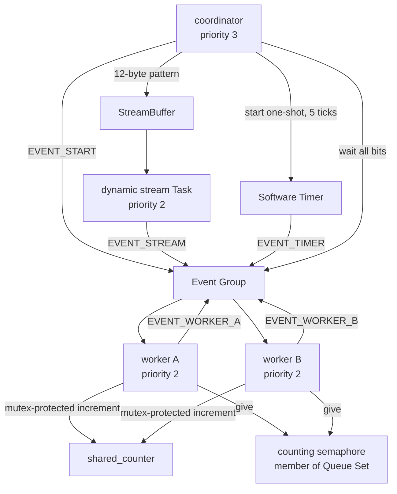

# RTOS Platform 綜合自測 Application

`platform` profile 是 FreeRTOS 移植完成後的綜合自測 firmware。它的目的不是提供一般使用者功能，而是在同一個實際執行流程中驗證 heap、同步物件、Task 狀態、UART interrupt 與 runtime diagnostics。

主要實作位於 [`OS/rtos/src/main_platform.c`](../../OS/rtos/src/main_platform.c)。若 Platform 通過，表示這些功能在目前 CPU／RTL／FreeRTOS 組合上可以共同運作；它仍不是形式驗證，也不代表所有參數、競爭條件與長時間負載都已涵蓋。

## 1. 何時應執行 Platform

建議在下列情況執行：

- 修改 trap、context switch、timer 或 interrupt RTL 後。
- 更換 FreeRTOS kernel／RISC-V port 版本後。
- 修改 heap、linker script、UART driver 或 FreeRTOSConfig 後。
- 移植較大型 C/C++ 軟體或 Lua 前。
- 實板偶爾出現 Queue、timeout、malloc 或 UART 問題時。
- release 前作為比 smoke/preflight 更完整的板上檢查。

Platform 不必在每次啟動正式 application 前都執行。日常 runner 使用較短的 preflight；Platform 適合開發與驗收。

## 2. 執行方式

```powershell
cd C:/cpu_design
./tools/run_rtos_app.ps1 -Port COM5 -App platform
```

成功輸出會依序包含：

```text
RTOS_PLATFORM_BEGIN
[PLATFORM] test=heap begin
[PLATFORM] test=heap pass
[PLATFORM] test=recursive-mutex pass
[PLATFORM] test=external-irq pass
[PLATFORM] test=sync-event-stream-timer pass
[PLATFORM] test=diagnostics pass tasks=... runtime=...
PLATFORM_STATS ...
RTOS_PLATFORM_PASS
Commands: irqping, stats, reload
platform>
```

Runner 對 `platform` 自動選擇 `RTOS_PLATFORM_PASS` 作為 target marker。

只編譯：

```powershell
./tools/build_rtos_app.ps1 -App platform
```

## 3. Task 與 object 架構



## 4. Task 配置

| Task | 配置 | Priority | Stack | 結束狀態 |
|---|---|---:|---:|---|
| `plat_coord` | static | 3 | 640 words = 2560 bytes | 自測完成後進入互動 loop |
| `plat_work_a` | static | 2 | 384 words = 1536 bytes | 完成後 `vTaskSuspend(NULL)` |
| `plat_work_b` | static | 2 | 384 words = 1536 bytes | 完成後 `vTaskSuspend(NULL)` |
| `plat_stream` | dynamic | 2 | 384 words = 1536 bytes | 驗證資料後 `vTaskDelete(NULL)` |
| Timer service | static system Task | 4 | 512 words | 執行 one-shot callback |
| Idle | static system Task | 0 | 256 words | 回收已刪除 dynamic Task |

Platform 故意同時使用 static 與 dynamic Task，讓兩條 allocation path 都被執行。Coordinator 的 stack 較大，因為它保存 `TaskStatus_t task_status[12]` 並執行多組診斷。

## 5. 建立的 FreeRTOS objects

| Object | 建立方式 | 用途 |
|---|---|---|
| 普通 mutex | `xSemaphoreCreateMutexStatic()` | 保護兩個 worker 共用的 `shared_counter` |
| Recursive mutex | `xSemaphoreCreateRecursiveMutexStatic()` | 同一 Task 連續 take 兩次再 give 兩次 |
| Counting semaphore | `xSemaphoreCreateCountingStatic(2, 0)` | 接收兩個 worker completion |
| Queue set | `xQueueCreateSet(2)` | 驗證 semaphore member 的 select 流程；此物件動態配置 |
| Event group | `xEventGroupCreateStatic()` | 聚合 worker、stream 與 timer 完成 bits |
| StreamBuffer | 32-byte static storage | 傳送固定 12-byte pattern；ring buffer 可用容量為 31 bytes |
| Software timer | static、one-shot、5 ticks | callback 設定 `EVENT_TIMER` |

這組測試不代表每個 object 的所有 API 都被涵蓋。例如 mutex 測的是 take/give 與共享計數，不是完整 priority-inheritance 壓力測試。

## 6. Heap 與 C allocator 測試

`test_c_heap()` 驗證的是本專案 mini libc 與 FreeRTOS `heap_4` 的整合：

1. `malloc(64)`。
2. 寫入固定 pattern。
3. `realloc(..., 160)`。
4. 確認原來 64 bytes 仍保留。
5. `calloc(32, 4)`。
6. 確認 128 bytes 全部為零。
7. `free()` 兩塊記憶體。
8. 確認剩餘 heap 仍大於 1 MiB。

[`minilibc.c`](../../OS/rtos/src/minilibc.c) 的 `malloc/calloc/realloc/free` 最終使用 `pvPortMalloc()`／`vPortFree()`；它不是 host OS 的 allocator，也沒有虛擬記憶體。

可能的 failure marker：

```text
[PLATFORM] FAIL reason=malloc
[PLATFORM] FAIL reason=realloc
[PLATFORM] FAIL reason=realloc_data
[PLATFORM] FAIL reason=calloc
[PLATFORM] FAIL reason=calloc_data
[PLATFORM] FAIL reason=heap_capacity
```

## 7. Recursive mutex 測試

Coordinator 對同一把 recursive mutex：

```text
take #1 -> take #2 -> give #1 -> give #2
```

四次操作都必須成功。普通 mutex 不允許依這種方式重入；此測試確認 `configUSE_RECURSIVE_MUTEXES=1` 與 queue/semaphore kernel path 已正確編入。

## 8. Worker、普通 mutex 與 time slicing

兩個 worker 等待 `EVENT_START`，之後各執行 250 次：

```c
xSemaphoreTake(test_mutex, portMAX_DELAY);
shared_counter++;
xSemaphoreGive(test_mutex);
```

每 16 iterations 會 `taskYIELD()`，增加交錯執行的機會。最後必須得到：

```text
shared_counter = 2 * 250 = 500
```

若少於 500，可能代表 mutex、context switch、shared-state 保護或 Task 執行路徑出現問題。

## 9. Counting semaphore 與 Queue set

每個 worker 完成時：

1. `xSemaphoreGive(completion_sem)`。
2. 設定自己的 Event Group bit。
3. suspend 自己。

Counting semaphore 是 Queue set 的唯一 member，但 maximum count 為 2，所以 set capacity 也設為 2。Coordinator 在所有事件完成後連續選取兩次，每次都必須選到 `completion_sem`，再執行 nonblocking `xSemaphoreTake()`。

這證明 Queue set 回報的是「哪個 member ready」，不是自動替使用者 consume 該 member。

## 10. StreamBuffer 與 dynamic Task

Coordinator 將 12-byte `stream_pattern` 寫入 StreamBuffer。動態建立的 `plat_stream` Task：

1. 以 `portMAX_DELAY` 等待資料。
2. 允許一次或多次 receive，直到收滿 12 bytes。
3. byte-by-byte 比對 pattern。
4. 設定 `EVENT_STREAM`。
5. 呼叫 `vTaskDelete(NULL)`。

這同時驗證 StreamBuffer blocking/unblocking、資料順序、dynamic Task allocation 與 delete path。刪除後的 heap cleanup 需要 Idle Task 有機會執行。

## 11. Software timer

Platform 建立 5-tick one-shot software timer：

```text
period = 5 ticks = 5 ms（實板 1 kHz tick）
auto reload = false
```

Timer callback 只設定 `EVENT_TIMER`，沒有做 blocking 或大型工作。Callback 在 FreeRTOS Timer service Task 中執行，不在 machine timer ISR 中執行。

## 12. External interrupt 測試

Coordinator 記錄 UART IRQ count，呼叫：

```c
rtos_uart_trigger_test_interrupt();
```

然後 delay 2 ticks，確認 interrupt count 增加。這是透過 UART/MMIO test interrupt path 主動觸發 machine external interrupt，不需要使用者剛好在測試瞬間輸入字元。

它驗證：

- `mie.MEIE` 與全域 interrupt enable。
- CPU external interrupt trap 路徑。
- project application interrupt handler。
- UART interrupt source ack。
- ISR 與 Task 恢復。

它不等於高速 UART 壓力測試；hardware overrun 與 StreamBuffer drop 仍需另做快速連續輸入測試。

## 13. Event Group 完成條件

Coordinator 等待：

```text
EVENT_WORKER_A
EVENT_WORKER_B
EVENT_STREAM
EVENT_TIMER
```

必須在 100 ticks 內全部出現。使用 `wait-for-all=pdTRUE`，因此只完成其中三項仍會 timeout 並停止：

```text
[PLATFORM] FAIL reason=event_timeout
```

## 14. Task diagnostics

同步測試完成後還會驗證：

- 兩個 worker 的 state 都是 `eSuspended`。
- Coordinator、worker A、worker B 的 stack high-water mark 都非 0。
- `uxTaskGetSystemState()` 至少回報 5 個 Task。
- runtime counter total 非 0。

非 0 high-water mark 只代表目前沒有把已知 stack 全部用完，不代表 margin 足夠。正式 application 仍應記錄實際 words 並保留安全餘量。

## 15. `PLATFORM_STATS`

```text
PLATFORM_STATS tick=... tasks=... heap_free=... heap_min=... irq=... hw_overrun=... stream_drop=...
```

| 欄位 | 意義 |
|---|---|
| `tick` | 自測完成時的 FreeRTOS tick |
| `tasks` | 當下 Task 數量 |
| `heap_free` | 目前可用 heap bytes |
| `heap_min` | 歷史最低可用 heap bytes |
| `irq` | UART external interrupt count |
| `hw_overrun` | hardware RX holding register overflow count |
| `stream_drop` | ISR 放入 UART StreamBuffer 失敗的 byte count |

由於 dynamic stream Task 的 cleanup 時點取決於 Idle Task，`heap_free` 在非常接近 delete 的瞬間可能受排程時序影響；`heap_min` 則保留動態配置峰值。

## 16. PASS 後的互動命令

通過後 Coordinator 不會結束，而是提供簡單介面：

| 命令 | 作用 |
|---|---|
| `irqping` | 顯示目前 UART IRQ count，證明實際鍵盤輸入也經 external interrupt |
| `stats` | 再次輸出 `PLATFORM_STATS` |
| `reload` | 回到 UART bootloader |

Platform line buffer 是 32 bytes，接受 ASCII 可列印字元與 Enter，但沒有 Console/Lua 那樣的 Backspace 或游標編輯。輸入錯誤時直接重新輸入一整行較可靠。

## 17. 自動 probe

先讓 Platform 在板上執行並到達 PASS，停止原本 monitor，再執行：

```powershell
python ./tools/rtos_platform_probe.py --port COM5
```

Probe 會對實際 UART command path 檢查 marker。COM port 同一時間只能由一個程式開啟。

## 18. RTL simulation

```powershell
./tools/run_rtos_platform_sim.ps1
```

此測試會：

1. 以 `platform` profile 重新 build。
2. 以 Icarus Verilog 編譯完整 RTL testbench。
3. 執行最多 12,000,000 cycles。
4. 等待 `RTOS_PLATFORM_PASS`。
5. 拒絕 assert、fatal、exception 與 timeout marker。

Simulation 預設用 100 MHz `configCPU_CLOCK_HZ` 配合 simulation clock；實板 build 預設 50 MHz。這是刻意讓 tick 設定符合各自 clock domain，不是兩份硬體規格互相矛盾。

## 19. PASS 能證明與不能證明的範圍

Platform PASS 能提供強而實用的整合證據：

- Scheduler、tick、context switch 可以支撐多 Task。
- Static/dynamic allocation 與 C allocator 可共同使用。
- Mutex、recursive mutex、counting semaphore、Queue set、Event Group、StreamBuffer、software timer 可完成目前測試路徑。
- External interrupt 與 runtime diagnostics 正常。

但它不能單獨證明：

- 所有 FreeRTOS API 與所有參數組合。
- 長時間 heap fragmentation 不會出現。
- 所有 priority inversion、race condition 或 deadline。
- UART 在任何 host burst rate 下都不丟 byte。
- Cache、DDR 與 CPU 每條 ISA 的完整正確性。
- 應用程式自己的演算法沒有 bug。

因此正式驗證仍應把 Platform、CPU regression、各 application probe、長時間 soak 與實際 workload 結合使用。
