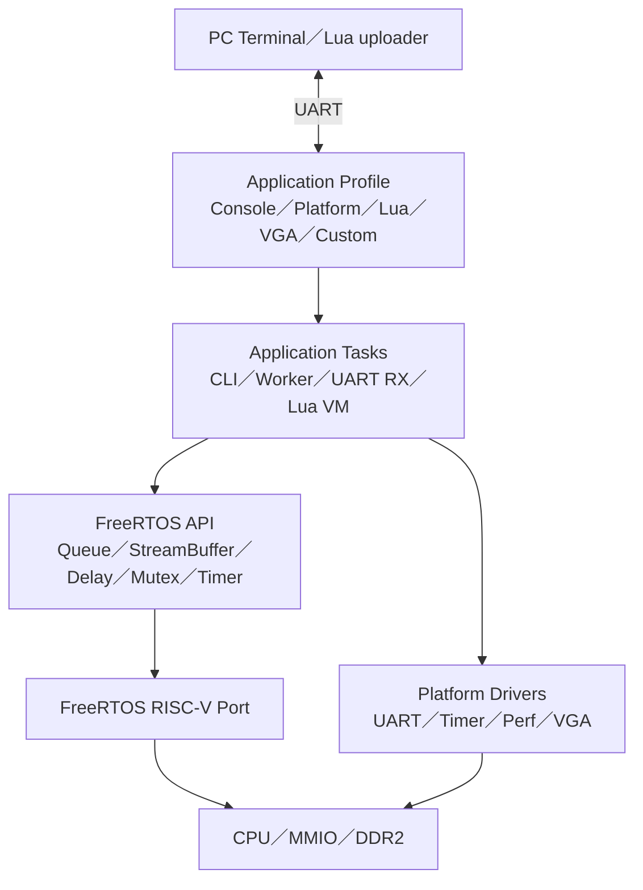
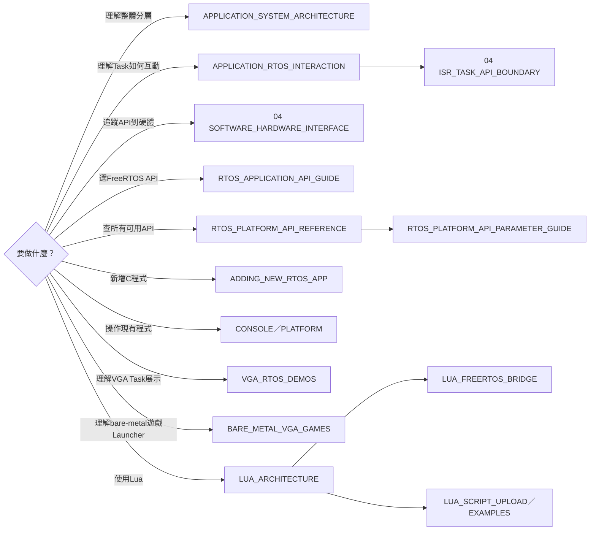

# 05 — Application 導覽

> 這個資料夾說明最上層軟體：C application 如何建立 Task、如何呼叫 FreeRTOS 與 driver，以及 Lua VM 如何作為其中一個 application 執行腳本。

## 完整軟體階層

一份 `.mem` 會包含 startup、FreeRTOS kernel、port、driver，以及「一個被選定的 application profile」。Lua profile 還會包含已編譯成 RISC-V machine code 的 Lua VM；`.lua` 腳本則在 runtime 送入 VM，不是另一個作業系統。

## 先選你要走的路線

## 文件分組

| 分組 | 文件 | 用途 |
|---|---|---|
| 全貌 | [APPLICATION_SYSTEM_ARCHITECTURE.md](APPLICATION_SYSTEM_ARCHITECTURE.md) | `.mem`、RTOS、Task、driver、Lua 的完整位置 |
| 互動原理 | [APPLICATION_RTOS_INTERACTION.md](APPLICATION_RTOS_INTERACTION.md) | `main()`、Task、ISR、blocking 與 Queue 的關係 |
| ISR／Task邊界 | [ISR_TASK_API_BOUNDARY.md](../04-freertos/ISR_TASK_API_BOUNDARY.md) | 現有UART ISR資料流、輸入API、新Driver何時及如何新增ISR |
| 軟硬體接口 | [SOFTWARE_HARDWARE_INTERFACE.md](../04-freertos/SOFTWARE_HARDWARE_INTERFACE.md) | API如何成為RISC-V指令、CSR、MMIO與interrupt |
| API 選型 | [RTOS_APPLICATION_API_GUIDE.md](RTOS_APPLICATION_API_GUIDE.md) | Queue、notification、mutex、semaphore、timer 怎麼選 |
| API 總表 | [RTOS_PLATFORM_API_REFERENCE.md](RTOS_PLATFORM_API_REFERENCE.md) | 目前可用、已驗證、未啟用的FreeRTOS與Platform API逐項索引 |
| API 參數 | [RTOS_PLATFORM_API_PARAMETER_GUIDE.md](RTOS_PLATFORM_API_PARAMETER_GUIDE.md) | 每個參數、pointer方向、timeout單位與回傳值怎麼填 |
| 新增程式 | [ADDING_NEW_RTOS_APP.md](ADDING_NEW_RTOS_APP.md) | 從 C source 到 runner profile 的完整步驟 |
| 現有程式 | [CONSOLE_APP.md](CONSOLE_APP.md)、[PLATFORM_APP.md](PLATFORM_APP.md) | 操作與內部 Task 架構 |
| VGA展示 | [VGA_RTOS_DEMOS.md](VGA_RTOS_DEMOS.md) | 三Task、Producer→Queue→Renderer與畫面含義 |
| Bare-metal遊戲 | [BARE_METAL_VGA_GAMES.md](BARE_METAL_VGA_GAMES.md) | 9-slot記憶體配置、Menu跳轉、polling輸入與建置／上板 |
| Lua 原理 | [LUA_ARCHITECTURE.md](LUA_ARCHITECTURE.md)、[LUA_FREERTOS_BRIDGE.md](LUA_FREERTOS_BRIDGE.md) | VM、C bridge 與 FreeRTOS 的關係 |
| Lua 使用 | [LUA_SCRIPT_UPLOAD.md](LUA_SCRIPT_UPLOAD.md)、[LUA_APP_EXAMPLES.md](LUA_APP_EXAMPLES.md) | 上傳與腳本範例 |

## 最短閱讀路線

- 寫第一個 C/RTOS application：`APPLICATION_SYSTEM_ARCHITECTURE` → `RTOS_APPLICATION_API_GUIDE` → `RTOS_PLATFORM_API_REFERENCE`／`RTOS_PLATFORM_API_PARAMETER_GUIDE` → `ADDING_NEW_RTOS_APP`。
- 只執行 Lua 腳本：`LUA_ARCHITECTURE` 的前兩節 → `LUA_SCRIPT_UPLOAD` → `LUA_APP_EXAMPLES`。
- 除錯 UART command：`CONSOLE_APP` → `APPLICATION_RTOS_INTERACTION` → `04-freertos/ISR_TASK_API_BOUNDARY` → `02-memory-io/UART`。
- 解說VGA RTOS展示：`VGA_RTOS_DEMOS` → `04-freertos/RTOS_CONCEPTS`。
- 維護裸機VGA遊戲Launcher：`BARE_METAL_VGA_GAMES` → `02-memory-io/VGA` → `03-build-boot/C_TO_RISCV_MACHINE_CODE`。
- 追蹤一個 API 到 FPGA RTL：`04-freertos/SOFTWARE_HARDWARE_INTERFACE` → `02-memory-io/MMIO` → 對應周邊文件。

上下游：[FreeRTOS](../04-freertos/README.md) · [Build／Boot](../03-build-boot/README.md) · [驗證](../06-verification/README.md)
