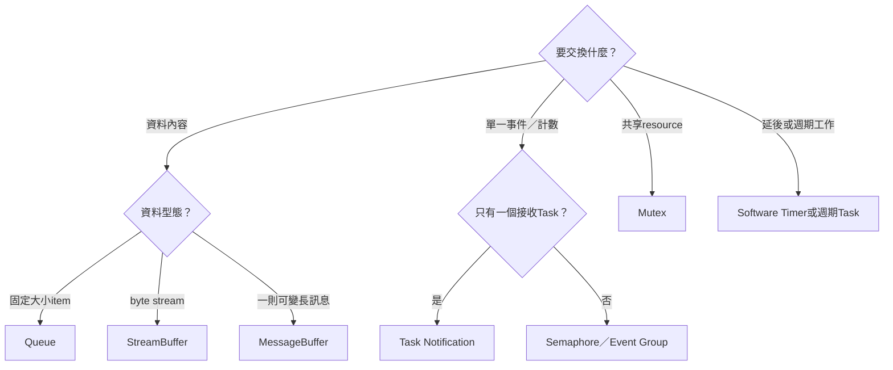
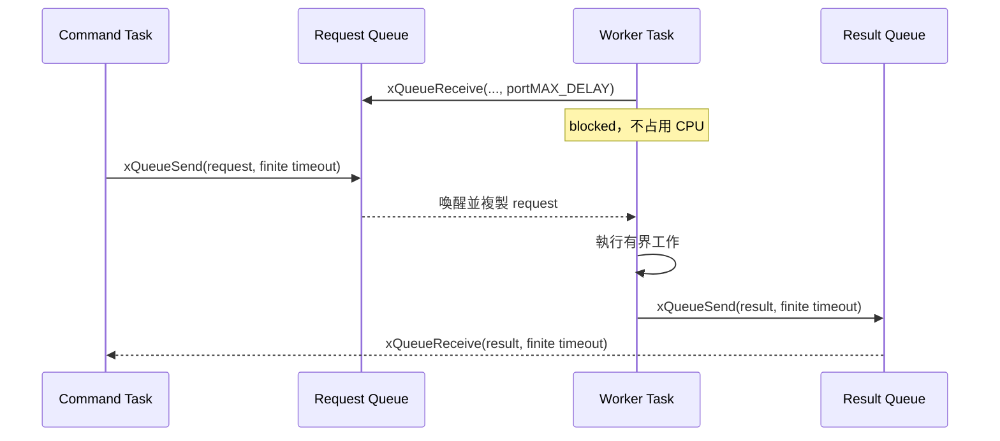
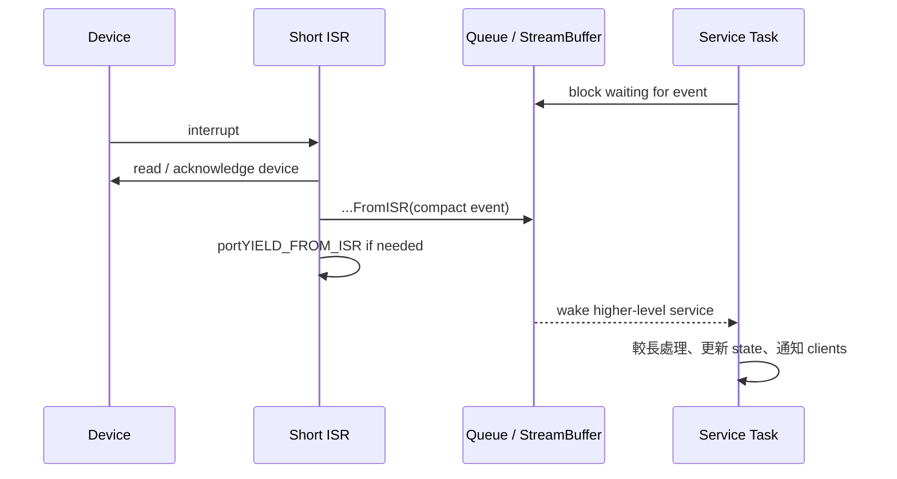

# RTOS Application API 選型與整合指南

本文件從 application designer 的角度回答「這個需求應使用哪一個 FreeRTOS API」。完整函式範例可搭配 [FREERTOS_API_EXAMPLES.md](../04-freertos/FREERTOS_API_EXAMPLES.md)，逐項可用性與Platform Driver入口查 [RTOS_PLATFORM_API_REFERENCE.md](RTOS_PLATFORM_API_REFERENCE.md)，每個參數則查 [RTOS_PLATFORM_API_PARAMETER_GUIDE.md](RTOS_PLATFORM_API_PARAMETER_GUIDE.md)，實際三個application的資料流見 [APPLICATION_RTOS_INTERACTION.md](APPLICATION_RTOS_INTERACTION.md)。

## API 選型決策圖



選完物件後再用第3節確認呼叫位置是Task或ISR，最後到 `FREERTOS_API_EXAMPLES` 複製對應程式骨架。

## 1. 先決定資料與控制語意

不要先看到某個 API 就硬套。先回答：

- 要傳的是資料、事件、資源數量還是共享resource ownership？
- Producer/consumer各有幾個？
- 呼叫者是Task還是ISR？
- 可以等待多久？Timeout後怎麼辦？
- 是否只需要最新值，還是每一筆都不能丟？
- 是否需要按priority立即喚醒Task？
- 資料copy成本是否可接受？

## 2. Object 選擇表

| 需求 | 第一選擇 | 原因 |
|---|---|---|
| 傳固定型別message | Queue | Copy semantics、FIFO、block/timeout |
| 傳UART/byte stream | StreamBuffer | 低overhead連續bytes、ISR-friendly |
| 一個sender喚醒一個已知Task | Task notification | 不需額外object、快速 |
| ISR通知Task一次 | Notification或binary semaphore | 有`FromISR` API |
| 表示N個相同資源／完成次數 | Counting semaphore | 保留count |
| Task互斥使用共享resource | Mutex | Ownership + priority inheritance |
| 同Task需巢狀取得同一lock | Recursive mutex | 計算巢狀take/give次數 |
| 等多個bit條件 | Event Group | Any/all bits與timeout |
| 等多個Queue/semaphore任一ready | Queue set | 回傳ready member |
| 延後執行短callback | Software timer | Timer service Task管理expiry |
| 固定週期Task | `xTaskDelayUntil()` | 維持phase，避免work time累積漂移 |
| 極短不可中斷register更新 | Critical section | 暫時關interrupt；必須有嚴格上限 |

## 3. 呼叫環境矩陣

這張表是快速選型；Task／ISR caller context、現有UART資料流與新增Driver ISR的完整解釋見 [ISR_TASK_API_BOUNDARY.md](../04-freertos/ISR_TASK_API_BOUNDARY.md)。

| API 類型 | Scheduler前 | Task | ISR | Timer callback |
|---|---|---|---|---|
| 建立static object/Task | 可以 | 可以 | 不可 | 不建議 |
| 建立dynamic object/Task | 可以 | 可以 | 不可 | 不建議 |
| Queue一般API | scheduler前可做nonblocking初始化send | 可以 | 不可 | 可，但不應長block |
| Queue `FromISR` | 不適用 | 不使用 | 可以 | 不使用 |
| Mutex | scheduler前可建立 | take/give | 不可 | 避免長持有 |
| Delay/block | 不可在scheduler前期待排程 | 可以 | 不可 | Callback不可長block |
| Event Group一般API | 建立/設初值可分析使用 | 可以 | 不可 | 可短操作 |
| Event Group `FromISR` | 不適用 | 不使用 | 可以 | 不使用 |
| `pvPortMalloc`/`malloc` | 可以 | 可以 | 不可 | 避免 |
| UART TX polling | 可以 | 可以 | 不應 | 避免長輸出 |
| `taskENTER_CRITICAL` | 可用但要了解scheduler狀態 | 可以且極短 | ISR使用對應mask pattern | 避免 |

Timer callback雖不是ISR，但所有software timers共用Timer service Task。長時間block會延遲其他timer command/callback。

## 4. 建立 Task

固定Task優先使用static allocation：

```c
#define SERVICE_STACK_WORDS 512u

static StaticTask_t service_tcb;
static StackType_t service_stack[SERVICE_STACK_WORDS];

TaskHandle_t service = xTaskCreateStatic(
    service_task,
    "service",
    SERVICE_STACK_WORDS,
    &service_config,
    2,
    service_stack,
    &service_tcb
);
configASSERT(service != NULL);
```

設計要點：

- Stack depth 是32-bit words；512 words = 2048 bytes。
- `pvParameters` 只保存pointer，指向資料必須長期有效。
- `configMAX_TASK_NAME_LEN=12` 包含結尾 `\0`，所以最多保留11個可見字元；過長會被截斷。
- Priority範圍0..4；Timer Task已在4。
- Task loop每輪要block/delay/yield，尤其是high priority。
- 一次性Task結束用`vTaskDelete(NULL)`，不可return。

Dynamic Task只在數量/生命週期真的動態時使用，並檢查`pdPASS`。

## 5. Queue 設計

```c
typedef struct {
    uint32_t id;
    uint32_t opcode;
    uint32_t value;
} Request;
```

Queue容量估算不能只看平均速率。至少考慮：

```text
burst size
producer maximum rate
consumer worst-case processing time
consumer被higher-priority Tasks延遲的時間
允許的drop/latency
```

Send政策：

```c
if (xQueueSend(request_queue, &request, pdMS_TO_TICKS(5)) != pdPASS) {
    request_drop_count++;
}
```

選擇：

- 不能等：timeout 0，失敗drop/counter。
- 可短等：有限timeout，避免整個control path永久卡住。
- 每筆都必須處理：`portMAX_DELAY`，但還要有system liveness診斷。
- 只需要latest：長度1 Queue + `xQueueOverwrite()`。

## 6. Task notification

一對一event可用：

```c
/* Receiver */
uint32_t count = ulTaskNotifyTake(pdTRUE, portMAX_DELAY);

/* Sender Task */
xTaskNotifyGive(receiver);

/* Sender ISR */
BaseType_t higher = pdFALSE;
vTaskNotifyGiveFromISR(receiver, &higher);
portYIELD_FROM_ISR(higher);
```

適合：

- Driver completion喚醒唯一service Task。
- 單一Task的work count。
- 不需要保留每筆payload。

不適合：

- 多consumer競爭同一event。
- 需要傳完整message。
- 同一notification entry同時混用count、bits、overwrite語意。

目前每Task只有1個notification entry，應先規定用途。

## 7. Semaphore 與 mutex 不可混用語意

### Semaphore是事件/數量

Counting semaphore沒有owner：Task A give、Task B take是正常用法。ISR可以give semaphore。

### Mutex是ownership

Mutex由取得它的Task歸還，提供priority inheritance。ISR不可使用mutex。

「shared resource」的定義、`counter++`競爭、UART字串交錯、Task等待Mutex時的Blocked狀態，以及single-owner替代架構，詳見 [TASK_QUEUE.md](../04-freertos/TASK_QUEUE.md) 第12節。

錯誤例子：

```c
/* 不要把mutex當ISR事件。 */
xSemaphoreGiveFromISR(mutex, &higher);
```

若是ISR完成事件，改用notification/binary semaphore/Queue。

## 8. 優先使用 single-owner Task

多個Tasks都對同一driver上mutex雖可行，但更容易出現lock order、priority與timeout問題。較清楚的模式：

```text
driver service Task唯一擁有hardware/state
  <- request Queue from clients
  -> result Queue/notification to clients
```

Console worker與Lua未來hardware binding都可沿用。Mutex只用在少量確實共享、不能message-passing的resource。

## 9. Event Group

適合等待多個boolean條件：

```c
EventBits_t bits = xEventGroupWaitBits(
    events,
    EVENT_INPUT | EVENT_WORKER | EVENT_TIMER,
    pdTRUE,
    pdTRUE,
    pdMS_TO_TICKS(100)
);
```

需要定義：

- Bit是level state還是edge-like event？
- Wait成功後是否清除？
- Any或all？
- 多個waiters清bit會不會互相影響？

Event Group不記錄同一bit發生幾次。若同一事件發生3次都重要，用Queue/counting semaphore。

## 10. StreamBuffer

適合單writer/singlereader byte stream：

```c
size_t sent = xStreamBufferSendFromISR(
    rx_stream, &byte, 1, &higher
);
if (sent != 1) {
    stream_drop_count++;
}
```

Ring buffer會保留1 byte區分full/empty。因此static storage 256 bytes的實際payload容量是255 bytes。

若多個writers要共用：

- 外部mutex序列化Task writers；ISR與Task混合時更複雜。
- 或讓每個source有自己的buffer。
- 或改用Queue保存message boundaries。

StreamBuffer不保留message boundaries；要保留一筆一筆訊息可考慮MessageBuffer，但目前application主要驗證StreamBuffer。

## 11. Software timer

Callback應像：

```c
static void timer_callback(TimerHandle_t timer)
{
    (void)timer;
    xTaskNotifyGive(service_task_handle);
}
```

不要在callback：

- 大量UART print。
- `portMAX_DELAY`等待Queue/mutex。
- 執行無上限演算法。
- 呼叫會等待hardware的polling loop。

Application真正工作交給service Task，Timer callback只發event。

## 12. Delay 與 deadline

背景週期：

```c
vTaskDelay(pdMS_TO_TICKS(1000));
```

固定phase：

```c
TickType_t last = xTaskGetTickCount();
for (;;) {
    do_bounded_work();
    if (xTaskDelayUntil(&last, pdMS_TO_TICKS(10)) == pdFALSE) {
        deadline_miss_count++;
    }
}
```

`xTaskDelayUntil()`回傳值可用來發現Task已錯過預定wake time。Application應把overrun變成counter，而不是靜默累積。

## 13. Critical section

可接受：

```c
taskENTER_CRITICAL();
snapshot_low = shared_low;
snapshot_high = shared_high;
taskEXIT_CRITICAL();
```

不可接受：

```c
taskENTER_CRITICAL();
xQueueReceive(queue, &item, portMAX_DELAY);
rtos_uart_write_line(very_long_text);
taskEXIT_CRITICAL();
```

本port critical section關閉global machine interrupt，所以同時延遲tick與UART。若臨界區長到需要loop或I/O，應重新設計ownership/mutex。

## 14. Heap 與 static allocation

核心application objects建議static：

```text
Task TCB/stack
固定Queue storage/control block
固定mutex/Event Group/Timer control block
```

Dynamic適合：

```text
Lua state與變長table/string
確實runtime才知道大小的buffer
數量動態的短期Task/object
```

監測：

```c
size_t now = xPortGetFreeHeapSize();
size_t minimum = xPortGetMinimumEverFreeHeapSize();
UBaseType_t margin_words = uxTaskGetStackHighWaterMark(task);
```

`minimum`與stack watermark要在最壞路徑、錯誤路徑、長時間測試後讀取。

## 15. UART/BSP API

[`uart.h`](../../OS/rtos/src/uart.h) 提供：

| API | 使用環境 | 作用 |
|---|---|---|
| `rtos_uart_putc` | startup/Task | Polling輸出一字元 |
| `rtos_uart_write[_line]` | startup/Task | Polling輸出字串 |
| `rtos_uart_write_u32/u64/hex32` | startup/Task | 無完整printf的數字輸出 |
| `rtos_uart_wait_tx_idle` | Task/控制路徑 | 確保最後bytes已shift完 |
| `rtos_uart_rx_interrupt_init` | scheduler前初始化 | 建立RX StreamBuffer並enable external IRQ |
| `rtos_uart_getc` | Task | Blocking/timeout取一byte |
| `rtos_uart_try_getc` | Task | Nonblocking取byte |
| RX counters | Task diagnostics | IRQ/hardware overrun/stream drop |
| `rtos_uart_trigger_test_interrupt` | test Task | 觸發test external interrupt |

Application通常不直接呼叫`rtos_uart_handle_external_interrupt()`；它由project interrupt hook在ISR context呼叫。

## 16. Board control API

[`board_control.h`](../../OS/rtos/src/board_control.h)：

```c
rtos_board_request_image_reload();
```

此函式`noreturn`，適合Console/Lua/Platform的`reload`。Custom application若使用它，必須把 [`board_control.c`](../../OS/rtos/src/board_control.c) 加到 `-ExtraSource`，因它不是custom build的通用source。

## 17. Performance counter API

Application可透過 [`perf_counters.h`](../../OS/rtos/src/perf_counters.h)：

- 檢查ABI是否匹配。
- Reset/start/stop。
- Atomic snapshot。
- 取得24組64-bit counters。
- 計算per-mille ratio與名稱。

長測量區間要避免把UART輸出也算進workload，除非目標就是量測logging。常見流程：reset/start → workload → stop/snapshot → 最後才print。

## 18. API return value政策

所有可能失敗API都要分類：

```c
if (xQueueSend(queue, &item, 0) != pdPASS) {
    /* 允許drop：counter++ */
}
```

```c
if (xTaskCreate(...) != pdPASS) {
    /* 核心啟動物件：fatal */
}
```

```c
if (xQueueReceive(queue, &item, pdMS_TO_TICKS(100)) != pdPASS) {
    /* Peer liveness failure：report/recover */
}
```

不要所有失敗都assert，也不要全部忽略。Application文件應記錄每個Queue full/timeout的產品語意。

## 19. API 組合範例：request/worker/result



若command Task要同時處理多個job：

- 不要送一筆後立刻永久等待。
- Result含request ID。
- Separate result Task或event-driven state machine。
- Queue capacity按outstanding jobs估算。
- Timeout後定義late result如何丟棄。

## 20. API 組合範例：ISR/service



這是UART driver目前採用的核心pattern，也是未來加入板載I/O時最容易debug的結構。

## 21. Application API review checklist

- 每個API的caller context是Task還是ISR？
- ISR版本是否帶`FromISR`且處理`higher_priority_task_woken`？
- Block time是0、有限還是`portMAX_DELAY`；原因是什麼？
- Object static storage生命週期足夠嗎？
- Queue item type與storage size一致嗎？
- Pointer ownership有文件嗎？
- Mutex一定由owner歸還嗎？
- High-priority Task有blocking point嗎？
- Timer callback有界且不長block嗎？
- Critical section是否短到可量化？
- Stack/heap單位與margin量過嗎？
- API failure能被counter、marker或probe觀察嗎？
