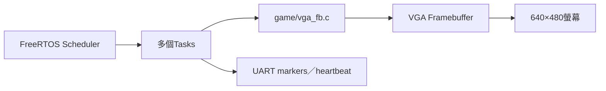
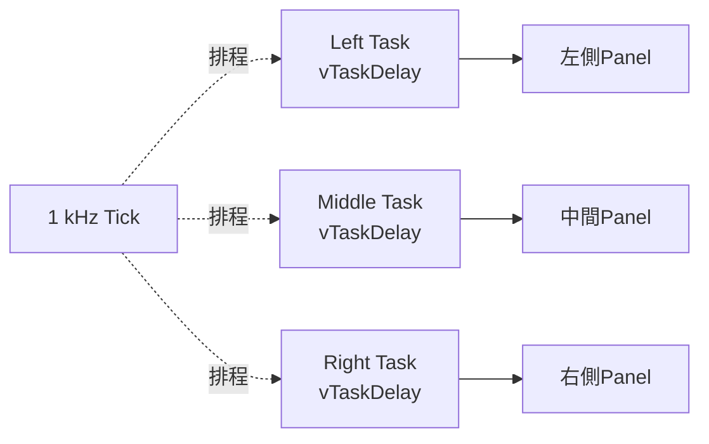
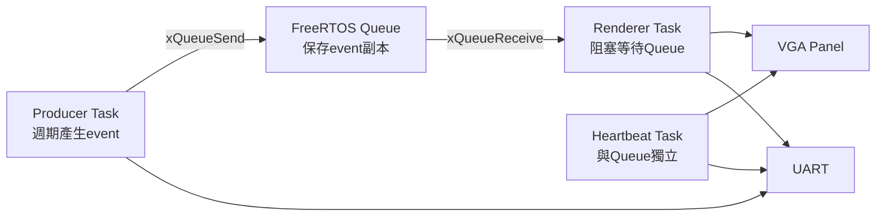
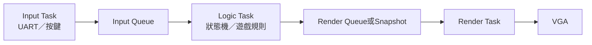

# VGA FreeRTOS Demo架構與展示說明

> 本頁把早期VGA demo紀錄中的有效內容整理為正式技術文件，說明畫面每個區域如何對應Task、Queue與scheduler。上板指令仍以 [BOARD_OPERATION_GUIDE.md](../00-overview/BOARD_OPERATION_GUIDE.md) 為準。

## 1. 為什麼需要VGA RTOS demo

UART log可以證明程式有輸出，但觀眾不容易直接看出Task之間的關係。VGA demo將RTOS狀態轉成持續變化的畫面，同時保留UART marker供自動判定。



畫面是展示介面，不是RTOS正確性的唯一證據；正式判定仍需要tick、Queue marker、probe與錯誤檢查。

## 2. 兩個正式profile

| Profile | 主程式 | 展示重點 | Ready marker |
|---|---|---|---|
| `vga_demo` | `OS/rtos/src/main_vga_demo.c` | 三個獨立週期Task | `[VGA] task=L start` |
| `vga_queue_demo` | `OS/rtos/src/main_vga_queue_demo.c` | Producer→Queue→Renderer＋Heartbeat | `[PIPE] task=P producer start` |

兩者共用 [`game/vga_fb.c`](../../game/vga_fb.c) 存取framebuffer。

## 3. 三Task VGA demo



每個Task：

1. 只更新自己的畫面區域；
2. 使用 `vTaskDelay()`進入Blocked；
3. 醒來後更新frame counter與顏色；
4. 每隔固定frame輸出UART log。

預期啟動：

```text
[VGA] task=L start
[VGA] task=M start
[VGA] task=R start
```

執行中：

```text
[VGA] tick=... task=L frame=...
[VGA] tick=... task=M frame=...
[VGA] tick=... task=R frame=...
```

三個區域都持續變化，表示不同Task能delay、喚醒並重新獲得CPU；但它不單獨證明Queue通訊。

## 4. Queue Pipeline demo



### Task責任

| Task | 行為 | 畫面意義 |
|---|---|---|
| Producer `P` | 產生遞增event並送入Queue | 左側色塊與進度 |
| Renderer `R` | Queue為空時Blocked；收到event才繪圖 | 中間區域跟隨Producer資料 |
| Heartbeat `H` | 獨立週期delay與更新 | 右側仍持續活動，證明scheduler沒有被pipeline卡住 |

畫面標示：

- `P`：Producer產生資料；
- `Q`：Queue／event slot；
- `R`：Renderer收到資料後更新；
- `H`：獨立Heartbeat；
- 底部progress bars：三個Task持續前進。

### 使用的FreeRTOS API

| API | 用途 |
|---|---|
| `xTaskCreateStatic()` | 靜態建立Producer、Renderer、Heartbeat |
| `xQueueCreateStatic()` | 建立不使用heap的Queue |
| `xQueueSend()` | Producer複製event到Queue |
| `xQueueReceive()` | Renderer等待並取出event |
| `vTaskDelay()` | 週期性阻塞，讓其他Task執行 |
| `xTaskGetTickCount()` | UART與畫面顯示tick |
| Critical section | 避免多個Task的UART文字互相穿插 |

### UART證據

```text
[PIPE] task=R renderer start
[PIPE] task=P producer start
[PIPE] task=H heartbeat start
[PIPE] tick=... task=P send=0x00000004
[PIPE] tick=... task=R recv=0x00000004
[PIPE] tick=... task=H beat=0x00000002
```

`P send`與`R recv`的event number持續對應，才能證明Queue真的傳遞資料；只看到三個Task start不足以證明runtime pipeline仍正常。

## 5. 上板方式

前提：本次Vivado編譯包含VGA介面與constraints，且已燒入該次 `.bit`。

```powershell
.\tools\run_rtos_app.ps1 -Port COM5 -App vga_demo
```

觀察完成後按 `Ctrl+C`釋放COM，再切換：

```powershell
.\tools\run_rtos_app.ps1 -Port COM5 -App vga_queue_demo
```

Runner會自動編譯、執行preflight、上傳target並等待marker。

## 6. 完成標準

### 三Task demo

- 三個start marker全部出現；
- 沒有exception、stack overflow或fatal；
- 左／中／右區域都持續變化；
- tick與frame counter持續增加。

### Queue demo

- Producer、Renderer、Heartbeat marker全部出現；
- `send`與`recv`event持續增加且對應；
- Queue為空時Renderer不busy spin；
- Heartbeat與Queue pipeline同時前進；
- 實體畫面與UART含義一致；
- 長時間執行無fatal或停住。

## 7. 為什麼這不是三個裸機loop

有力證據是：

- Tasks由FreeRTOS建立；
- machine timer tick驅動preemption與delay timeout；
- `vTaskDelay()`使Task進入Blocked；
- Renderer在 `xQueueReceive()`等待資料；
- Queue copy、block與unblock由FreeRTOS kernel處理；
- Task context在trap path保存與恢復。

因此畫面變化是RTOS scheduler與Queue資料流的可視化結果，不是單一`while(1)`手動輪流呼叫三個函式。

## 8. 已驗證路徑與早期教訓

目前穩定路徑保留：

- 官方FreeRTOS RISC-V `portASM.S`；
- `mtime/mtimecmp` tick；
- Task內使用 `vTaskDelay()`；
- 既有 `game/vga_fb.c` packed framebuffer API；
- 小型、職責單一的Task與buffer。

早期不穩定版本同時替換framebuffer helper、停用timer tick並加入大量trace，導致無法判斷是繪圖、排程或記憶體問題。後續新增demo應一次只改一個已驗證層級。

更完整案例見 [FPGA_BRINGUP_CASE_STUDIES.md](../06-verification/FPGA_BRINGUP_CASE_STUDIES.md)。

## 9. 延伸成正式互動應用

Queue demo可以擴充為：



這種分層讓輸入、邏輯與繪圖可以分別測試，也避免任一個慢速I/O直接阻塞整個application。

