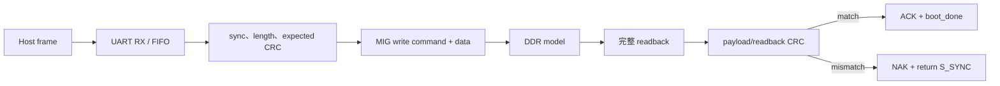

# UART Bootloader 驗證

本文件專注於 [`uart_bootloader.v`](../../uart_bootloader.v) 的 verification。Protocol格式與上板操作請另見 [UART_BOOTLOADER.md](../03-build-boot/UART_BOOTLOADER.md)；這裡說明各測試要證明的 safety property、執行方式與判讀方法。

## 1. Bootloader 的核心安全要求

Bootloader 不只是「把 bytes 寫到 DDR」。正式成功至少需要：

```text
合法 sync/header
AND length 合法
AND host payload CRC 正確
AND 每筆 DDR write 被 MIG 接受
AND 從 DDR 讀回的完整 image CRC 正確
AND 回覆 ACK
THEN 才能 boot_done = 1、釋放 CPU
```

任何一步失敗時都必須：

- 不釋放 CPU；
- 不把部分 image 當成有效程式；
- 回覆 NAK（v2）；
- 回到可重新同步的狀態；
- 接受 rearm 或新的 sync recovery。

## 2. 被驗證的資料路徑



Protocol v2 frame：

```text
SYNC 4 bytes + LENGTH 4 bytes + EXPECTED_CRC32 4 bytes + PAYLOAD N bytes
```

所有 multibyte host欄位使用 little-endian。

## 3. 建置共用 RTL source list

```powershell
cd C:/cpu_design
New-Item -ItemType Directory -Force build_verification | Out-Null
$rtl = Get-ChildItem . -Filter *.v -File | ForEach-Object { $_.FullName }
```

使用根目錄全部 RTL、`-s` 指定唯一 top，可避免漏掉 bootloader 相依的 UART module：

```powershell
function Invoke-BootTb([string]$Top) {
  $out = "./build_verification/$Top.out"
  $log = "./build_verification/$Top.log"
  iverilog -g2005-sv -DFAST_SIM -i -o $out -s $Top $rtl
  if ($LASTEXITCODE -ne 0) { throw "compile failed: $Top" }
  $lines = & vvp $out 2>&1
  $lines | Tee-Object -FilePath $log
  if ($LASTEXITCODE -ne 0 -or ($lines -join "`n") -match "\] FAIL") {
    throw "run failed: $Top; see $log"
  }
}
```

## 4. 主 protocol／recovery test

```powershell
Invoke-BootTb "uart_bootloader_tb"
```

成功：

```text
[TB] PASS: v1/v2, UART/DDR CRC rejection, rearm, and host-sync recovery passed.
```

主要階段：

| 階段 | 刺激 | 必須觀察 |
|---|---|---|
| valid v2 image | 正確 header、CRC、payload | MIG write、DDR readback、ACK、`boot_done` |
| rearm | application/launcher要求重新載入 | 離開 done、回 sync search |
| second image | rearm後傳另一份 image | 第二份內容取代第一份，CRC PASS |
| bad host CRC | header CRC與payload不符 | CPU不釋放、NAK、回 S_SYNC |
| bad DDR readback | UART frame正確但DDR內容被竄改 | CPU不釋放、readback NAK、回 S_SYNC |
| host-sync recovery | rejection後直接送新v2 sync | loader重新同步並成功載入新 image |

這個 TB 同時證明「成功路徑」和更重要的「失敗時絕不能啟動」。

## 5. MIG back-pressure test

```powershell
Invoke-BootTb "uart_bootloader_stall_tb"
```

成功：

```text
[STALL_TB] PASS: bootloader tolerates stalled app_rdy/app_wdf_rdy.
```

此測試刻意使 MIG ready 暫時拉低，檢查：

- `app_en`尚未 handshake時 command/address保持；
- `app_wdf_wren`尚未 handshake時 data/mask保持；
- loader不會因等待多個 cycle重複計算 byte或跳過資料；
- back-pressure解除後仍完成 write/readback/verify。

若 deterministic主 TB PASS、stall TB FAIL，通常是 valid/ready protocol問題，不是 CRC polynomial問題。

## 6. Split command/data ready test

```powershell
Invoke-BootTb "uart_bootloader_split_ready_tb"
```

成功：

```text
[SPLIT_READY_TB] PASS: split app_rdy/app_wdf_rdy write acceptance works.
```

MIG native interface的 command ready與write-data ready不保證同一 cycle出現。此 TB 專門驗證：

- command先接受、data後接受；
- data先 ready、command後接受；
- loader只在兩部分都完成後推進到下一個 128-bit word；
- 不會重送已被接受的一半，或提早丟棄尚未接受的一半。

這類 bug在永遠 `ready=1` 的簡化 model中看不出來，因此不可只保留主 TB。

## 7. 大型 image CRC test

[`uart_bootloader_large_crc_tb.v`](../../uart_bootloader_large_crc_tb.v) 可使用指定的實際 firmware image。
建議透過 regression runner 執行；runner 會從 `.mem` 計算 payload 長度與 host `zlib.crc32`，
再透過 `IMAGE_BYTES`／`IMAGE_CRC32` parameters 與 `+MEMFILE` 傳給 TB：

```powershell
python tools/run_regression.py --suite unit `
  --boot-image build_rtos_apps/lua/rtos_lua.mem
```

此命令也執行其餘 unit／subsystem TB。指定的 image 必須已建置，且大小不超過 512 KiB；
缺失、含無效 word 或超出容量都會失敗。重新編譯 firmware 後可直接重跑，不必修改 TB 常數。

為相容舊的手動呼叫，TB 未覆寫參數時仍保留歷史 fixture：

```text
MEMFILE = build_rtos_apps/lua/rtos_lua.mem
IMAGE_BYTES = 213580
IMAGE_CRC32 = 0xD360D14F
```

歷史 fixture 的成功輸出如下；新 image 的長度／CRC 會不同：

```text
[LARGE_CRC_TB] REFERENCE crc=d360d14f
[LARGE_CRC_TB] FINAL expected=d360d14f computed=d360d14f
[LARGE_CRC_TB] PASS bytes=213580 crc=d360d14f
```

### 為什麼直接注入 decoder output

如果以115200 baud逐 bit模擬約 214 KiB，需要極大量 clock cycle。Large CRC TB直接驅動內部 RX decoder輸出，但仍保留：

- bootloader FIFO；
- header/parser；
- payload CRC；
- MIG write；
- DDR readback；
- readback CRC；
- ACK/boot_done。

因此它驗證大 image CRC/readback state machine，但不驗證 UART sampling timing；UART sampling由主 bootloader TB與UART MMIO TB補足。

### Fixture 更新規則

Lua firmware 只要重新編譯，image 大小或 CRC 可能改變。更新步驟：

1. 建置正式 Lua image；
2. 用上方 runner 的 `--boot-image` 指向新的 `.mem`；
3. 確認 `REFERENCE`、`FINAL expected/computed` 與 `PASS` 一致；
4. 保存 `summary.json`、simulation log 與對應 firmware。

## 8. 一次執行四個 bootloader TB

```powershell
$tops = @(
  "uart_bootloader_tb",
  "uart_bootloader_stall_tb",
  "uart_bootloader_split_ready_tb"
)
foreach ($top in $tops) {
  Invoke-BootTb $top
}
```

上方手動命令執行前三個 TB；第四個 large CRC 使用第 7 節的 runner 命令傳入當次 image。
若沒有已建置的 Lua image，可將前三個記為 PASS，large CRC 明確記為 `NOT RUN: fixture unavailable`，
不可省略後仍聲稱四項全數通過。

## 9. Host uploader 單元測試

Bootloader RTL之外，PC端 framing、retry、marker parser與script uploader也要測：

```powershell
python -m unittest `
  tools.test_rtos_board_runner `
  tools.test_lua_script_tool `
  tools.test_uart_keys -v
```

這些測試不需要 FPGA或COM port，適合每次修改：

- v1/v2 frame；
- CRC；
- ACK/NAK；
- retry/rearm；
- marker timeout/failure marker；
- Lua script protocol；
- terminal key mapping。

Host unit tests PASS不能代替RTL bootloader TB，因為兩側可能用相同的錯誤假設。

## 10. Dry-run image驗證

已有 preflight與target `.mem` 時：

```powershell
python ./tools/rtos_board_runner.py `
  --port COM5 `
  --preflight-mem ./build_rtos_apps/preflight/rtos_preflight.mem `
  --target-mem ./build_rtos_apps/console/rtos_console.mem `
  --protocol v2 `
  --dry-run
```

成功：

```text
Protocol:  v2 CRC32 (preflight=0x..., target=0x...)
Dry run passed: both images and upload frames are valid.
```

Dry-run證明：

- `.mem`可解析；
- payload可建立；
-長度與frame可生成；
- host CRC可計算。

它不會開COM，也不能證明FPGA loader或DDR可用。

## 11. 實板 protocol驗收

標準兩階段上板：

```powershell
./tools/run_rtos_app.ps1 `
  -Port COM5 `
  -App console `
  -Protocol v2 `
  -Log ./build_rtos_apps/board_console.log
```

關鍵成功順序：

```text
preflight v2 frame accepted
RTOS_PREFLIGHT_PASS
target v2 frame accepted
APP_READY
Target confirmed by marker: APP_READY
```

這同時驗證真實USB-UART、pacing、MIG與DDR readback。

## 12. ACK／NAK 與 exit code

| 結果 | 意義 | 處理 |
|---|---|---|
| ACK (`0x06`) | v2 image與DDR readback被loader接受 | 接著等待application marker |
| NAK `0x15` | header/payload CRC/format類 rejection | 保存log、重傳完整frame |
| NAK `0x16` | DDR write/readback verification類 rejection | 檢查MIG、DDR與loader path |
| no reply | loader未同步、COM/baud錯、仍在reset或frame未到 | preamble、startup delay、reset、bitstream |
| ACK後marker timeout | image已接受但target未報 ready | 調查application/trap/marker，不先怪CRC |

底層 runner exit code：

| Code | 類型 |
|---:|---|
| 0 | upload/marker成功或dry-run成功 |
| 2 | image/dependency/參數問題 |
| 3 | bootloader reject、marker timeout或failure marker重試耗盡 |
| 4 | COM/UART exception |

## 13. 反向測試的重要性

Release前不只要測正確 image，也應確認：

- payload改一個byte必須被拒絕；
- header length超範圍必須被拒絕；
- DDR readback資料改一個byte必須被拒絕；
- incomplete frame timeout後可以重新sync；
- CPU不能在任何verification failure下跑到target；
- rearm後舊 image不應繼續擁有CPU。

Bootloader的安全性主要由「錯誤時不啟動」決定，而不是只由成功上傳一次決定。

## 14. 常見失敗

| 現象 | 優先檢查 |
|---|---|
| 主 TB valid image失敗 | UART byte order、sync、length、CRC init/final xor |
| stall TB失敗 | valid/ready hold與beat counter |
| split-ready失敗 | command/data acceptance flags |
| bad CRC卻boot_done | verification gating是重大錯誤，停止上板使用 |
| DDR corruption未被發現 | readback範圍、最後partial 128-bit mask、CRC byte count |
| large CRC reference不符 | fixture size/hash與Lua image revision |
| 實板偶發NAK、RTL全PASS | USB-UART/pacing、MIG/reset、實體bitstream或CDC |
| 實板總是ACK但target無輸出 | target firmware、reset PC、trap/UART TX |

## 15. 驗證結論邊界

四個RTL TB與host unit tests通過，可以證明目前model與test vectors下的protocol、CRC、rearm、recovery與back-pressure行為符合預期。最終仍必須做實板兩階段 upload，因為RTL TB不包含真實USB bridge、DDR2 training、FPGA timing與板級reset。
