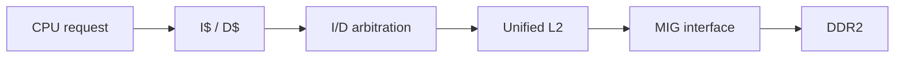

# Cache 與記憶體階層測試

本文件說明 L1 I-Cache、L1 D-Cache、統一 L2 與完整 CPU cache workload 的驗證方式。架構本身請先閱讀：

- [ICACHE.md](../02-memory-io/ICACHE.md)
- [DCACHE.md](../02-memory-io/DCACHE.md)
- [L2_CACHE_DDR2.md](../02-memory-io/L2_CACHE_DDR2.md)

## 1. 為什麼 Cache 必須分層測試

Cache 錯誤可能來自不同位置：



若只跑完整 CPU，最後看到 register錯誤，可能很難判斷是：

- tag/index 判斷錯；
- victim/LRU 選錯；
- dirty line 沒 writeback；
- refill beat 順序錯；
- request 在 ready=0 時改變；
- response 在 ready=0 時改變；
- L2 arbitration 把 response 回給錯誤 master；
- DDR/MIG transaction 地址錯。

因此使用「standalone I$/D$ → L2/ARB → full CPU → 實板 counter」逐層驗證。

## 2. 建置環境

```powershell
cd C:/cpu_design
New-Item -ItemType Directory -Force build_verification | Out-Null
```

## 3. I-Cache standalone test

編譯與執行：

```powershell
iverilog -g2005-sv `
  -o ./build_verification/icache_tb.out `
  -s icache_tb `
  ./icache_tb.v ./icache.v
vvp ./build_verification/icache_tb.out
```

成功：

```text
All tests passed.
```

### I$ directed cases

| Case | 驗證內容 | 關鍵不變量 |
|---:|---|---|
| 1 | cold miss → line refill → response | 只在完整 refill 後回覆正確 instruction |
| 2 | 同 line不同 word hit | 不再發新 linefill |
| 3 | CPU response back-pressure | `if_resp_valid/data` 保持到 ready |
| 4 | in-flight hit path kill | 被 kill request不得產生 architectural response |
| 5 | uncached fetch | 發 UC_READ，不配置 cached line |
| 6 | flush all後重取 | 原 line失效，下一次必須 re-miss |
| 7 | 連續不同 line miss | 每個 address得到各自正確資料 |
| 8 | single-way invalidate | 指定 way失效，再存取時 re-miss |
| 9 | uncached L2 error | `if_resp_err` 正確傳回 |
| 10 | cached refill error | 不安裝錯誤 line，回覆 error |
| 11 | refill期間 response path back-pressure | beat與最終 response不遺失 |

### I$ 失敗時觀察訊號

- CPU side：`if_req_valid/ready/addr/kill`、`if_resp_valid/ready/inst/err`
- Cache state：FSM、IF1/IF2 address、hit way、victim way
- L2 side：`l2_req_*`、`l2_rsp_*`、beat count、`last`
- management：`ic_flush_req/ack`、invalidate index/way

## 4. D-Cache standalone test

編譯與執行：

```powershell
iverilog -g2005-sv `
  -o ./build_verification/dcache_tb.out `
  -s dcache_tb `
  ./dcache_tb.v ./dcache.v
vvp ./build_verification/dcache_tb.out
```

成功結尾：

```text
Coverage summary:
  ...
dcache_tb: All tests passed.
```

此 testbench 包含 directed cases 與 20,000 次 scoreboard-based mixed operation，所以執行時間會明顯比小型 decode TB 長。

### D$ directed cases

| Case | 驗證內容 |
|---:|---|
| 1 | cold load miss、request stall、response delay |
| 2 | 同 line hit不新增 LINE_RD |
| 3 | store hit更新 line並設 dirty |
| 4 | store miss使用 UC_WR、no-write-allocate，後續 load再 refill |
| 5 | uncached read不配置，後續 cached read仍 miss |
| 6 | dirty victim eviction觸發 WB_LINE，資料回寫後可讀回 |
| 7 | uncached read error傳播 |
| 8 | cached refill error傳播 |
| 9 | CPU response back-pressure時 valid/data保持 |
| 10 | L2 request back-pressure |
| 11 | refill beats之間存在 gap |
| 12 | clean eviction不得多餘 writeback |
| 13 | uncached store更新 backing memory |
| 14 | partial store miss以 byte strobe UC_WR |
| 15 | uncached 64-bit response high-word lane選擇 |
| 16 | UC_WR error傳播 |
| 17 | dirty line 8 beats完整保存，不能只回寫修改的 word |
| 18 | miss處理期間 `cpu_req_ready=0` |
| 19 | 相同 index三個 tag的 LRU replacement |
| 20 | 同 line兩次 store miss仍為 no-write-allocate |
| 21 | cached byte/halfword store mask |
| 22 | uncached byte/halfword store/load |
| 23 | uncached wait期間 `cpu_req_ready=0` |
| 24 | 20,000 次 random load/store、size、uncached與 back-pressure |

### Scoreboard 與 coverage

Testbench 維護 `mem_ref` shadow model。每次 store先更新 reference，再將 DUT load結果與 reference比較。Random regression結束前要求至少命中：

- load、store；
- load hit/miss；
- store hit/miss；
- cached、uncached；
- full/partial store；
- byte/half/word size；
- high/low 64-bit lane；
- L2 request back-pressure；
- CPU response back-pressure。

若功能結果正確但 coverage counter為 0，testbench仍會 `$fatal`，因為那表示隨機序列沒有真正走過宣稱要驗證的路徑。

## 5. L2 與 I/D arbitration test

```powershell
iverilog -g2005-sv `
  -o ./build_verification/l2_arb_tb.out `
  -s l2_arb_tb `
  ./l2_arb_tb.v ./I_D_arbitration.v ./L2_cache.v
vvp ./build_verification/l2_arb_tb.out
```

成功：

```text
L2/ARB TB: PASS
```

主要 cases：

| Case | 驗證內容 |
|---:|---|
| 1 | I/D 同時提出 cached request時 D$ 優先 |
| 2 | I$ uncached request可優先於 D$ cached request |
| 3 | UC_WR正確回覆單 beat ack |
| 4 | D$ WB_LINE的 8 request beats被鎖在同一 transaction |
| 5 | 非法 burst length得到 error response |

L2 test 使用簡化 MIG model，驗證的是數位 transaction contract，不是實體 DDR timing training。

## 6. Full CPU Cache workloads

先依 [CPU_REGRESSION.md](CPU_REGRESSION.md) 編譯 `icache_pipeline_tb`。

| TEST | 重點 |
|---:|---|
| 14 | instruction-side miss/stall |
| 15 | I$ error injection |
| 16 | D$ error injection |
| 17 | I$ stress並要求至少一次 linefill |
| 18 | D$ writeback workload |
| 21 | 長 branch造成大量 fetch/control交互作用 |
| 22/23 | branch + data memory mix |
| 24..27 | 全 pipeline/cache mixed stress |

執行範例：

```powershell
$sim = "./build_verification/icache_pipeline_tb.out"
14..18 | ForEach-Object {
  vvp $sim "+TEST=$_" "+ASSERT_EN=1"
  if ($LASTEXITCODE -ne 0) { throw "cache integration TEST=$_ failed" }
}
```

## 7. Back-pressure contract

所有 Cache interface都使用 valid/ready。最重要的規則：

```text
valid = 1 且 ready = 0
=> producer 必須保持 payload 不變
```

Request payload包含：

- address；
- command；
- size／length；
- write data；
- byte strobe；
- last。

Response payload包含：

- read data；
- error；
- last。

只有 `valid && ready` 的 cycle才算一次 transfer。只看到 `valid` 不能增加 beat counter，也不能提前切到下一筆資料。

## 8. Error injection 應檢查什麼

Cache error測試的目的不是讓 simulation crash，而是證明錯誤能受控傳播：

```text
L2 error
  -> I$/D$ response error
  -> CPU instruction/load/store access fault
  -> trap/diagnostic
```

同時要確保：

- error refill不安裝 valid line；
- dirty writeback error不靜默丟棄 dirty victim；
- early `last`不被當成完整 64-byte line；
- error response不殘留到下一筆 transaction。

## 9. Cache 組態差異

目前主要組態：

| Build | I$ | D$ | L2 |
|---|---:|---:|---:|
| `FAST_SIM` | 8 KiB | 8 KiB | 16 KiB |
| 現行 `FAST_SYNTH` 實板 | 8 KiB | 8 KiB | 16 KiB |
| full RTL config | 64 KiB | 128 KiB | 256 KiB |

即使 FAST_SIM 與現行實板容量相同，後端 memory model仍不同。若改變 Cache容量、ways或 line size，必須重跑：

- standalone I$/D$/L2；
- address alias與same-index replacement cases；
- full CPU regression；
- synthesis BRAM utilization與timing；
- 實板 performance counter基準。

## 10. 實板上的間接 Cache 驗證

實板不能直接看到每個 tag，但可透過 Console：

```text
perf clear
perf start
perf test 100000
perf snapshot
perf show
```

觀察：

- I$/D$ request、hit/miss；
- L2/DDR command；
- dirty writeback；
- memory stall；
- cycle／retired instruction。

Counter值不一定每次完全相同，因為 UART、tick與interrupt會加入少量事件；但同一 bitstream、image與命令不應出現數量級突變。若功能 marker PASS但 miss/writeback變成 0 或異常暴增，仍應調查 routing或counter事件定義。

## 11. 常見失敗

| 現象 | 可能原因 |
|---|---|
| cold miss timeout | request沒有 handshake、L2沒有回齊 beats |
| hit卻再次 LINE_RD | valid/tag/index未保存或 refill未 install |
| dirty data重讀錯誤 | WB_LINE beat/address/strobe錯 |
| partial store污染其他 byte | byte lane與wstrb merge錯 |
| random case偶發錯 | stalled payload改變、response競爭或FSM race |
| I$/D$各自 PASS，full CPU FAIL | top routing、arbitration、pipeline stall/flush整合 |
| simulation PASS，板上錯 | MIG/clock/reset/timing、bitstream revision或真實DDR問題 |

## 12. 通過結論的正確寫法

可以寫：

> I$、D$、L2 directed testbench通過；D$ 20,000-operation scoreboard regression通過；完整 CPU cache workloads在指定 seeds下得到 golden result。

不應只因這些測試通過就寫：

> Cache對所有地址、所有時序與所有FPGA PVT條件已完全驗證。

