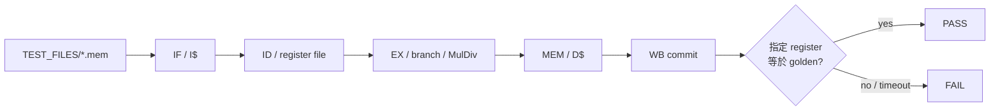

# CPU 功能回歸

本專案的主 CPU regression 使用 [`icache_pipeline_tb.v`](../../icache_pipeline_tb.v)。Testbench 載入 RV32 machine-code `.mem`，由完整 pipeline 執行，再以 architectural register golden value、錯誤事件或 RTOS UART marker 判定。

## 1. Regression 實際涵蓋什麼

一般 `TEST=1..27` 會經過：



因此它不是只驗證 ALU，也不是只驗證 Cache。任何一層造成錯誤的 instruction、data、stall、flush 或 commit，都可能讓最終 register 不符。

## 2. 編譯 testbench

PowerShell：

```powershell
cd C:/cpu_design
New-Item -ItemType Directory -Force build_verification | Out-Null
$rtl = Get-ChildItem . -Filter *.v -File | ForEach-Object { $_.FullName }
iverilog -g2005-sv -DFAST_SIM -i `
  -o ./build_verification/icache_pipeline_tb.out `
  -s icache_pipeline_tb $rtl
if ($LASTEXITCODE -ne 0) { throw "CPU TB compile failed" }
```

`FAST_SIM` 使用較小 Cache 組態與 behavioral memory 路徑，以縮短 simulation；它不代表實板 full timing。

## 3. 執行單一 test

```powershell
vvp ./build_verification/icache_pipeline_tb.out `
  +TEST=1 +ASSERT_EN=1 +MAXCYCLES=250000
```

成功範例：

```text
[TB CFG] TEST=1 MEMFILE=TEST_FILES/mem_test1_alu_fwd.mem ...
PASS: test 1 expect x3 = 0x00000004
```

若看見 `PASS` 之前出現 `ASSERT_FAIL`、`FATAL` 或 `TIMEOUT`，仍應判為 FAIL。

## 4. TEST=1..27 對照表

以下 golden value 來自目前 [`icache_pipeline_tb.v`](../../icache_pipeline_tb.v)：

| ID | Image | 主要目的 | Golden |
|---:|---|---|---|
| 1 | `mem_test1_alu_fwd.mem` | ALU dependency 與 forwarding | `x3=0x00000004` |
| 2 | `mem_test2_load_use.mem` | load-use hazard stall | `x2=0x00000012` |
| 3 | `mem_test3_store_dep.mem` | store data/address dependency | `x2=0x00000005` |
| 4 | `mem_test4_branch_taken.mem` | taken branch 與 flush | `x2=0x00000002` |
| 5 | `mem_test5_load_store.mem` | 基本 load/store data path | `x2=0x00000009` |
| 6 | `mem_test6_branch_not_taken.mem` | not-taken branch | `x2=0x00000002` |
| 7 | `mem_test7_jal.mem` | JAL link/target | `x2=0x00000004` |
| 8 | `mem_test8_jalr.mem` | JALR link/target/alignment | `x2=0x00000004` |
| 9 | `mem_test9_lb_sb.mem` | byte load/store、sign extension | `x2=0xFFFFFF80` |
| 10 | `mem_test10_lhu_sh.mem` | halfword store、unsigned load | `x2=0x000000F0` |
| 11 | `mem_test11_long_mix.mem` | 較長 ALU/control mix | `x8=0x0000001B` |
| 12 | `mem_test12_long_mem.mem` | 較長 memory dependency | `x10=0x00000103` |
| 13 | `mem_test13_stress.mem` | directed stress/hash | `x8=0x2D064C9E` |
| 14 | `mem_test14_id_miss.mem` | instruction-side miss/stall mix | `x8=0x0002FFF4` |
| 15 | test 1 image + injected I$ error | I-side error path被觀察 | `PASS: test 15 I$ error observed` |
| 16 | test 5 image + injected D$ error | D-side error path被觀察 | `PASS: test 16 D$ error observed` |
| 17 | `mem_test17_icache_stress.mem` | I$ linefill、不同 line fetch | `x4=0x00000011` 且需 linefill |
| 18 | `mem_test18_dcache_wb.mem` | D$ writeback/refill | `x8=0x00000011` |
| 19 | `mem_test19_hazard_branch.mem` | hazard 與 branch 同時作用 | `x6=0x000000CC` |
| 20 | `mem_test20_long_mix.mem` | 長 mixed workload | `x8=0x0000005A` |
| 21 | `mem_test21_long_branch.mem` | 長 branch workload | `x8=0x0000005A` |
| 22 | `mem_test22_branch_mem_mix.mem` | branch + memory mix | `x8=0x00000055` |
| 23 | `mem_test22_from_c.mem` | C toolchain 產生的同類 workload | `x8=0x00000055` |
| 24 | `mem_test24_from_c.mem` | C mixed regression | `x8=0x2400C0DE` |
| 25 | `mem_test25_all_instr_stress.mem` | RV32I instruction stress | `x10=0xDEAD25FF` |
| 26 | `mem_test26_mixed_stress.mem` | calibrated mixed stress hash | `x10=0x2600C0DE` |
| 27 | `mem_test27_full_system_stress.mem` | full-system mixed stress | `x10=0x2700C0DE` |

Test 15/16 的成功不是「程式正常跑完」，而是 testbench 確認注入的 error 真的穿過 DUT error path；不能用一般 golden register 規則解讀。

## 5. 一次執行全部 TEST=1..27

```powershell
$sim = "./build_verification/icache_pipeline_tb.out"
$failed = @()
1..27 | ForEach-Object {
  $id = $_
  $log = "./build_verification/cpu_test_$id.log"
  Write-Host "Running TEST=$id"
  $lines = & vvp $sim "+TEST=$id" "+ASSERT_EN=1" 2>&1
  $lines | Set-Content -Encoding UTF8 $log
  $text = $lines -join "`n"
  $pass = $text -match "PASS:\s+test"
  $bad = $text -match "ASSERT_FAIL|FATAL|TIMEOUT|FAIL:"
  if (-not $pass -or $bad -or $LASTEXITCODE -ne 0) {
    $failed += $id
    Write-Host "FAIL TEST=$id log=$log"
  } else {
    Write-Host "PASS TEST=$id"
  }
}
if ($failed.Count -ne 0) {
  throw "CPU regression failed: $($failed -join ',')"
}
```

每個 test 在 testbench 內有自己的預設 `max_cycles`；若 command line 傳 `+MAXCYCLES`，會覆寫它。不要把所有測試強制設成過小值。

## 6. 自訂 `.mem` 測試

`TEST=0` 可用於 bare-metal 自訂程式：

```powershell
vvp ./build_verification/icache_pipeline_tb.out `
  +TEST=0 `
  +MEMFILE=TEST_FILES/mem_my_test.mem `
  +EXPECT_RD=8 `
  +EXPECT_VAL=12345678 `
  +MAXCYCLES=500000 `
  +ASSERT_EN=1
```

`MEMFILE`、trace 與 coverage 路徑目前可容納 1024 bytes。相對 image 路徑會搜尋目前與最多六層父目錄；
明確指定卻找不到的 `MEMFILE` 會報錯，不會改載入預設韌體。含空白的 plusarg 請整個加上引號。
`tools.test_verification_tools` 包含長路徑、父目錄搜尋與缺失 image 的 Icarus 整合測試。

程式在完成時必須把明確的 signature 放進指定 register，並避免該 register 後續被 terminal loop 改寫。推薦：

```c
register unsigned signature asm("s0") = 0x12345678u;
asm volatile("" : : "r"(signature));
for (;;) {
    asm volatile("nop");
}
```

實際編譯器 register allocation仍應以 `.dis` 與 commit trace確認；最可靠方式是以 startup/assembly 明確安排 signature。

## 7. 隨機 memory timing

單次範例：

```powershell
vvp ./build_verification/icache_pipeline_tb.out `
  +TEST=27 `
  +RAND_MEM=1 `
  +SEED=123 `
  +RAND_BP_PCT=15 `
  +RAND_I_MAX=9 `
  +RAND_D_MAX=9 `
  +ASSERT_EN=1 `
  +STALL_WDOG=512 `
  +RD_WDOG=256 `
  +MAXCYCLES=250000
```

同一個 test 不論 seed 如何，golden architectural result 必須相同。Seed 只改變合法 handshake 延遲，不應改變程式語意。

## 8. 多 seed regression

先依第 2 節編譯穩定的 simulation executable，再執行：

```powershell
./tools/run_multiseed_regression.ps1 `
  -Tests 24,25,26,27 `
  -SeedStart 1 `
  -SeedCount 20 `
  -OutDir build_multiseed `
  -Compile 0 `
  -SimExe ./build_verification/icache_pipeline_tb.out
```

`-Compile 0` 可重用已編譯的 executable。預設 `-Compile 1` 現在會從 repository 根目錄取得主線 RTL，
明確指定 `icache_pipeline_tb` 與 `FAST_SIM`，不再依賴歷史 DDR3 source list；修改 RTL 後應重新編譯。

輸出：

```text
build_multiseed/
├─ t24_s1.log ...
├─ summary.csv
└─ summary.txt
```

`summary.txt` 應為：

```text
Total: 80
Pass : 80
Fail : 0
Mode : RAND_MEM=1 ASSERT_EN=1
```

20 seeds × 4 tests = 80 cases。

## 9. 長時間 verification

[`run_long_verification.ps1`](../../tools/run_long_verification.ps1) 在 multiseed 後額外收集 trace、event coverage，並在提供 reference trace 時執行 differential compare：

```powershell
./tools/run_long_verification.ps1 `
  -Tests 24,25,26,27 `
  -SeedStart 1 `
  -SeedCount 100 `
  -OutDir build_long_verification `
  -Compile 0 `
  -SimExe ./build_verification/icache_pipeline_tb.out
```

步驟：

1. 400 個多 seed cases；
2. 對 `TraceSeed` 各跑一次 commit trace；
3. 彙整 handshake／stall／error coverage；
4. 若 `-RefTraceDir` 非空，執行 trace compare；
5. 產生 `report.txt`。

未提供 reference trace 時，differential status 是 `SKIP`，不是 PASS，也不是 DUT FAIL。報告必須明確寫「functional regression PASS、differential SKIP」。
若已指定 `-RefTraceDir` 卻缺少檔案或 Python，則判為 FAIL。預設 `-DiffSquashDup 0` 保留每筆 commit，
避免掩蓋重複提交；空 trace、超出 RV32 範圍的 register/value 也會判為 FAIL。

## 10. Commit trace

手動產生：

```powershell
vvp ./build_verification/icache_pipeline_tb.out `
  +TEST=27 +ASSERT_EN=1 `
  +TRACE_EN=1 `
  +TRACE_FILE=./build_verification/test27.trace `
  +COV_EN=1 `
  +COV_FILE=./build_verification/test27.cov
```

Trace 適合定位第一個 architectural divergence：

1. 找出 DUT 與 reference 第一筆不同 commit；
2. 查該 PC 的 `.dis`；
3. 往前觀察 producer instruction、load response 或 redirect；
4. 不要只從最後 golden mismatch 反推幾萬 cycle 前的原因。

[`compare_commit_trace.py`](../../tools/compare_commit_trace.py) 支援 `--squash-dup`，用來處理某些 trace 來源的重複記錄。啟用前應先理解重複的來源，不能用它掩蓋 DUT 重複 commit。

### 10.1 產生本專案的reference trace

專案已有簡化RV32I reference interpreter [`gen_ref_trace_rv32i.py`](../../tools/gen_ref_trace_rv32i.py) 與批次wrapper [`gen_ref_traces.ps1`](../../tools/gen_ref_traces.ps1)。先確認TEST 24..27的`.mem`存在，再執行嚴格產生：

```powershell
./tools/gen_ref_traces.ps1 `
  -Tests 24,25,26,27 `
  -OutDir build_ref_traces `
  -MaxSteps 500000 `
  -AllowMiss 0
```

成功輸出：

```text
build_ref_traces/
├─ t24.trace
├─ t25.trace
├─ t26.trace
├─ t27.trace
├─ summary.csv
└─ summary.txt
```

每個case應顯示：

```text
REF_TRACE_OK test=24 commits=... out=...
```

如果使用預設`-AllowMiss 1`，找不到預期signature時會產生partial trace並標為`REF_TRACE_MISS`，batch仍可能exit 0。這適合除錯，不可把`MISS`當成reference PASS；正式比較建議使用`-AllowMiss 0`。

接著把reference目錄交給長時間驗證：

```powershell
./tools/run_long_verification.ps1 `
  -Tests 24,25,26,27 `
  -SeedStart 1 `
  -SeedCount 100 `
  -OutDir build_long_verification `
  -Compile 0 `
  -SimExe ./build_verification/icache_pipeline_tb.out `
  -RefTraceDir build_ref_traces
```

`compare_commit_trace.py`預設比較每次GPR writeback的順序：

```text
rd register number
written 32-bit value
```

它預設不要求cycle相同，因為reference的cycle欄位接近instruction-step count，而DUT cycle包含cache、stall與pipeline timing。`--strict-cycle`不適合直接拿簡化ISS和RTL pipeline比較。

### 10.2 Reference interpreter的邊界

這個Python interpreter是專案內的輕量輔助模型，不是完整Spike/QEMU，也不是RISC-V formal model：

- 只正式配置TEST 24、25、26、27。
- 主要實作RV32I所需路徑，不能取代RV32M、CSR、interrupt、privilege與MMIO驗證。
- 使用1 MiB簡化memory model，base為`0x8000_0000`。
- `FENCE/FENCE.I`與`SYSTEM`目前以簡化no-op處理。
- Trace只保留GPR writeback，不直接比較PC、memory store、CSR side effect或exception。
- 同一錯誤若剛好沒有改變GPR write sequence，可能不會被發現。

因此它的正確定位是：

```text
Golden register test
  + randomized memory timing
  + GPR commit-sequence differential
  + unit/subsystem assertions
```

而不是「已有完整ISA differential verification」。若要宣稱完整ISA相容性，仍需要接入獨立且受信任的reference model，並比較PC、instruction、register、memory與trap architectural effects。

### 10.3 第一筆差異案例

假設compare輸出：

```text
DIFF_FAIL
  index=31
  ref: line=33 cycle=32 rd=x8 val=0x0000002a
  dut: line=33 cycle=47 rd=x8 val=0x00000029
```

建議順序：

1. 在`.dis`查第31筆附近會寫`x8`的instruction。
2. 查它的source registers最後一次正確writeback。
3. 若是load，查D-cache response、byte select與forwarding。
4. 若是branch後第一筆差異，查redirect/flush與wrong-path commit。
5. 先修第一筆差異；後面大量不同通常只是連鎖結果。

## 11. Assertion 與 watchdog

`icache_pipeline_tb` 主要檢查：

- I request stalled時 address/control 不變；
- D request stalled時 address/control 不變；
- I response stalled時 data/error 不變；
- D response stalled時 data/error 不變；
- stall 不超過 watchdog；
- read response不永久消失；
- 目標 test在 cycle上限內完成。

若 assertion failure：

```text
ASSERT_FAIL: D req changed while stalled
```

應先檢查 valid/ready contract，不要先檢查 C 程式 golden value。這類錯誤表示下游看到的 transaction 可能已經不可靠。

## 12. 常見失敗判讀

| 現象 | 可能原因 | 優先觀察 |
|---|---|---|
| `cannot open MEMFILE` | working directory／路徑錯誤 | `[TB CFG] MEMFILE` |
| 很早 golden mismatch | decode、forwarding、startup/image | commit trace前幾筆 |
| 只有 random seed 失敗 | handshake hold、race、stall/flush交互作用 | 失敗 seed log與 waveform |
| `I req changed while stalled` | frontend沒有鎖住 request | valid/ready、PC、kill/redirect |
| `D rsp changed while stalled` | response buffer不穩定 | rsp data/error/last |
| test 15/16 timeout | error injection沒有抵達觀察點 | I/D error path |
| 最後 register一直沒有出現 | deadlock、loop或 cycle上限不足 | last WB PC、pipeline state |
| deterministic PASS、multiseed FAIL | timing敏感 RTL bug | 固定失敗 seed重跑 |

## 13. Regression 結論邊界

`TEST=1..27` PASS 可以合理說明：

- 這些 directed/mixed workload 在該 simulation config得到預期 architectural result；
- 主要 pipeline、cache與memory handshake可共同執行；
- 已啟用 assertion未發現所列 protocol違規。

它不能單獨證明：

- 所有 RV32 指令編碼與所有輸入組合；
- 所有 exception、interrupt interleaving；
- 真實 DDR2、clock、timing closure；
- 完整 FreeRTOS 或 Lua 功能；
- formal equivalence 或 100% coverage。
