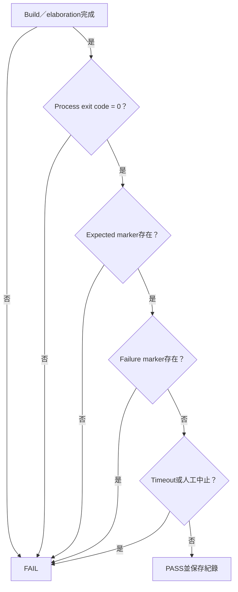

# 預期結果與 PASS／FAIL 判定

本文件集中列出正式測試應出現的成功 marker、失敗 marker、exit code與結果紀錄方式。它描述的是「判定合約」，不是某一次執行的自動生成測試報告。

## PASS 判定流程



本頁適合查表：先找到測試類型，再比對marker和exit code，不需要依章節順序閱讀。

## 1. 最重要的判定規則

一次測試必須同時符合：

```text
build/elaboration成功
AND process exit code = 0
AND expected PASS/READY marker存在
AND failure marker不存在
AND 未超時／未人工中止
```

以下情況不能單獨算PASS：

- terminal有任何文字；
- `vvp`沒有當掉；
- FPGA LED有亮；
- bootloader ACK，但application marker沒出現；
-腳本自己印了`PASS`，但protocol final marker沒有出現；
-只跑一個seed；
- log被截斷在看起來正常的位置。

## 2. RTL unit test預期結果

| Testbench | 必須出現 |
|---|---|
| `id_illegal_decode_tb` | `PASS: id_illegal_decode_tb` |
| `id_csr_decode_tb` | `PASS: id_csr_decode_tb` |
| `csr_file_tb` | `PASS: csr_file_tb` |
| `csr_privilege_tb` | `PASS: csr_privilege_tb` |
| `misalign_check_tb` | `PASS: misalign_check_tb` |
| `machine_irq_sources_tb` | `PASS: machine_irq_sources_tb` |
| `booth_multiplier_tb` | `PASS: booth_multiplier_tb` |
| `restoring_divider_tb` | `PASS: restoring_divider_tb` |
| `ex_muldiv_tb` | `PASS: ex_muldiv_tb` |
| `id_muldiv_decode_tb` | `PASS: id_muldiv_decode_tb` |
| `bp_redirect_scenarios_tb` | `[TB] PASS: 3 scenarios all matched` |
| `icache_tb` | `All tests passed.` |
| `dcache_tb` | `dcache_tb: All tests passed.` |
| `l2_arb_tb` | `L2/ARB TB: PASS` |
| `uart_mmio_tb` | `[TB] PASS: UART/performance MMIO checks completed` |
| `performance_counters_tb` | `[TB] PASS: 64-bit counter control/snapshot checks completed` |
| `vga_subsystem_tb` | `VGA TB PASS` |

若testbench會輸出coverage summary，PASS marker必須在coverage adequacy check之後出現。

## 3. Bootloader RTL預期結果

| Testbench | 必須出現 |
|---|---|
| `uart_bootloader_tb` | `[TB] PASS: v1/v2, UART/DDR CRC rejection, rearm, and host-sync recovery passed.` |
| `uart_bootloader_stall_tb` | `[STALL_TB] PASS: bootloader tolerates stalled app_rdy/app_wdf_rdy.` |
| `uart_bootloader_split_ready_tb` | `[SPLIT_READY_TB] PASS: split app_rdy/app_wdf_rdy write acceptance works.` |
| `uart_bootloader_large_crc_tb` | `[LARGE_CRC_TB] PASS bytes=... crc=...` |

Large CRC還必須確認：

```text
REFERENCE crc == expected constant
FINAL computed == expected
PASS crc == expected
```

如果fixture image不存在或revision不符，結果應記為`NOT RUN`或`BLOCKED BY FIXTURE`，不是PASS。

## 4. CPU TEST=1..27 預期結果

一般格式：

```text
PASS: test N expect xR = 0xVVVVVVVV
```

主要golden：

| TEST | Expected |
|---:|---|
| 1 | `x3=0x00000004` |
| 2 | `x2=0x00000012` |
| 3 | `x2=0x00000005` |
| 4 | `x2=0x00000002` |
| 5 | `x2=0x00000009` |
| 6 | `x2=0x00000002` |
| 7 | `x2=0x00000004` |
| 8 | `x2=0x00000004` |
| 9 | `x2=0xFFFFFF80` |
| 10 | `x2=0x000000F0` |
| 11 | `x8=0x0000001B` |
| 12 | `x10=0x00000103` |
| 13 | `x8=0x2D064C9E` |
| 14 | `x8=0x0002FFF4` |
| 15 | `PASS: test 15 I$ error observed` |
| 16 | `PASS: test 16 D$ error observed` |
| 17 | `x4=0x00000011`，且linefill被觀察 |
| 18 | `x8=0x00000011` |
| 19 | `x6=0x000000CC` |
| 20 | `x8=0x0000005A` |
| 21 | `x8=0x0000005A` |
| 22 | `x8=0x00000055` |
| 23 | `x8=0x00000055` |
| 24 | `x8=0x2400C0DE` |
| 25 | `x10=0xDEAD25FF` |
| 26 | `x10=0x2600C0DE` |
| 27 | `x10=0x2700C0DE` |

完整用途見 [CPU_REGRESSION.md](CPU_REGRESSION.md)。

## 5. Multiseed預期結果

20 seeds、4 tests：

```text
Total: 80
Pass : 80
Fail : 0
Mode : RAND_MEM=1 ASSERT_EN=1
```

100 seeds、4 tests：

```text
Total: 400
Pass : 400
Fail : 0
```

只要一個seed失敗，該次suite就是FAIL。不得以「399/400夠好」掩蓋合法handshake時序下的功能錯誤。

Differential compare：

| Status | 意義 |
|---|---|
| `PASS` | DUT trace與提供的reference符合compare規則 |
| `FAIL` | 找到差異或compare error |
| `SKIP` | 沒提供reference或工具不可用；不能寫成differential PASS |

## 6. RTOS simulation預期結果

| Profile | 必須出現 | 必須不存在 |
|---|---|---|
| smoke | `RTOS_SMOKE_PASS`、`PASS: RTOS smoke simulation` | `FAIL/FATAL/TIMEOUT` |
| preflight | `RTOS_PREFLIGHT_PASS`、`PASS: RTOS preflight simulation` | `RTOS_PREFLIGHT_FAIL`、`[TRAP]` |
| Console | `APP_READY`、`PASS: RTOS Console simulation` | `[CONSOLE] fatal`、`[TRAP]` |
| Platform | 所有subtest pass、`RTOS_PLATFORM_PASS` | `[PLATFORM] FAIL` |
| Lua | protocol/selftest/ready markers、`PASS: RTOS Lua simulation` | Lua panic/fatal、RTOS exception |

### Preflight正常範例

```text
RTOS_PREFLIGHT_BEGIN
RTOS_PREFLIGHT_PASS
PASS: RTOS UART observed pass marker
PASS: RTOS preflight simulation
```

### Platform正常範例

```text
RTOS_PLATFORM_BEGIN
[PLATFORM] test=heap pass
[PLATFORM] test=recursive-mutex pass
[PLATFORM] test=external-irq pass
[PLATFORM] test=sync-event-stream-timer pass
[PLATFORM] test=diagnostics pass tasks=... runtime=...
RTOS_PLATFORM_PASS
```

Task數、runtime counter與free heap可以隨build改變；marker和關鍵invariant才是固定合約。

## 7. 上板 runner預期順序

Console：

```text
RTOS target: ...rtos_console.mem
Preflight: ...rtos_preflight.mem (...)
Target:    ...rtos_console.mem (...)
Protocol:  v2 CRC32 (...)
Uploading RTOS preflight ...
RTOS_PREFLIGHT_BEGIN
RTOS_PREFLIGHT_PASS
Preflight passed; target image sent for bootloader verification.
APP_READY
Target confirmed by marker: APP_READY
```

其中：

- v2 ACK證明loader接受image；
- `RTOS_PREFLIGHT_PASS`證明短版RTOS真的執行；
- `APP_READY`證明target application啟動。

缺少任何一層都不能寫「完整上板PASS」。

## 8. 內建 application marker

| App | Target marker | 預設timeout |
|---|---|---:|
| `smoke` | `RTOS_SMOKE_PASS` | 20 s |
| `console` | `APP_READY` | 20 s |
| `platform` | `RTOS_PLATFORM_PASS` | 20 s |
| `lua` | `LUA_RTOS_READY` | 60 s |
| `vga_demo` | `[VGA] task=L start` | 20 s |
| `vga_queue_demo` | `[PIPE] task=P producer start` | 20 s |

Custom application應提供唯一ASCII marker，例如：

```text
MY_APP_READY
```

marker應在必要driver、object、Task與scheduler確實ready後輸出，不能在`main()`一開始就印出。

## 9. Console probe預期結果

| Command | Expected substring |
|---|---|
| `ping` | `PONG tick=` |
| `status` | `STATUS tick=` |
| `tasks` | `TASK name=console_rx` |
| `echo console-probe` | `ECHO console-probe` |
| `work 256` | `WORK done id=` |
| `perf test N` | `PERF_TEST_PASS` |

最後：

```text
[PROBE] PASS: all RTOS Console commands responded.
```

`tick`、work result ID與counter數值不必固定成同一數字；應驗證格式、範圍與單調性。

## 10. Platform probe預期結果

```text
UART_IRQ_PASS count=
PLATFORM_STATS tick=
[PLATFORM PROBE] PASS: interrupt-driven UART is responsive.
```

如果Platform boot自測PASS但probe失敗，表示startup功能正常，但runtime UART RX IRQ或互動loop仍可能有問題。

## 11. Lua預期結果

Lua boot：

```text
LUA_SCRIPT_PROTOCOL_PASS
LUA_FLOAT_PASS
LUA_SELFTEST_PASS
LUA_REPL_RECOVERY_PASS
LUA_RTOS_READY
```

Lua script upload的正式final marker：

| Marker | 判定 |
|---|---|
| `LUA_SCRIPT_PASS` | 成功完成 |
| `LUA_SCRIPT_ERROR` | compile/runtime錯誤 |
| `LUA_SCRIPT_CRC_ERROR` | transport CRC不符 |
| `LUA_SCRIPT_TIMEOUT` | 超過execution budget |
| `LUA_SCRIPT_STOPPED` | stop命令成功；一般file run不算PASS |
| `LUA_SCRIPT_NOT_READY` | VM/service尚未ready |

Script自己的：

```lua
print("MY_SCRIPT_PASS")
```

只能作application-level輸出；host工具仍應等待`LUA_SCRIPT_PASS`。

## 12. Failure marker總表

常見正式failure pattern：

```text
FAIL
ASSERT_FAIL
FATAL
TIMEOUT
[TRAP]
[RTOS] assert
[RTOS] exception
[RTOS] unexpected
RTOS_PREFLIGHT_FAIL
[CONSOLE] fatal
[PLATFORM] FAIL
[LUA] FATAL
[LUA] PANIC
[VGA] fatal
[PIPE] fatal
```

搜尋marker時要注意context：例如正常說明文字可能含`error test pass`。最可靠做法是由每個runner維護明確failure marker list，而不是對所有log搜尋不分大小寫的`error`。

## 13. Runner exit code

| Exit code | 解釋 |
|---:|---|
| 0 | 成功／dry-run成功 |
| 2 | image解析、dependency或參數問題 |
| 3 | bootloader/marker/failure marker類驗證失敗 |
| 4 | COM/UART exception |

PowerShell wrapper最後的：

```text
RTOS board runner failed with exit code 3.
```

只是總結；真正原因一定要看它前面的第一個具體訊息。

## 14. VGA結果

沒有VGA螢幕：

| 項目 | 可記錄結果 |
|---|---|
| `vga_subsystem_tb` | PASS/FAIL |
| VGA firmware build | PASS/FAIL |
| UART task marker | PASS/FAIL |
| 實體畫面 | N/A — no VGA display |

不能把`N/A`寫成FAIL，因為它不是DUT已被測出錯誤；也不能寫PASS，因為沒有觀察實體輸出。

## 15. 結果狀態定義

建議只使用：

| 狀態 | 定義 |
|---|---|
| PASS | 已執行，所有明確條件通過 |
| FAIL | 已執行，至少一個條件失敗 |
| NOT RUN | 尚未執行 |
| BLOCKED | 想執行但缺dependency、fixture或硬體 |
| N/A | 該feature不在此build／設備適用範圍 |
| SKIP | suite有意跳過，且原因已記錄 |

不要使用模糊的「應該可以」、「看起來正常」作正式狀態。

## 16. 標準結果表

```markdown
| ID | Test | Command/config | Result | Evidence |
|---|---|---|---|---|
| U01 | csr_file_tb | Icarus ... | PASS | build.../csr_file_tb.log |
| C01 | CPU TEST=1..27 | ASSERT_EN=1 | PASS | build.../summary.csv |
| C02 | TEST=24..27 seeds 1..100 | RAND_MEM=1 | PASS | build.../summary.txt |
| R01 | Platform sim | 100 MHz, 12M cycles | PASS | .../rtos_platform_sim.log |
| B01 | Board Platform | bitstream SHA..., COM5 | PASS | .../board_platform.log |
| V01 | Physical VGA | no display | N/A | equipment unavailable |
```

## 17. 每次Release的摘要範本

```text
Verification date:
Git commit:
Working tree:
RTL simulator/version:
RISC-V GCC/version:
FreeRTOS revision:
Vivado/version:
Bitstream SHA-256:
Board:
CPU clock:

Unit TB: PASS __ / __
CPU TEST 1..27: PASS/FAIL
Multiseed: tests=__, seeds=__, PASS __ / __
Differential: PASS/FAIL/SKIP
RTOS simulation: PASS __ / __
Host unit tests: PASS __ / __
Vivado timing: setup WNS=__, hold WHS=__
Board preflight: PASS/FAIL
Board Platform: PASS/FAIL
Console probe: PASS/FAIL
Lua probe: PASS/FAIL/N/A
Warm reload cycles: PASS __ / __
Cold boot cycles: PASS __ / __
Soak duration: __
Physical VGA: PASS/FAIL/N/A

Known failures/gaps:
Log directory:
Reviewer:
```

## 18. 如何描述正確的驗證結論

推薦：

> 在commit X、FAST_SYNTH、50 MHz bitstream Y下，CPU TEST=1..27、TEST=24..27的100 seeds、Platform/Lua RTL simulation、實板preflight與Console probe皆通過；實體VGA因無螢幕未執行。

不推薦：

> 所有功能都完全驗證，沒有任何bug。

驗證結果永遠和revision、config、seed、工具與設備綁定。清楚描述邊界，比給出過度寬泛的PASS更有價值。
