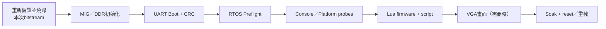
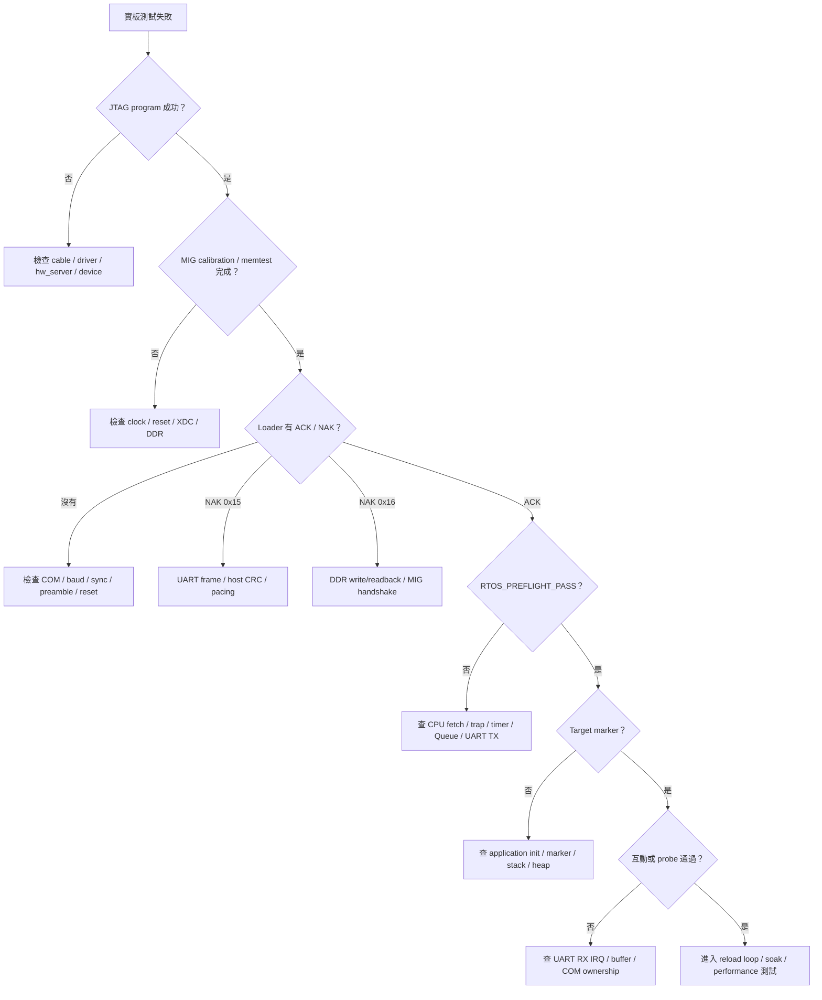

# FPGA 實板驗證

本文件定義Nexys A7-100T的實板驗收流程。標準目標是無需VGA螢幕也能完成CPU、DDR2、UART bootloader、FreeRTOS與Lua的主要驗證；VGA實體畫面列為選配項目。

## 實板驗收層級



每一層通過後才往右進行；失敗時停在該層除錯，不要用後面的application現象猜前面的硬體問題。日常指令統一查 [BOARD_OPERATION_GUIDE.md](../00-overview/BOARD_OPERATION_GUIDE.md)。

## 1. 實板測試的目的

RTL simulation無法完全重現：

- FPGA implementation後的實際clock/reset；
- DDR2 MIG calibration與實體記憶體；
- USB-UART bridge、COM port與線材；
- JTAG programming；
- 真實50 MHz CPU執行；
- 重置、斷電、重載與長時間運作；
- Vivado timing closure。

所以最終驗收必須包含實板，但實板也不能取代directed RTL TB。

## 2. 所需設備

必要：

- Digilent Nexys A7-100T；
-可傳資料的USB線；
-Windows主機與正確cable driver；
-標準非VGA bitstream；
-板載USB-UART，預設115200 baud；
- Python + pyserial；
- RISC-V toolchain與FreeRTOS source。

選配：

- VGA螢幕與線材；
-邏輯分析儀／示波器；
-第二台主機或USB-UART analyzer；
-可控電源供應器。

目前沒有VGA螢幕時，可將「實體VGA畫面」記為 `N/A — equipment unavailable`；UART與`vga_subsystem_tb`仍可驗證數位部分。

## 3. 測試前記錄

```powershell
cd C:/cpu_design
git rev-parse HEAD
git status --short
Get-FileHash ./build_fpga/board_top_rtos_rearm.bit -Algorithm SHA256
Get-Item ./build_fpga/board_top_rtos_rearm.bit |
  Select-Object FullName,Length,LastWriteTime
python --version
```

另記錄：

```text
board serial/識別：
Vivado version：
CPU clock：
bitstream top：
FAST_SYNTH/PRODUCTION_BUILD：
FreeRTOS version/path：
COM port：
UART baud：
```

沒有revision/hash的「上板成功」很難在之後重現。

## 4. Bitstream 驗收

若RTL、XDC、clock或MIG有變更，先依 [PROGRAM_FPGA.md](../03-build-boot/PROGRAM_FPGA.md)重建：

```powershell
./tools/build_board_bitstream.ps1 `
  -Project $Project `
  -VivadoBat $VivadoBat `
  -OutputBit ./build_fpga/board_top_rtos_rearm.bit `
  -Jobs 4
```

必須確認：

- project top是`board_top`；
- source path指向目前repository；
- synthesis/implementation完成；
- setup WNS與hold WHS非負；
-沒有未處理的clock/unconstrained-path critical warning；
- output bitstream時間戳與hash是本次結果。

## 5. JTAG program

```powershell
./tools/program_board_bitstream.ps1 `
  -Bitstream ./build_fpga/board_top_rtos_rearm.bit `
  -VivadoBat $VivadoBat
```

成功：

```text
PROGRAMMED: C:\cpu_design\build_fpga\board_top_rtos_rearm.bit
```

Programming成功只代表FPGA configuration完成；DDR中的application仍是空的。

## 6. 上電後初步狀態

標準流程：

```text
FPGA configured
→ clock/reset初始化
→ MIG calibration
→ DDR power-on memory test
→ UART bootloader等待image
→ CPU仍被reset hold
```

`board_top.v`的status LED可輔助判斷：

| 狀態 | 意義 |
|---|---|
| MIG calibration完成 | DDR controller可用的必要條件 |
| DDR memtest pass | boot前基本DDR read/write通過 |
| boot_done | image verification成功、CPU可釋放 |

LED有phase multiplexing，必須配合`boot_done`解讀；不要只用某一顆LED亮或不亮判斷全部功能。

## 7. 找出 COM port

```powershell
[System.IO.Ports.SerialPort]::GetPortNames()
```

或：

```powershell
Get-CimInstance Win32_SerialPort |
  Select-Object DeviceID,Name
```

關閉PuTTY、Tera Term、Arduino Serial Monitor與舊的Python monitor。Windows同一個COM port通常只能被一個process獨占。

## 8. 第一階段：Preflight + Console

```powershell
./tools/run_rtos_app.ps1 `
  -Port COM5 `
  -App console `
  -Protocol v2 `
  -Log ./build_rtos_apps/board_console.log
```

Runner會：

1. 建置preflight與Console；
2.等待DDR/loader；
3.傳preflight；
4.等待`RTOS_PREFLIGHT_PASS`；
5.讓preflight要求reload；
6.傳Console；
7.等待`APP_READY`；
8.進入interactive monitor。

必須看見：

```text
RTOS_PREFLIGHT_PASS
Preflight passed; target image sent for bootloader verification.
APP_READY
Target confirmed by marker: APP_READY
```

## 9. Console 功能 probe

Runner interactive monitor仍開著時，先按`Ctrl+C`釋放COM。這只關閉PC monitor，不會停止FPGA上的CPU。

執行：

```powershell
python ./tools/rtos_console_probe.py `
  --port COM5 `
  --baud 115200 `
  --perf-iterations 256
```

Probe依序驗證：

| Command | Marker |
|---|---|
| `ping` | `PONG tick=` |
| `status` | `STATUS tick=` |
| `tasks` | `TASK name=console_rx` |
| `echo console-probe` | `ECHO console-probe` |
| `work 256` | `WORK done id=` |
| `perf test 256` | `PERF_TEST_PASS` |

成功結尾：

```text
[PROBE] PASS: all RTOS Console commands responded.
```

這同時測試interrupt-driven UART RX、Stream Buffer、command Task、Queue、worker Task與performance counter MMIO。

## 10. Platform 綜合驗收

```powershell
./tools/run_rtos_app.ps1 `
  -Port COM5 `
  -App platform `
  -Monitor none `
  -Log ./build_rtos_apps/board_platform.log
```

必須看見：

```text
RTOS_PREFLIGHT_PASS
RTOS_PLATFORM_PASS
Target confirmed by marker: RTOS_PLATFORM_PASS
```

接著：

```powershell
python ./tools/rtos_platform_probe.py --port COM5
```

應通過：

```text
UART_IRQ_PASS count=
PLATFORM_STATS tick=
[PLATFORM PROBE] PASS: interrupt-driven UART is responsive.
```

Platform是release前建議的主要FreeRTOS實板驗收，涵蓋heap、同步物件、software timer、external IRQ、runtime diagnostics與dynamic/static Task。

## 11. Lua 驗收

上板：

```powershell
./tools/run_rtos_app.ps1 `
  -Port COM5 `
  -App lua `
  -Monitor none `
  -Log ./build_rtos_apps/board_lua.log
```

Lua預設target timeout為60秒。必須看見：

```text
LUA_SCRIPT_PROTOCOL_PASS
LUA_SELFTEST_PASS
LUA_RTOS_READY
Target confirmed by marker: LUA_RTOS_READY
```

REPL probe：

```powershell
python ./tools/rtos_lua_probe.py --port COM5
```

它檢查table、string/math、錯誤後recovery、loop與`rtos.sleep/heartbeat`。

Script service probe：

```powershell
python ./tools/rtos_lua_script_probe.py --port COM5
```

涵蓋：

- multi-line script；
- CRC錯誤；
- size/guard；
- timeout；
- stop/detach；
- large script；
-錯誤後恢復。

簡單檔案：

```powershell
python ./tools/run_lua_script.py `
  --port COM5 `
  --file ./lua_apps/hello.lua
```

正式成功應等待protocol final marker：

```text
LUA_SCRIPT_PASS
```

不要只因腳本自己印出`PASS`文字就判定transport與execution成功。

## 12. Bootloader reload／重複上傳

依序切換：

```powershell
./tools/run_rtos_app.ps1 -Port COM5 -App console  -Monitor none
./tools/run_rtos_app.ps1 -Port COM5 -App platform -Monitor none
./tools/run_rtos_app.ps1 -Port COM5 -App lua      -Monitor none
./tools/run_rtos_app.ps1 -Port COM5 -App console  -Monitor none
```

每次都必須經過preflight與target marker。這測試：

- application-requested reload；
- hardware sync takeover；
-第二份image覆蓋第一份；
-不斷電切換application；
- COM重新開啟。

若只有第一次上傳成功，後續必須按reset，表示rearm/recovery仍不完整。

## 13. Cold boot 與 warm reload 的差別

### Warm reload

FPGA仍供電且bitstream存在，只重新上傳`.mem`：

-不需JTAG program；
- runner可用`reload`/sync讓bootloader接管；
- DDR內容會被新image覆蓋。

### CPU reset

CPU/board reset後：

- FPGA configuration通常仍在；
- DDR/MIG與loader會重新初始化；
-通常需要重新上傳`.mem`。

### 完全斷電

- FPGA SRAM configuration消失；
- DDR內容消失；
-必須重新program `.bit`；
-再重新上傳`.mem`；
- Lua script也需重傳。

「5～10次斷電重開」就是完整重複program bitstream + upload + marker，而不只是關掉terminal。

## 14. 穩定性循環

### Warm upload循環

固定bitstream與target，重複10次：

```text
preflight upload → PASS
target upload → marker
close COM
repeat
```

記錄每次：

- attempt數；
- ACK/NAK；
- marker等待時間；
-是否需要手動reset；
- raw UART log。

### Cold boot循環

建議release前5～10次：

```text
power off
wait until fully discharged
power on
program same bitstream
upload same target
run same probe
```

冷啟動能發現MIG calibration、reset sequencing與USB enumeration的偶發問題。

## 15. Soak test

最低建議：

- Console/Platform：30分鐘；
-長時間Queue smoke：30～60分鐘；
-目標application：至少涵蓋最壞case輸入；
- Lua：重複script上傳、執行、error recovery。

觀察：

- tick持續增加；
- Task輸出/heartbeat未停止；
- UART沒有大量overrun/亂碼；
-沒有`[TRAP]`、assert、stack overflow、malloc failure；
-performance counter仍可snapshot；
- reload仍能恢復。

Soak沒有錯誤不代表不存在罕見race；報告應記錄實際時間和操作次數。

## 16. Performance counter實板檢查

Console：

```powershell
python ./tools/rtos_console_probe.py `
  --port COM5 `
  --perf-only `
  --perf-iterations 100000 `
  --timeout 20
```

保存：

- cycle；
- retired instructions；
- IPC；
- frontend/memory/MulDiv stall；
- branch prediction/redirect；
- I$/D$ miss；
- L2/DDR command。

同一revision重測應大致一致。性能數字不是PASS marker的替代品：程式算錯但跑得很快仍是FAIL。

## 17. VGA 選配驗收

沒有VGA螢幕時：

-執行`vga_subsystem_tb`；
-確認VGA firmware可build；
-可透過UART marker確認VGA Task啟動；
-實體畫面、sync polarity與類比輸出標記N/A。

有螢幕時才做：

1. 使用`board_top_vga`與對應XDC重建bitstream；
2.先顯示固定色塊／initials；
3.檢查640×480穩定、不漂移；
4.再跑RTOS VGA demo；
5.確認畫面更新與UART marker一致。

標準`board_top_rtos_rearm.bit`不是VGA top，不能只換firmware就得到VGA pins。

## 18. Failure triage

| 現象 | 分類 |
|---|---|
| JTAG找不到device | USB/JTAG/driver/hw_server |
| program成功、MIG LED不完成 | clock/reset/MIG/XDC/DDR |
| loader沒有ACK/NAK | COM/baud/sync/preamble/loader reset |
| NAK `0x15` | frame/host CRC/header |
| NAK `0x16` | DDR write/readback verification |
| preflight BEGIN後FAIL | Queue/tick/data/RTOS問題 |
| preflight沒有BEGIN | CPU未啟動、fetch/trap/UART TX |
| preflight PASS、target無marker | target application或marker timeout |
| Console TX正常、probe無RX | UART RX IRQ/Stream Buffer/COM ownership |
| 偶發亂碼 | baud/clock、USB線、host pacing、overrun |
|一段時間後停止 | deadlock、stack/heap、interrupt、long-op/memory stall |

從最早缺少的證據開始查，通常比直接懷疑 application 更快：



## 19. 實板通過條件

標準非VGA release至少：

- bitstream timing通過；
- JTAG programming成功；
- MIG/memtest正常；
- protocol v2 preflight PASS；
- target marker PASS；
- Platform self-test PASS；
- Console probe PASS；
- Lua profile若列為release功能，Lua probes PASS；
- warm reload循環通過；
- cold boot循環通過；
- soak期間無failure marker；
-所有log、hash與revision已保存。

## 20. 結論邊界

沒有VGA螢幕不影響下列結論：

- CPU能在FPGA執行；
- DDR2、UART bootloader與CRC可用；
- FreeRTOS scheduler/Queue/IRQ可用；
- Console、Platform與Lua可用；
-performance counter可量測。

但不能宣稱：

-實體VGA connector、類比電平、sync與特定螢幕相容性已驗證。
