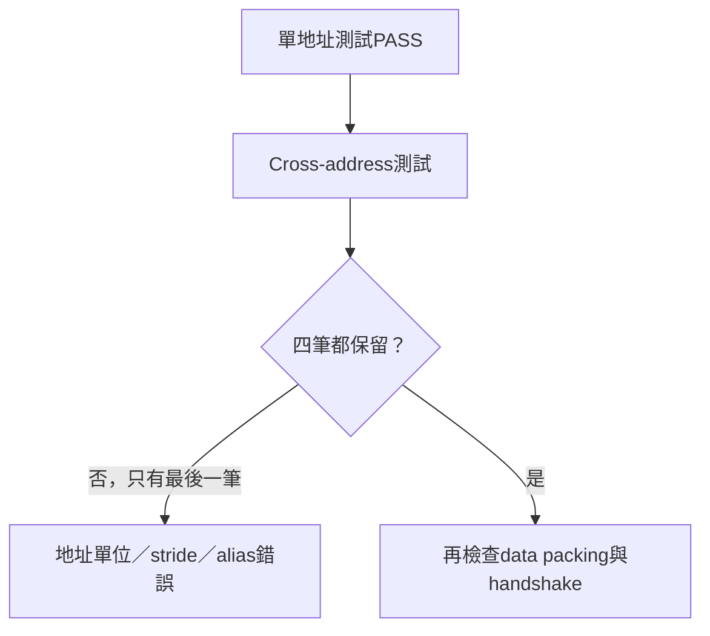
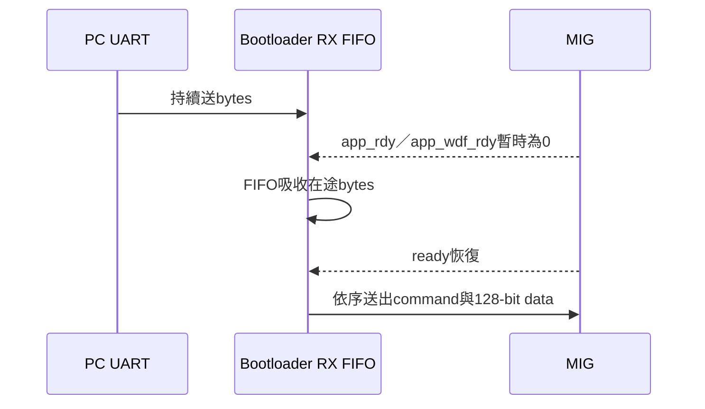

# FPGA Bring-up除錯案例與設計經驗

> 本頁保存早期 `DDR2 + UART bootloader + CPU + VGA` 實板除錯中仍有價值的根因與方法。它不是目前操作指令；日常上板請使用 [BOARD_OPERATION_GUIDE.md](../00-overview/BOARD_OPERATION_GUIDE.md)。

## 1. 為什麼保留除錯案例

正式規格告訴讀者「現在應該如何運作」，但無法完整說明：

- 哪些看似合理的假設其實錯誤；
- 為什麼單一test pass仍可能是假象；
- 如何從多個現象縮小到真正根因；
- 哪些debug機制值得留在正式設計。


## 2. 案例一：DDR單地址通過，但相鄰資料互相覆蓋

### 現象

- MIG `init_calib_complete`正常；
- 單一地址write/read memtest會PASS；
- UART sync可以被偵測；
- 但較長image寫入後，CPU取指或DDR verify失敗。

這些現象一度讓問題看起來像UART丟包或MIG握手錯誤。

### 能區分根因的測試

將memtest從「同一地址寫後立即讀」改成：

```text
write addr0
write addr1
write addr2
write addr3
read  addr0
read  addr1
read  addr2
read  addr3
```

結果只有最後寫入的地址正確，代表多筆physical address被錯誤映射到相同MIG位置。



### 根因

早期RTL把這顆x16 DDR2 MIG native interface的`app_addr`誤認成16-byte beat index，因此使用：

```text
(physical_address - DDR_BASE) >> 4
```

實際上目前MIG的`app_addr`要以byte-domain offset使用。低4 bits仍因128-bit beat而對齊為0，但不能在送入MIG前再次右移4位。

### 正式修正

- L2：`pa_to_app_addr16()`回傳 `(PA - DDR_BASE)[26:0]`；
- Bootloader write／verify：使用byte-domain offset；
- 16-byte beat依`+0x10`前進；
- Power-on memtest測試`0x00/0x10/0x20/0x30`等真正相鄰beat。

目前規格見 [L2_CACHE_DDR2.md](../02-memory-io/L2_CACHE_DDR2.md)。

### 防止復發

1. 保留cross-address memtest；
2. 驗證第一筆資料在後續多筆寫入後仍存在；
3. Bootloader完成後重新從DDR讀回整份image並驗證CRC；
4. Cache／L2 test同時檢查beat address序列；
5. 不從資料寬度直接猜測vendor IP地址單位，必須查generated MIG參數與實測。

## 3. 案例二：MIG reset極性使所有後續現象失真

### 現象

- `init_calib_complete`不穩定或無法到達；
- reset相關LED只在按鍵時短暫變化；
- Bootloader與CPU看似同時失敗。

### 根因與教訓

MIG `sys_rst` polarity一度接反。DDR未完成正確初始化時，任何UART image、Cache或CPU現象都不具診斷價值。

正確順序是：

```text
Clock Wizard lock
  → MIG reset正確解除
  → init_calib_complete
  → cross-address memtest PASS
  → Bootloader sync／upload／CRC
  → CPU release
```

若前一層沒有證據，不應跳到後一層猜測。

## 4. 案例三：MIG back-pressure期間UART RX遺失

### 問題

UART持續送payload，但MIG的command或write-data channel可能暫時`ready=0`。如果Bootloader只能保存當下一個byte，等待MIG期間新的UART資料就可能覆蓋或遺失。



### 修正與驗證

- Bootloader加入RX FIFO；
- command與write-data handshake分開保存done狀態；
- `uart_bootloader_stall_tb.v`刻意注入MIG stall；
- Protocol v2加入length、CRC與DDR readback驗證；
- PC runner保留chunk pacing與retry。

這個FIFO不是最後的DDR address根因，但它是可靠長payload上傳的必要條件。

## 5. 案例四：VGA RTOS demo偏離已驗證路徑後不穩定

### 早期問題

- 使用新的32-bit framebuffer helper，而既有穩定driver使用16-bit packed 4-pixel word；
- 暫時停用`mtime/mtimecmp`，改靠合作式`taskYIELD()`；
- 同時加入過多trace、unused buffer與debug helper，使故障邊界不清楚。

### 收斂方法

```text
先從已驗證的RTOS smoke路徑開始
  + 官方FreeRTOS RISC-V portASM.S
  + machine timer tick
  + vTaskDelay()
  + 既有 game/vga_fb.c
  + 最小Task與最小buffer
```

三Task VGA demo最後只保留左、中、右三個Task，每個Task只更新自己的panel，並定期輸出frame counter。Queue demo則再加入Producer→Queue→Renderer與獨立Heartbeat。

教訓是：新增demo時一次只替換一個已驗證元件，否則多個變因會讓問題無法定位。

## 6. LED診斷應該保留到什麼程度

早期bring-up使用大量phase-dependent LED，可以區分：

- Clock lock與MIG calibration；
- UART edge與sync；
- DDR multi-address memtest；
- Bootloader verify request／response；
- `boot_done`；
- CPU fetch／commit與runtime UART。

大量LED適合bring-up，但交接時必須說明同一顆LED可能依boot phase改變語意。正式版建議至少保留：

| 狀態 | 用途 |
|---|---|
| DDR init done | 確認MIG calibration |
| DDR memtest pass | 確認多地址不alias |
| Boot done | 確認image被接受 |
| Core alive | 確認CPU持續前進 |
| UART active／error | 確認runtime I/O與錯誤 |

完整mapping以 [`board_top.v`](../../board_top.v) 的實際status mux為準，不應只引用歷史pin表。

## 7. Bring-up的分層判斷法

| 層級 | 最小證據 | 不能證明什麼 |
|---|---|---|
| Clock／Reset | lock、reset解除 | DDR一定正常 |
| MIG | calibration done | 多地址mapping正確 |
| DDR memtest | cross-address PASS | UART串流與CRC正確 |
| UART Boot | ACK＋DDR CRC PASS | CPU／RTOS已啟動 |
| Preflight | `RTOS_PREFLIGHT_PASS` | 目標application正確 |
| Target | READY marker | 所有互動功能通過 |
| Probe／Soak | 功能PASS、長時間穩定 | 所有未測workload都正確 |

## 8. 從案例得到的通用規則

1. 單地址memory test不足，必須測cross-address與保留性；
2. Vendor IP介面單位要由generated configuration與directed test確認；
3. UART sync成功不代表payload正確，必須有CRC與DDR readback；
4. Back-pressure要在testbench中主動注入；
5. 已知良好路徑一次只修改一個變因；
6. 實板LED、UART marker、CRC與RTL assertion應互相補足；
7. 一個test pass只能證明它實際覆蓋的條件；
8. 修正根因後要加入regression，不能只記在聊天或暫存筆記。

## 9. 對應正式文件

- [L2_CACHE_DDR2.md](../02-memory-io/L2_CACHE_DDR2.md)：目前MIG地址與仲裁規格。
- [UART_BOOTLOADER.md](../03-build-boot/UART_BOOTLOADER.md)：Protocol v2、CRC與rearm。
- [BOOTLOADER_TESTS.md](BOOTLOADER_TESTS.md)：stall、ready split與錯誤注入。
- [CLOCK_RESET.md](../01-architecture/CLOCK_RESET.md)：reset polarity與clock domain。
- [VGA_RTOS_DEMOS.md](../05-applications/VGA_RTOS_DEMOS.md)：目前VGA Task／Queue demo。
- [FPGA_BOARD_TEST.md](FPGA_BOARD_TEST.md)：正式實板驗收流程。

