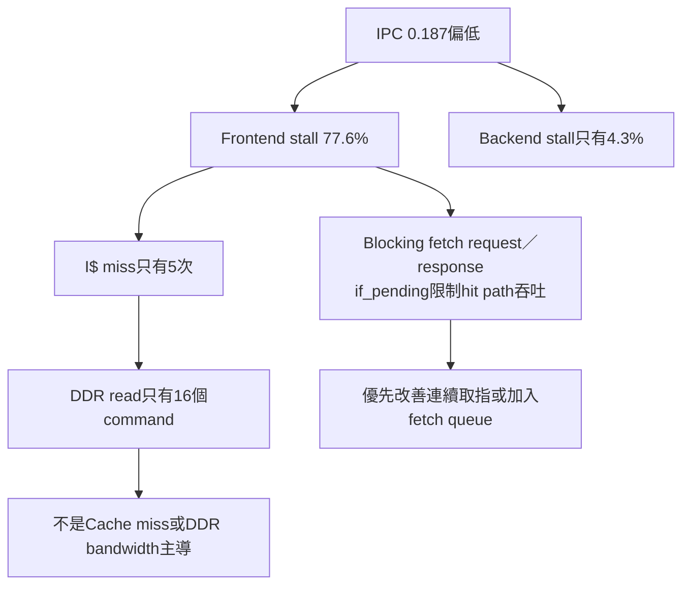
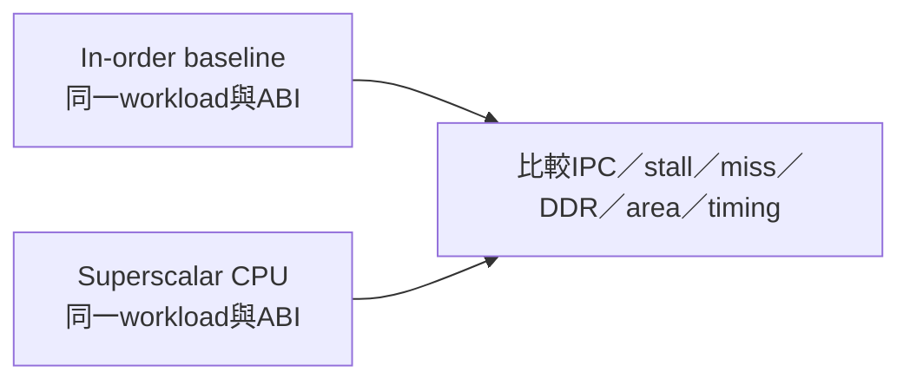

# RV32IM＋FreeRTOS實板效能基準分析

> 本頁保存2026-07-15量測的in-order CPU基準與推論，內容由舊分析紀錄遷移。它是可重現的歷史baseline，不代表每次修改RTL後的最新數值；硬體變更後應重新執行相同workload並新增一筆結果。

## 1. 量測條件

| 項目 | 條件 |
|---|---|
| 開發板 | Nexys A7-100T |
| CPU | RV32IM、五級、in-order、single-issue |
| Core clock | 50 MHz |
| Firmware | RTOS Console |
| Workload | `perf test 100000` |
| Cache狀態 | Console啟動已經使用Cache；此workload是上板後第一次執行 |
| 日期 | 2026-07-15 |

量測前重新上傳Console並reset counters。日後重跑時至少記錄Git commit、Vivado project/top、Cache build define、clock與workload參數。

## 2. FPGA implementation結果

| 項目 | 結果 |
|---|---:|
| Setup WNS | `+0.202 ns` |
| Hold WHS | `+0.015 ns` |
| Routing errors | 0 |
| Slice LUT | 27,158 / 63,400（42.84%） |
| Slice FF | 17,746 / 126,800（14.00%） |
| BRAM tile | 16 / 135（11.85%） |
| DSP | 0 |

相較當時加入counter前的24,725 LUT／14,613 FF，增加2,433 LUT與3,133 FF。FF增加主要來自：

```text
24 × 64-bit live counters
+ 24 × 64-bit snapshot counters
= 3,072 bits的counter state，加上control與routing
```

當時最差setup path回到`MEM addr_q → I-Cache PLRU`，endpoint不在performance counter。PERF MMIO採registered response，避免大型read mux直接進入核心combinational path。

## 3. 實板原始輸出

```text
PERF_TEST iterations=100000 result=0x7CFED607
PERF cycles=5791940 instret=1085672 ipc=0.187 overflow=0
PERF_STALL frontend=0.776 backend=0.043 load_use=0.000 ex_busy=0.000
PERF_CTRL branch=205002 taken=101407 jumps=103594 miss=2429 miss_rate=0.007
PERF_CACHE i=5/1088998 i_miss=0.000 d=0/49975 d_miss=0.000 wb_beats=0
PERF_MEM load=29655 store=21063 mmio_r=394 mmio_w=349 ddr_r=16 ddr_w=0
PERF_SYSTEM exception=391 interrupt=116 flush=3443
PERF_TEST_PASS
```

Console使用三位小數顯示ratio：

- `frontend=0.776`代表77.6%，不是0.776%；
- `ipc=0.187`代表每cycle退休約0.187條指令；
- 非零但極小的miss rate可能顯示為`0.000`，應用原始分子／分母重算。

## 4. 衍生指標

| 指標 | 計算 | 結果 |
|---|---|---:|
| IPC | `1,085,672 / 5,791,940` | 約0.18745 |
| CPI | `5,791,940 / 1,085,672` | 約5.335 |
| Frontend stall | `frontend / cycles` | 約77.6% |
| Backend stall | `backend / cycles` | 約4.3% |
| Control miss rate | `2,429 / (205,002 + 103,594)` | 約0.787% |
| I$ miss rate | `5 / 1,088,998` | 約0.000459% |
| D$ miss rate | `0 / 49,975` | 0% |
| DDR reads／1k inst | `16 × 1000 / 1,085,672` | 約0.0147 |

## 5. 主要結論：瓶頸在前端供應吞吐



如果前端stall是由I$ miss主導，應同時看到大量I$ line fill與DDR read。實際上I$ miss極低，表示資料多數已在Cache，但前端控制仍無法穩定每cycle取得一條指令。

因此當時的優先優化方向是：

1. 讓I-Cache hit path可以pipeline；
2. 降低一次只能有一筆blocking fetch的限制；
3. 加入小型fetch queue，解耦取指回覆與ID消耗；
4. 再量測branch redirect時queue清除與錯誤路徑。

單純先擴大Cache容量不會直接解除此瓶頸。

## 6. Branch predictor不是最大損失來源

| 事件 | 次數 |
|---|---:|
| Conditional branches | 205,002 |
| Taken branches | 101,407 |
| JAL／JALR | 103,594 |
| Recovery redirects | 2,429 |

Control miss rate約0.787%，遠低於frontend stall比例。即使完全消除這些redirect，也無法解釋77.6%的前端等待。

不過目前counter把conditional branch direction miss與JALR target recovery放在同一組，不能直接把0.787%當成PHT本身的錯誤率。未來若研究BTB／RAS，應拆分event。

## 7. Counter交叉一致性

### Memory分類閉合

```text
loads + stores
= 29,655 + 21,063
= 50,718

D-Cache accesses + MMIO reads + MMIO writes
= 49,975 + 394 + 349
= 50,718
```

兩邊相等，表示這個workload的load/store在D-Cache與local MMIO分類上沒有明顯重複或漏計。

### Pipeline flush閉合

```text
control mispredict                                  2,429
391次taskYIELD exception + 391次mret                  782
116次timer interrupt + 116次mret                      232
---------------------------------------------------------
pipeline flush                                      3,443
```

`run_workload()`每256 iteration呼叫一次`taskYIELD()`；100,000 iterations產生391次yield，符合向上取整後的呼叫次數。這項關係同時驗證exception、interrupt、`mret`與system flush event。

## 8. Cache與DDR結果的限制

首次workload只有：

- 5次I$ line fill；
- 16次L2到DDR read command；
- 0次D$ miss；
- 0次writeback與DDR write。

第二次相同workload的DDR read變成0，符合L2已暖機。因此這個workload適合驗證pipeline、branch、yield、interrupt與counter一致性，但不適合代表大型working set或memory bandwidth。

要評估Memory system，還需要：

- 大於L1／L2容量的sequential streaming；
- random access；
- dirty eviction與writeback；
- read／write混合；
- cold-cache與warm-cache分開紀錄。

## 9. 如何重跑

先依 [BOARD_OPERATION_GUIDE.md](../00-overview/BOARD_OPERATION_GUIDE.md) 燒錄本次硬體，再啟動Console：

```powershell
.\tools\run_rtos_app.ps1 -Port COM5 -App console
```

看到`APP_READY`後輸入：

```text
perf test 100000
```

保存完整UART：

```powershell
.\tools\run_rtos_app.ps1 `
  -Port COM5 `
  -App console `
  -Monitor interactive `
  -Log .\build_rtos_apps\perf_baseline.log
```

每次結果至少記錄：

```text
日期／Git commit
Vivado project與top
FAST_SYNTH／PRODUCTION_BUILD設定
Clock frequency
Firmware與workload參數
Cold／warm cache
24個raw counter
Vivado timing與resource utilization
```

## 10. 與未來Superscalar比較



公平比較要求：

- 相同輸入與軟體語意；
- 相同counter定義或提升ABI version；
- 同時報告frequency，不能只比較cycle；
- Superscalar instret能一cycle增加多條；
- 分開說明issue width、fetch width與retire width；
- 同時比較LUT、FF、BRAM、DSP與timing margin。

如果Superscalar只增加後端issue width，卻沿用無法持續供應指令的blocking frontend，IPC不會按寬度比例提高。

## 11. 這份基準能與不能證明什麼

可以證明：

- Counter的主要分類能交叉閉合；
- 此特定workload的主要瓶頸是frontend throughput；
- branch、D-Cache與DDR不是該次量測的主要限制；
- 基準可作為未來架構修改前的比較起點。

不能證明：

- 所有application都由相同瓶頸主導；
- Cache與DDR頻寬已充分測試；
- 新版RTL仍有完全相同數值；
- 僅靠counter即可取代waveform、testbench與timing report。

延伸閱讀：[效能監測架構](../02-memory-io/PERFORMANCE_MONITORING_ARCHITECTURE.md) · [Counter MMIO ABI](../02-memory-io/PERFORMANCE_COUNTER_REGISTERS.md)

