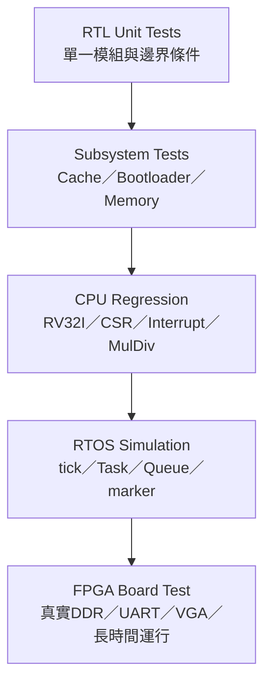
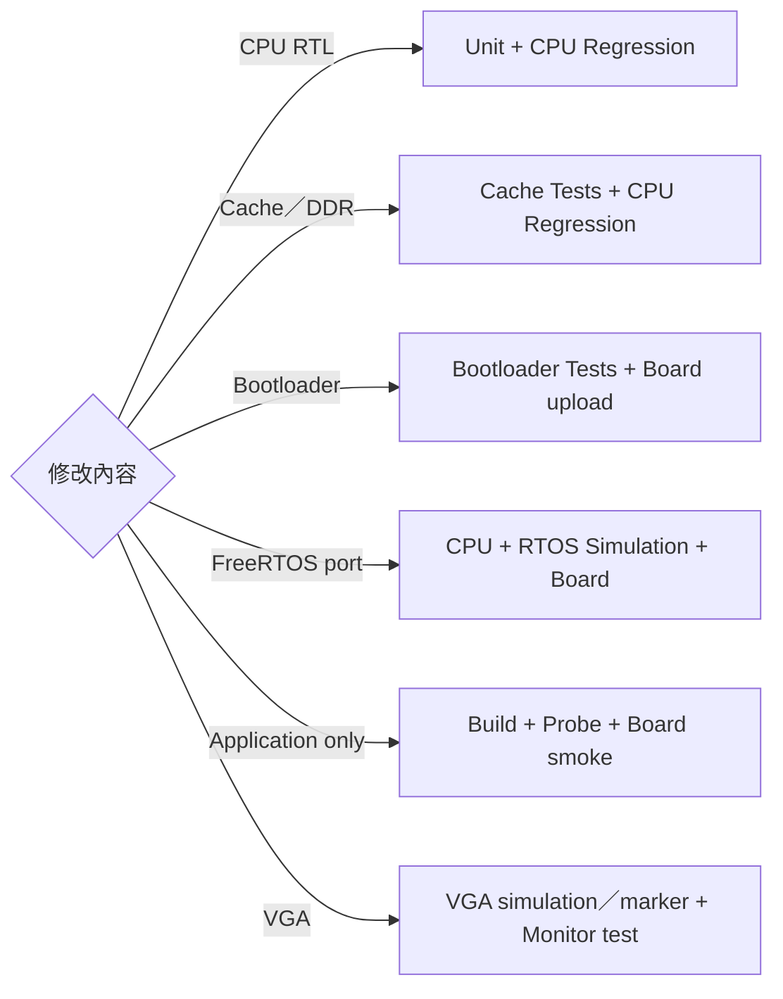

# 06 — Verification 導覽

> 這個資料夾不是要求每次都跑所有測試，而是依修改風險選擇正確層級，從單一 RTL 模組一路確認到實際 FPGA、FreeRTOS 與 application。

## 驗證金字塔

越往下執行越快、問題定位越精確；越往上越接近真實使用，但失敗時需要回到下層找原因。

## 文件分工

| 文件 | 回答的問題 |
|---|---|
| [VERIFICATION_PLAN.md](VERIFICATION_PLAN.md) | 修改了某功能，最少要重跑哪些測試？ |
| [TESTBENCH_CATALOG.md](TESTBENCH_CATALOG.md) | 每個 testbench 名稱和用途是什麼？ |
| [CPU_REGRESSION.md](CPU_REGRESSION.md) | 如何跑 CPU TEST=1..27 與 multiseed？ |
| [CACHE_TESTS.md](CACHE_TESTS.md) | I$、D$、L2、DDR 路徑如何分層測？ |
| [BOOTLOADER_TESTS.md](BOOTLOADER_TESTS.md) | UART protocol、CRC、back-pressure 如何測？ |
| [RTOS_SIMULATION.md](RTOS_SIMULATION.md) | FreeRTOS 如何在 RTL simulation 中驗證？ |
| [FPGA_BOARD_TEST.md](FPGA_BOARD_TEST.md) | 實板、VGA、Lua、soak test 如何驗收？ |
| [EXPECTED_RESULTS.md](EXPECTED_RESULTS.md) | 哪個 marker／數值才算 PASS？ |
| [FPGA_BRINGUP_CASE_STUDIES.md](FPGA_BRINGUP_CASE_STUDIES.md) | DDR address、MIG reset、UART back-pressure與VGA曾如何定位？ |
| [PERFORMANCE_BASELINE_ANALYSIS.md](PERFORMANCE_BASELINE_ANALYSIS.md) | 50 MHz in-order基準為何判定frontend是瓶頸？ |

## 修改範圍到測試層級

## 建議工作方式

1. 先在 `VERIFICATION_PLAN` 查 feature-to-test matrix。
2. 到對應測試文件複製指令。
3. 到 `EXPECTED_RESULTS` 判定 PASS／FAIL，不要只看 process exit code。
4. 實板交付最後填寫 `FPGA_BOARD_TEST` 的紀錄欄位。

上下游：[文件閱讀中心](../README.md) · [CPU 架構](../01-architecture/README.md) · [Memory／I/O](../02-memory-io/README.md) · [Application](../05-applications/README.md)
