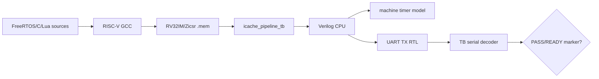

# FreeRTOS RTL Simulation

本文件說明如何讓自製 CPU RTL 執行真正的 FreeRTOS firmware，並以 UART marker判定 scheduler、tick、Task、Queue與application startup。這不是在Windows上執行FreeRTOS，也不是C函式的host mock；每一條指令都由Verilog CPU在simulation中執行。

## 1. Simulation 架構



這一層會涵蓋：

- startup assembly與linker layout；
- RV32IM/Zicsr machine code；
- CSR、trap handler與`mret`；
- machine timer interrupt；
- FreeRTOS context switch；
- application建立的Task/object；
- UART TX輸出。

## 2. 必要工具

- Python 3；
- RISC-V bare-metal GCC/binutils；
- Icarus Verilog `iverilog`與`vvp`；
- FreeRTOS-Kernel source checkout；
- PowerShell。

確認：

```powershell
python --version
iverilog -V
vvp -V
C:/riscv/xpack-riscv-none-elf-gcc/bin/riscv64-unknown-elf-gcc --version
```

預設 FreeRTOS path是開發機路徑：

```text
C:\Users\a0968\Downloads\FreeRTOSv202406.04-LTS\FreeRTOS-LTS\FreeRTOS\FreeRTOS-Kernel
```

其他環境應指定：

```powershell
$FreeRTOSRoot = "D:/src/FreeRTOS-Kernel"
```

## 3. Simulation clock 與實板 clock

現有 RTOS simulation scripts預設：

```text
CpuClockHz = 100,000,000
```

現行實板預設：

```text
CpuClockHz = 50,000,000
```

simulation testbench clock與firmware的`configCPU_CLOCK_HZ`必須一致，machine timer compare才能產生預期1 kHz tick。這兩個值不同是兩個不同build profile，不代表CPU同時在兩個頻率運作。

不要把100 MHz simulation的牆上執行時間當成100 MHz實體效能；event-driven RTL simulation可能比實板慢數萬倍。

## 4. UART marker monitor

`icache_pipeline_tb`可用：

```text
+RTOS_UART_MON=1
+RTOS_UART_FINISH_ON_PASS=1
```

Testbench會依UART bit timing重新組成byte並輸出文字，辨識：

- `RTOS_SMOKE_PASS`
- `RTOS_PREFLIGHT_PASS`
- `RTOS_PLATFORM_PASS`
- `LUA_RTOS_READY`
- `APP_READY`

看見marker後的換行，testbench輸出：

```text
PASS: RTOS UART observed pass marker
```

各PowerShell wrapper仍會再次掃描profile-specific marker與failure marker，避免只靠generic monitor。

## 5. Smoke simulation

```powershell
cd C:/cpu_design
./tools/run_rtos_smoke_sim.ps1 `
  -FreeRTOSRoot $FreeRTOSRoot
```

預設：

| 參數 | 值 |
|---|---:|
| BuildDir | `build_rtos` |
| MaxCycles | 5,000,000 |
| CpuClockHz | 100,000,000 |

成功需要：

```text
RTOS_SMOKE_PASS
PASS: RTOS smoke simulation
```

Smoke firmware建立producer/consumer Task與Queue，至少交換三筆遞增資料。它證明基本scheduler、tick、blocking Queue與兩個Task可以工作。

## 6. Preflight simulation

```powershell
./tools/run_rtos_preflight_sim.ps1 `
  -FreeRTOSRoot $FreeRTOSRoot
```

成功：

```text
RTOS_PREFLIGHT_BEGIN
RTOS_PREFLIGHT_PASS
PASS: RTOS preflight simulation
```

Preflight檢查：

- static Queue建立；
-兩個static Task建立；
- `xQueueSend`／`xQueueReceive`；
-三筆資料順序；
- tick count非0；
- UART TX。

在實板上，preflight PASS後會要求bootloader reload；simulation通常在marker時結束，因此不需要真的送第二份image。

## 7. Console simulation

```powershell
./tools/run_rtos_console_sim.ps1 `
  -FreeRTOSRoot $FreeRTOSRoot
```

成功：

```text
APP_READY
RTOS Console ready. Type 'help'.
PASS: RTOS Console simulation
```

它驗證Console firmware能：

-初始化heap與UART RX結構；
-建立RX、command、worker、heartbeat Tasks；
-建立Queue；
-啟動scheduler；
-輸出ready marker。

目前script在看到`APP_READY`後完成，不會模擬使用者輸入全部命令。`ping/status/tasks/work/perf`由實板 [`rtos_console_probe.py`](../../tools/rtos_console_probe.py)補足。

## 8. Platform simulation

```powershell
./tools/run_rtos_platform_sim.ps1 `
  -FreeRTOSRoot $FreeRTOSRoot
```

預設 `MaxCycles=12,000,000`。

成功：

```text
[PLATFORM] test=heap pass
[PLATFORM] test=recursive-mutex pass
[PLATFORM] test=external-irq pass
[PLATFORM] test=sync-event-stream-timer pass
[PLATFORM] test=diagnostics pass ...
RTOS_PLATFORM_PASS
PASS: RTOS Platform simulation
```

Platform比preflight涵蓋更多：

- malloc/calloc/realloc/free；
- static與dynamic Task；
- mutex、recursive mutex；
- counting semaphore與Queue Set；
- Event Group；
- Stream Buffer；
- software timer；
- simulated external interrupt；
- Task state、stack high-water mark、runtime stats。

Platform PASS是目前最完整的FreeRTOS整合自測，但不包含每一個API或所有競爭排列。

## 9. Lua simulation

```powershell
./tools/run_rtos_lua_sim.ps1 `
  -FreeRTOSRoot $FreeRTOSRoot
```

預設 `MaxCycles=40,000,000`，因Lua parser、allocator、floating-point library與自測需要更多指令。

成功必須同時包含：

```text
LUA_SCRIPT_PROTOCOL_PASS
LUA_FLOAT_PASS ...
LUA_SELFTEST_PASS ...
LUA_REPL_RECOVERY_PASS ...
LUA_RTOS_READY
PASS: RTOS Lua simulation
```

Wrapper目前硬性要求：

- `LUA_SCRIPT_PROTOCOL_PASS`
- `LUA_SELFTEST_PASS`
- `LUA_RTOS_READY`

且拒絕：

- `ASSERT_FAIL`
- `FATAL`
- `[LUA] FATAL/PANIC/abort`
- `[RTOS] assert/exception/unexpected`
- `TIMEOUT`

Lua simulation證明VM與RTOS可啟動及完成內建自測；外部檔案上傳、CRC錯誤、timeout/stop與遊戲互動仍由host unit test和實板script probe補足。

## 10. 一次執行標準 RTOS simulation

```powershell
$scripts = @(
  "run_rtos_smoke_sim.ps1",
  "run_rtos_preflight_sim.ps1",
  "run_rtos_console_sim.ps1",
  "run_rtos_platform_sim.ps1",
  "run_rtos_lua_sim.ps1"
)
foreach ($script in $scripts) {
  Write-Host "=== $script ==="
  & "./tools/$script" -FreeRTOSRoot $FreeRTOSRoot
  if ($LASTEXITCODE -ne 0) {
    throw "RTOS simulation failed: $script"
  }
}
```

PowerShell script內的`throw`有時會終止目前scope而不是只留下清楚exit code，所以CI wrapper仍應捕捉PowerShell process本身的非零結果並保存log。

## 11. Build artifact 與 log

各script產生：

```text
build directory/
├─ *.o
├─ *.elf
├─ *.bin
├─ *.mem
├─ *.map
├─ *.dis
├─ icache_pipeline_*_tb.out
└─ *_sim.log
```

除錯時至少保存：

- `.map`：memory region與section配置；
- `.dis`：`mepc`／PC對應指令；
- `.mem`：實際被模擬的image；
- simulation log：最後marker、trap或commit狀態；
- 若需要，waveform／commit trace。

不要只重新編譯後查看新`.dis`來解釋舊log；舊log必須配對當時的ELF/disassembly。

## 12. 調整 MaxCycles

範例：

```powershell
./tools/run_rtos_platform_sim.ps1 `
  -FreeRTOSRoot $FreeRTOSRoot `
  -MaxCycles 20000000
```

合理增加MaxCycles的情況：

-加入新的、確定會完成的startup self-test；
-debug build產生更多instructions；
-simulation machine顯示DUT仍持續commit。

不應增加的情況：

-最後commit PC長時間不變；
-反覆進同一個trap；
-memory request永遠valid但payload或ready異常；
-scheduler從未啟動；
-marker字串本身拼錯。

## 13. Trap 除錯

可手動對`icache_pipeline_tb`加入：

```text
+RTOS_TRAP_TRACE=1
```

優先取得：

- `mepc`
- `mcause`
- `mtval`
- `mstatus`
- trap handler PC
- `mret`返回PC

常見分類：

| `mcause` | 意義 |
|---:|---|
| `0x00000002` | illegal instruction；檢查`-march`與decode |
| `0x00000004/6` | load/store misaligned |
| `0x00000005/7` | memory access fault |
| `0x0000000B` | M-mode ecall，可能是正常yield |
| `0x80000007` | timer interrupt，正常tick來源 |
| `0x8000000B` | external interrupt，UART/platform可能正常 |

不能只看到`mcause=11`就判定錯誤；同步ecall與external interrupt的最高位不同。

## 14. 常見失敗

| 現象 | 可能原因 | 優先檢查 |
|---|---|---|
| build找不到FreeRTOS | `-FreeRTOSRoot`錯 | kernel目錄與portable path |
| linker overflow | heap/firmware超過8 MiB layout | `.map`與linker ASSERT |
| 一開始illegal instruction | ISA build比RTL多 | `-march=rv32im_zicsr`、`.dis` |
| tick一直為0 | clock Hz/mtimecmp/IRQ/CSR錯 | timer、mie、mstatus、trap |
| Queue第一筆就錯 | context/register save或memory錯 | task stack、switch trace |
| Console有BEGIN沒READY | Task/object create、heap、UART init | fatal marker與source |
| Lua超時但仍有輸出 | MaxCycles不足或self-test變長 | last UART/commit進度 |
| random文字亂碼 | UART monitor clock/baud config不一致 | `UART_CLKS_PER_BIT` |
| simulation PASS實板FAIL | MIG/clock/reset/USB-UART/timing | 轉到[FPGA_BOARD_TEST.md](FPGA_BOARD_TEST.md) |

## 15. Simulation 能證明與不能證明的範圍

能證明：

-指定firmware由目前RTL執行到明確marker；
- trap/tick/scheduler/application startup在behavioral memory config共同運作；
-啟用的assertion與failure marker未觸發。

不能證明：

-真實DDR2 calibration與timing；
-真實USB-UART pacing；
- bitstream使用的就是同一份RTL；
-長時間實板穩定性；
-所有FreeRTOS API與所有race；
-應用程式互動命令全部正確。

