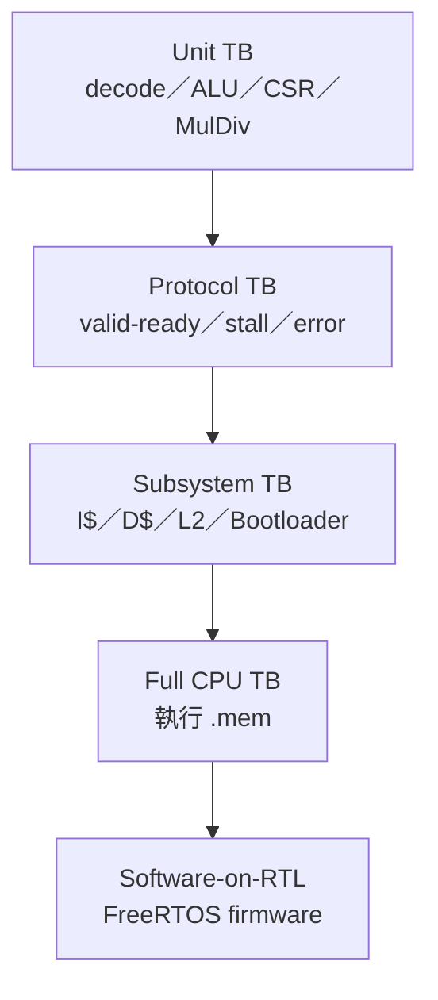

# Testbench 目錄與用途

本文件整理目前主線 RTL 的 testbench。主要 testbench 位於專案根目錄；`temp/`、`storage_top/` 與 `cache_old/` 內的舊實驗檔不列入正式 release regression，除非先確認它們仍對應目前介面。

## Testbench 層級圖



找測試時先選層級，再到後面對照檔名；越靠上層的測試越接近真實系統，但越不容易直接定位單一RTL錯誤。

## 1. Testbench 類型

| 類型 | 特徵 | 適合發現 |
|---|---|---|
| combinational/decode unit TB | 直接設定輸入後檢查輸出 | decode、控制訊號、alignment |
| multi-cycle unit TB | 驅動 clock、start/busy/done | multiplier、divider、CSR state |
| protocol TB | 驅動 valid/ready、注入 stall/error | Cache、L2、UART、bootloader |
| full CPU TB | 載入 `.mem` 執行 machine code | pipeline、ISA、memory hierarchy 整合 |
| software-on-RTL TB | CPU 執行 FreeRTOS firmware | trap、tick、scheduler、application startup |

## 2. 通用 Icarus 執行方式

在 PowerShell 中，先建立輸出目錄並取得根目錄 RTL：

```powershell
cd C:/cpu_design
New-Item -ItemType Directory -Force build_verification | Out-Null
$rtl = Get-ChildItem . -Filter *.v -File | ForEach-Object { $_.FullName }
```

對需要完整 top 相依性的 testbench，可使用：

```powershell
iverilog -g2005-sv -DFAST_SIM -i `
  -o ./build_verification/uart_mmio_tb.out `
  -s uart_mmio_tb $rtl
vvp ./build_verification/uart_mmio_tb.out
```

`-s` 指定唯一 top；`-i` 允許未被 top 使用的 missing module 參考不阻止 elaboration。對小型單元測試，建議只列必要來源，使依賴更清楚：

```powershell
iverilog -g2005-sv `
  -o ./build_verification/misalign_check_tb.out `
  -s misalign_check_tb `
  ./misalign_check_tb.v ./misalign_check.v
vvp ./build_verification/misalign_check_tb.out
```

## 3. CPU／pipeline testbench

| Testbench | DUT／範圍 | 主要檢查 | 成功輸出 |
|---|---|---|---|
| [`icache_pipeline_tb.v`](../../icache_pipeline_tb.v) | 完整 CPU top | `TEST=1..27`、自訂 `.mem`、golden register、stall assertion、trace/coverage、RTOS UART marker | `PASS: test ...` 或指定 RTOS marker |
| [`bp_redirect_scenarios_tb.v`](../../bp_redirect_scenarios_tb.v) | 完整 redirect/flush 整合 | 預測正確、預測 taken 實際 not-taken、預測 not-taken 實際 taken | `[TB] PASS: 3 scenarios all matched` |

`icache_pipeline_tb` 是主要整合回歸環境，不是單純 I$ test。詳細 plusargs 與 TEST ID 見 [CPU_REGRESSION.md](CPU_REGRESSION.md)。

`bp_redirect_scenarios_tb` 的三個 scenario 直接觀察：

- speculative frontend redirect；
- EX recovery redirect PC；
- `flush_ifid`、`flush_idex`；
- 預測正確時不應產生多餘 recovery。

## 4. Decode、CSR、exception 與 interrupt

| Testbench | 主要檢查 | 成功輸出 |
|---|---|---|
| [`id_illegal_decode_tb.v`](../../id_illegal_decode_tb.v) | 合法／非法 opcode、非法指令不得產生 register/memory side effect | `PASS: id_illegal_decode_tb` |
| [`id_csr_decode_tb.v`](../../id_csr_decode_tb.v) | CSRRW/CSRRS/CSRRC、immediate variants、`ecall`、`ebreak`、`mret` decode | `PASS: id_csr_decode_tb` |
| [`csr_file_tb.v`](../../csr_file_tb.v) | CSR reset/read/write/set/clear、writable mask、trap entry、`mret`、pending read view | `PASS: csr_file_tb` |
| [`csr_privilege_tb.v`](../../csr_privilege_tb.v) | reset M-mode、`mret` 到 U-mode、trap 回 M-mode、MPP 保存 | `PASS: csr_privilege_tb` |
| [`misalign_check_tb.v`](../../misalign_check_tb.v) | instruction target、byte/half/word load/store alignment | `PASS: misalign_check_tb` |
| [`machine_irq_sources_tb.v`](../../machine_irq_sources_tb.v) | MSIP/MEIP MMIO、mtime/mtimecmp、global/individual enable、IRQ priority | `PASS: machine_irq_sources_tb` |

建議執行：

```powershell
$cases = @(
  @{Top="id_illegal_decode_tb"; Src=@("id_illegal_decode_tb.v","ID.v")},
  @{Top="id_csr_decode_tb"; Src=@("id_csr_decode_tb.v","ID.v")},
  @{Top="csr_file_tb"; Src=@("csr_file_tb.v","CSR.v")},
  @{Top="csr_privilege_tb"; Src=@("csr_privilege_tb.v","CSR.v")},
  @{Top="misalign_check_tb"; Src=@("misalign_check_tb.v","misalign_check.v")},
  @{Top="machine_irq_sources_tb"; Src=@("machine_irq_sources_tb.v","machine_irq_sources.v")}
)
foreach ($case in $cases) {
  $out = "./build_verification/$($case.Top).out"
  iverilog -g2005-sv -o $out -s $case.Top $case.Src
  if ($LASTEXITCODE -ne 0) { throw "compile failed: $($case.Top)" }
  vvp $out
  if ($LASTEXITCODE -ne 0) { throw "run failed: $($case.Top)" }
}
```

注意：有些舊 testbench 以 `$finish` 而非 `$fatal` 結束失敗分支，因此自動化除了 exit code，也必須掃描 `FAIL` marker。

## 5. RV32M testbench

| Testbench | DUT | 主要檢查 | 成功輸出 |
|---|---|---|---|
| [`booth_multiplier_tb.v`](../../booth_multiplier_tb.v) | `booth_multiplier` | low/high half、signed/signed、signed/unsigned、unsigned、busy/done、busy 時忽略 restart、random cases | `PASS: booth_multiplier_tb` |
| [`restoring_divider_tb.v`](../../restoring_divider_tb.v) | `restoring_divider` | signed/unsigned quotient/remainder、除零、overflow、busy/done、restart | `PASS: restoring_divider_tb` |
| [`ex_muldiv_tb.v`](../../ex_muldiv_tb.v) | EX + MulDiv | 八個 RV32M operation、EX stall、結果選擇、random cases | `PASS: ex_muldiv_tb` |
| [`id_muldiv_decode_tb.v`](../../id_muldiv_decode_tb.v) | ID | RV32M funct3 到 ALU operation/control decode | `PASS: id_muldiv_decode_tb` |

整組工具：

```powershell
./tools/run_muldiv_verification.ps1
```

工具也會用 `-march=rv32im` 編譯 [`prog_test28_muldiv_smoke.c`](../../TEST_FILES/prog_test28_muldiv_smoke.c)，並在 `.dis` 中確認八個 M-extension mnemonic 都實際出現。這能防止 C 程式完全被 constant folding，使「軟體 build PASS」沒有真正涵蓋 RV32M。

## 6. Cache／memory hierarchy testbench

| Testbench | 主要檢查 | 成功輸出 |
|---|---|---|
| [`icache_tb.v`](../../icache_tb.v) | cold miss、hit、kill、uncached、flush/invalidate、error、back-pressure | `All tests passed.` |
| [`dcache_tb.v`](../../dcache_tb.v) | load/store hit/miss、no-write-allocate、dirty eviction、partial store、uncached、error、20k random operations | `dcache_tb: All tests passed.` |
| [`l2_arb_tb.v`](../../l2_arb_tb.v) | D>I、uncached>cached、UC_RD/WR、WB_LINE、bad len | `L2/ARB TB: PASS` |

完整說明與執行指令見 [CACHE_TESTS.md](CACHE_TESTS.md)。

## 7. UART、MMIO 與 performance testbench

| Testbench | 主要檢查 | 成功輸出 |
|---|---|---|
| [`uart_mmio_tb.v`](../../uart_mmio_tb.v) | UART TX/RX、busy/valid、RX pop、overrun set/clear、invalid MMIO、performance bank 整合 | `[TB] PASS: UART/performance MMIO checks completed` |
| [`performance_counters_tb.v`](../../performance_counters_tb.v) | ID/INFO、CONTROL、count enable、snapshot、clear、64-bit overflow、非法地址 | `[TB] PASS: 64-bit counter control/snapshot checks completed` |
| [`vga_subsystem_tb.v`](../../vga_subsystem_tb.v) | framebuffer MMIO readback、clock divider、horizontal counter | `VGA TB PASS` |

Makefile 已提供：

```powershell
make uart-mmio-tb
make perf-counter-tb
make vga-subsystem-tb
```

這些 testbench 驗證數位 RTL，不會證明實體 VGA 類比電阻網路、接腳或螢幕相容性。

## 8. UART bootloader testbench

| Testbench | 主要檢查 | 成功輸出 |
|---|---|---|
| [`uart_bootloader_tb.v`](../../uart_bootloader_tb.v) | valid v2、rearm、第二 image、UART CRC rejection、DDR readback rejection、fresh-sync recovery | `[TB] PASS: v1/v2, UART/DDR CRC rejection, rearm, and host-sync recovery passed.` |
| [`uart_bootloader_stall_tb.v`](../../uart_bootloader_stall_tb.v) | MIG command/data ready 被阻塞 | `[STALL_TB] PASS: ...` |
| [`uart_bootloader_split_ready_tb.v`](../../uart_bootloader_split_ready_tb.v) | `app_rdy` 與 `app_wdf_rdy` 不同 cycle assertion | `[SPLIT_READY_TB] PASS: ...` |
| [`uart_bootloader_large_crc_tb.v`](../../uart_bootloader_large_crc_tb.v) | 大型真實 image 的完整 CRC/readback；跳過逐 bit UART 時間 | `[LARGE_CRC_TB] PASS bytes=... crc=...` |

詳見 [BOOTLOADER_TESTS.md](BOOTLOADER_TESTS.md)。

## 9. Testbench plusargs

`icache_pipeline_tb` 主要 plusargs：

| Plusarg | 作用 |
|---|---|
| `+TEST=N` | 選擇內建 test ID；`0` 表示自訂 image |
| `+MEMFILE=path` | 覆寫 `.mem` 路徑 |
| `+EXPECT_RD=N` | 最終 golden register |
| `+EXPECT_VAL=hex` | golden 32-bit value |
| `+MAXCYCLES=N` | cycle watchdog |
| `+ASSERT_EN=1` | 啟用 protocol assertion/watchdog |
| `+RAND_MEM=1` | 啟用隨機 memory timing |
| `+SEED=N` | 隨機 seed |
| `+RAND_BP_PCT=N` | back-pressure 機率百分比 |
| `+RAND_I_MAX=N` | I-side 最大隨機 delay |
| `+RAND_D_MAX=N` | D-side 最大隨機 delay |
| `+STALL_WDOG=N` | request/response hold watchdog |
| `+RD_WDOG=N` | read response watchdog |
| `+TRACE_EN=1` | 輸出 commit trace |
| `+TRACE_FILE=path` | trace 目的檔 |
| `+COV_EN=1` | 輸出事件 coverage |
| `+COV_FILE=path` | coverage 目的檔 |
| `+RTOS_UART_MON=1` | decode simulation UART TX |
| `+RTOS_UART_FINISH_ON_PASS=1` | 看見認可 marker 後結束 |

Plusarg 的值屬於該次 simulation config，正式報告必須記錄，否則只有一個 `PASS` 字串無法重現結果。

## 10. 如何判定 Testbench 真的通過

建議自動化採雙重條件：

```text
process exit code == 0
AND expected PASS marker exists
AND no failure marker exists
```

建議 failure patterns：

```text
FAIL
ASSERT_FAIL
FATAL
TIMEOUT
ERROR:
```

但不可對所有 log 粗略搜尋 `ERROR`，因為某些測試會刻意注入 error，並在說明文字中出現 `error`。應以 testbench 定義的正式 failure prefix 和最終 PASS marker 為準。

### Host-side輔助測試與trace工具

除了Verilog testbench，專案還有下列PC端工具測試：

| 工具 | 主要用途 | 詳細文件 |
|---|---|---|
| `python -m unittest tools.test_rtos_board_runner -v` | runner protocol、retry、marker與COM流程 | [BOOTLOADER_TESTS.md](BOOTLOADER_TESTS.md) |
| `python -m unittest tools.test_lua_script_tool -v` | Lua script upload framing與回應 | [LUA_SCRIPT_UPLOAD.md](../05-applications/LUA_SCRIPT_UPLOAD.md) |
| `python -m unittest tools.test_uart_keys -v` | UART鍵盤escape/key mapping helper | [BOOTLOADER_TESTS.md](BOOTLOADER_TESTS.md) |
| [`gen_ref_traces.ps1`](../../tools/gen_ref_traces.ps1) | 為TEST 24..27產生簡化RV32I reference GPR trace | [CPU_REGRESSION.md](CPU_REGRESSION.md) |
| [`compare_commit_trace.py`](../../tools/compare_commit_trace.py) | 比較reference與DUT GPR write序列 | [CPU_REGRESSION.md](CPU_REGRESSION.md) |

PC端unit test通過不代表RTL或實板通過；它只驗證host protocol/parser行為。相反地，RTL通過也不會自動涵蓋Python的retry、timeout與serial framing。

## 11. 不列入正式 catalog 的檔案

以下位置可能保留早期 bring-up 或替代架構：

- `temp/`
- `storage_top/`
- `cache_old/`
- `replaced_and_store_file/`

根目錄另有三個容易被誤認為目前主線top／正式testbench的歷史或bring-up檔案：

| 檔案 | 原本用途 | 目前定位 |
|---|---|---|
| [`ddr2_test.v`](../../ddr2_test.v) | Nexys A7 MIG單一pattern寫入／讀回的獨立實板bring-up top | 可供DDR初期除錯參考；不是`board_top`的完整CPU驗證 |
| [`ip_test.v`](../../ip_test.v) | Xilinx MIG產生的`example_top`／traffic-generator範例 | Vendor example，不是本專案CPU top，也不列入正式regression |
| [`vga_initials_top.v`](../../vga_initials_top.v) | 早期VGA timing／initials顯示top | 現行CPU整合請使用`board_top_vga.v`與`vga_subsystem.v` |

案例：如果只跑`ddr2_test_top`看到LED pass，只能證明該獨立top的MIG pattern readback成功；它沒有經過CPU、I$/D$/L2或UART bootloader，因此不能填寫「完整系統DDR路徑PASS」。相反地，`vga_initials_top`有畫面也不能代表`0x5000_xxxx` framebuffer MMIO與雙緩衝協定已通過。

它們可作歷史參考，但不能自動視為目前 CPU 主線的 regression。若要重新納入，至少要：

1. 確認 DUT module 是目前主線；
2. 更新 interface 與 parameter；
3. 加入明確 PASS/FAIL；
4. 加入 watchdog；
5. 記錄其涵蓋功能與已知限制。
