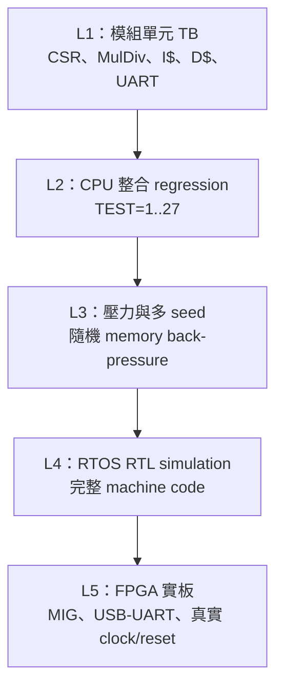

# 驗證計畫

本文件定義本專案的驗證範圍、測試層級、通過條件與 release 建議流程。它回答的不是「曾經跑過哪些 demo」，而是：

1. 每一類硬體風險要由哪一個測試發現；
2. 修改 RTL、FreeRTOS 或上板工具後，至少要重跑哪些項目；
3. simulation PASS、實板 PASS 與「尚未驗證」應如何區分；
4. 發生錯誤時，應先縮小到哪一層。

相關文件：

- [TESTBENCH_CATALOG.md](TESTBENCH_CATALOG.md)：所有主要 testbench 的用途。
- [CPU_REGRESSION.md](CPU_REGRESSION.md)：`icache_pipeline_tb` 的 `TEST=1..27` 與多 seed 回歸。
- [CACHE_TESTS.md](CACHE_TESTS.md)：I$、D$、L2 與 back-pressure 測試。
- [BOOTLOADER_TESTS.md](BOOTLOADER_TESTS.md)：UART upload、CRC、rearm 與 recovery。
- [RTOS_SIMULATION.md](RTOS_SIMULATION.md)：FreeRTOS、Console、Platform 與 Lua simulation。
- [FPGA_BOARD_TEST.md](FPGA_BOARD_TEST.md)：Nexys A7-100T 實板驗收。
- [EXPECTED_RESULTS.md](EXPECTED_RESULTS.md)：標準 PASS／FAIL marker 與紀錄格式。

## 1. 驗證目標

本專案目前的主要驗證目標如下：

| 目標 | 必須證明的事情 |
|---|---|
| ISA 正確性 | RV32I、RV32M、Zicsr 的 decode、運算結果與特殊邊界條件正確 |
| pipeline 正確性 | forwarding、load-use stall、長運算 stall、flush 與退休結果正確 |
| control-flow 正確性 | branch、JAL、JALR、prediction 與 mispredict recovery 不會提交錯路徑結果 |
| exception／interrupt 正確性 | CSR、misalignment、timer、software／external interrupt 與 `mret` 流程正確 |
| memory hierarchy 正確性 | I$、D$、L2、dirty writeback、refill、uncached、MMIO 與錯誤傳播正確 |
| protocol 正確性 | valid／ready 遇到 back-pressure 時資料、位址與控制訊號保持穩定 |
| boot 正確性 | UART image 完整寫入 DDR，CRC 失敗時不釋放 CPU，成功時可以重新載入 |
| RTOS 正確性 | tick、context switch、Task、Queue、heap、同步物件與 UART IRQ 可以共同執行 |
| application 正確性 | Console、Platform、Lua 與腳本服務回報各自的 READY／PASS marker |
| 實板穩定性 | 實際 clock、MIG、USB-UART、reset、重試與長時間執行沒有只在 simulation 看不到的問題 |

## 2. 驗證的五個層級



### L1：模組單元測試

單元 testbench 直接驅動模組介面，適合快速定位：

- ALU／MulDiv 計算錯誤；
- CSR 欄位、privilege 或 interrupt source 錯誤；
- Cache refill、writeback、LRU 或 back-pressure 錯誤；
- UART、bootloader、MMIO register 錯誤。

優點是速度快、容易注入 corner case；限制是沒有證明整顆 CPU 能正確執行程式。

### L2：完整 CPU regression

[`icache_pipeline_tb.v`](../../icache_pipeline_tb.v) 載入 `TEST_FILES/*.mem`，讓完整 CPU 從 `0x8000_0000` 執行程式，最後觀察指定 register 的 golden value。

這一層同時涵蓋：

- instruction fetch；
- decode、execute、MEM、WB；
- forwarding、stall、branch recovery；
- I$/D$/L2 模擬路徑；
- architectural register result。

它比單元測試更接近真實軟體，但仍使用 behavioral memory／MIG model。

### L3：多 seed 與 back-pressure 壓力測試

`TEST=24..27` 可搭配隨機 request／response delay、不同 seed、watchdog 與 assertion 執行。目的不是產生不同程式，而是用相同 golden workload，在大量合法時序排列下檢查：

- valid 已提出但 ready 尚未接受時，request 是否保持；
- response 被阻塞時，data／error／last 是否保持；
- 長時間 I-side、D-side delay 是否造成重複提交或遺失交易；
- pipeline stall 與 redirect 同時發生時是否仍得到相同結果。

固定一次 PASS 不能取代多 seed；多 seed PASS 也不能取代 directed corner-case test。

### L4：RTOS RTL simulation

將真正的 FreeRTOS firmware 編譯成 RV32IM/Zicsr machine code，再由完整 RTL CPU 執行。這層檢查：

- startup、linker layout 與 `.mem`；
- CSR、trap entry、`mret`；
- machine timer tick；
- context switch；
- FreeRTOS kernel、Task、Queue 與 application startup；
- UART TX marker。

RTOS simulation 很慢，因此以 marker 與 cycle timeout 判定，不應用牆上執行秒數推論實板效能。

### L5：FPGA 實板測試

實板是唯一能完整涵蓋以下因素的層級：

- Vivado synthesis／implementation 後的真實 netlist；
- clock MMCM、CDC 與 timing closure；
- DDR2 MIG calibration 與實際 DDR；
- USB-UART adapter、COM port、serial pacing；
- reset、斷電、reload 與 bootloader rearm；
- 50 MHz 實際 CPU clock；
- 真實長時間執行。

實板 PASS 不能取代 RTL corner-case regression，因為實板很難精確注入 cache error 或觀察內部 protocol。

## 3. Feature-to-test 對照矩陣

| 功能／風險 | 主要 directed test | 整合 test | 實板證據 |
|---|---|---|---|
| RV32I ALU／forwarding | `TEST=1`、`id_illegal_decode_tb` | `TEST=11,13,20,24..27` | preflight／Platform |
| load-use／store dependency | `TEST=2,3,5` | `TEST=12,18,19,22..27` | RTOS／Console workload |
| branch／JAL／JALR | `bp_redirect_scenarios_tb`、`TEST=4,6,7,8` | `TEST=19..27` | RTOS context flow |
| RV32M | multiplier、divider、EX、decode TB | RV32IM smoke build／實際 RTOS 軟體 | Lua math／C workload |
| CSR／privilege | `csr_file_tb`、`csr_privilege_tb`、`id_csr_decode_tb` | RTOS trap/tick simulation | FreeRTOS tick、yield |
| misaligned access | `misalign_check_tb` | exception regression／software trap | 非必要；實板不刻意破壞正式 app |
| machine IRQ | `machine_irq_sources_tb` | preflight／Platform simulation | Timer tick、UART IRQ probe |
| I$ | `icache_tb` | `TEST=15,17,21,24..27` | instruction-miss counter |
| D$ | `dcache_tb` | `TEST=16,18,22..27` | data-miss／writeback counter |
| L2 arbitration | `l2_arb_tb` | CPU regression memory stalls | DDR command counters |
| UART MMIO | `uart_mmio_tb` | RTOS UART TX monitor | Console probe |
| performance counters | `performance_counters_tb`、`uart_mmio_tb` | Console boot | `perf test` |
| bootloader v1/v2／CRC | 四個 bootloader TB | RTOS runner dry-run | preflight + target upload |
| FreeRTOS scheduler | smoke／preflight sim | Platform／Console／Lua sim | `RTOS_*_PASS`、interactive probe |
| Lua VM／script service | Lua simulation | script tool unit tests | Lua REPL／script probe |
| VGA MMIO／timing counters | `vga_subsystem_tb` | VGA firmware build | 有螢幕時做畫面驗收；無螢幕可標 N/A |

## 4. 修改範圍與最小重跑集合

| 修改內容 | 至少重跑 |
|---|---|
| `ID.v`、`EX.v`、`WB.v` | decode/EX 單元 TB、CPU `TEST=1..27` |
| hazard／forwarding | `TEST=1..3,19,22..27`，再跑多 seed |
| branch predictor／redirect | `bp_redirect_scenarios_tb`、`TEST=4,6..8,19..27` |
| CSR／trap／IRQ | CSR TB、IRQ TB、preflight sim、Platform sim、實板 preflight |
| MulDiv | `run_muldiv_verification.ps1`、至少一個完整 RV32IM firmware |
| I$ | `icache_tb`、`TEST=15,17,21,24..27` |
| D$ | `dcache_tb`、`TEST=16,18,22..27` |
| L2／MIG interface | I$、D$、L2 TB、CPU regression、多 seed、實板 preflight |
| UART runtime MMIO | `uart_mmio_tb`、Console sim、Console board probe |
| bootloader／upload protocol | 所有 bootloader TB、Python unit tests、實板重複 upload |
| FreeRTOS port／config | smoke、preflight、Platform、Console、Lua simulation 與實板 Platform |
| linker／startup | 自訂 bare-metal smoke、全部 RTOS simulation、實板 preflight |
| application C code | 該 profile build、該 application simulation／probe |
| Lua script host tool | Python unit tests、script service probe |
| XDC、clock、MIG IP、board top | Vivado implementation/timing、實板 cold boot 與 upload |

### 4.1 修改後如何選測試：兩個例子

**例子一：只修改 `hazard_unit.v` 的 load-use 判斷**

```text
先跑：hazard相關 directed CPU TEST=1..3
再跑：混合 memory/control TEST=19,22..27
再跑：TEST=24..27 多 seed，改變合法 back-pressure 時序
最後：preflight 或 Console workload，確認真實 firmware 沒有 regression
```

不需要因為這次修改重新驗證 Lua parser 的每個語法，但不能只跑一個 `ADD` test，因為 hazard bug 可能只在 load、store、stall 與 redirect 重疊時出現。

**例子二：只修改 `main_console.c` 新增一個命令**

```text
先做：console profile build，確認 compile/link/marker
再做：Console RTL simulation 或 command probe
實板：preflight + console，輸入新命令並檢查成功與錯誤參數
通常不需：重跑 Vivado synthesis/implementation
```

因為 C application 會重新產生 `.mem`，但沒有改變 Verilog bitstream。若新命令會操作新增的 MMIO register，那修改範圍已跨到 RTL，測試集合就必須擴大到 MMIO unit TB、CPU integration、Vivado timing 與實板。

## 5. 日常、標準與 Release 測試集合

### 5.1 日常快速檢查

適用於小幅修改、準備繼續開發，不作 release 宣告：

1. 修改模組的 dedicated TB；
2. CPU 代表性測試 `1,2,4,5,17,18,24,27`；
3. Python uploader/probe unit tests；
4. 若影響 RTOS，再跑 preflight simulation。

### 5.2 標準整合檢查

適用於準備 commit 或合併功能：

1. 所有 relevant unit TB；
2. CPU `TEST=1..27`；
3. `TEST=24..27` 至少 20 seeds；
4. smoke、preflight、Platform simulation；
5. 受影響 application simulation；
6. 實板 preflight + 一個 target marker。

### 5.3 Release／論文量測前檢查

建議包含：

1. 完整單元 testbench 清單；
2. CPU `TEST=1..27`；
3. `TEST=24..27` 至少 100 seeds；
4. commit trace 與可用 reference trace 比對；
5. 所有 RTOS profile simulation；
6. Python host tool unit tests；
7. Vivado synthesis、implementation、timing summary；
8. 實板 Platform、Console、Lua／目標 workload；
9. 5～10 次 cold boot／重新上傳循環；
10. 至少 30～60 分鐘目標 workload soak；
11. 記錄 bitstream hash、Git commit、tool version、clock 與測試輸出。

## 6. 通用 Entry Criteria

開始判定測試結果前，必須先確認：

- 使用的 Git commit 已記錄；
- working tree 中哪些修改屬於本次測試已記錄；
- Icarus、Python、RISC-V GCC、Vivado 版本可辨識；
- `.mem` 是本次來源重新產生，而不是未知的舊 build artifact；
- simulation 的 `CpuClockHz` 與 testbench clock 相符；
- 實板 bitstream 與 RTL revision 相符；
- COM port 沒有被另一個 terminal 佔用；
- 測試 timeout 是 cycle timeout 還是 host wall-clock timeout，兩者不可混用。

## 7. 通用 Exit Criteria

一個測試只有在下列條件都成立時才能記為 PASS：

1. 編譯／elaboration exit code 為 0；
2. simulation／工具 exit code 為 0；
3. 看見該測試明確定義的 PASS／READY marker；
4. log 中沒有 `FAIL`、`ASSERT_FAIL`、`FATAL`、`TIMEOUT`、`[TRAP]` 等 failure marker；
5. 沒有被 watchdog 或人工強制中止；
6. 若是實板測試，target marker 必須出現在 bootloader ACK 之後；
7. 測試所需的所有子項都完成，不能只截取其中一段輸出。

只看到「程式有印字」、`vvp` 沒當掉，或 UART terminal 還能輸入，都不足以單獨判定 PASS。

## 8. Coverage 策略

本專案目前同時使用三種 coverage 概念：

### 8.1 Directed functional coverage

由 testbench 明確列出 corner case，例如：

- signed／unsigned MulDiv；
- divide by zero；
- Cache clean／dirty eviction；
- UART overrun；
- CRC mismatch；
- valid／ready split acceptance。

### 8.2 Event coverage counters

`icache_pipeline_tb` 可輸出：

- commit 次數；
- I/D request／response handshake；
- 最大 stall；
- response error；
- fetch error。

這些是事件命中紀錄，不等於 simulator 的 line／toggle coverage。

### 8.3 實板 performance counters

24 組 64-bit MMIO counter 用來觀察真實 workload 是否經過預期硬體路徑，例如 I$ miss、D$ miss、L2/DDR transaction、branch redirect 與 stall。它們適合找瓶頸和異常，但不能單獨證明資料值正確。

## 9. 已知驗證缺口

目前仍不應宣稱「完全驗證」的部分包括：

- 尚未建立完整 RISC-V architectural compliance suite；
- 尚未建立 Spike／QEMU 的全面逐指令 differential regression；
- 沒有完整 formal property verification；
- 沒有完整 code／toggle／FSM coverage closure 報告；
- CDC、reset-domain crossing 主要依設計規則、Vivado 與實板觀察，尚未導入專用 CDC signoff；
- DDR2 實體訊號完整性、溫度／電壓角落未作實驗室等級量測；
- 無 VGA 螢幕時，不能宣稱實體 VGA 類比輸出與螢幕相容性通過；
- 多核心、cache coherence、MMU、PMP、S-mode 不在目前功能範圍。

這些缺口不代表現有功能不能使用，而是限制驗證結論的邊界。

## 10. 失敗分類與處理順序

| 失敗階段 | 優先檢查 |
|---|---|
| iverilog compile | top 名稱、source list、重複 module、define／parameter |
| simulation timeout | 最後一次 commit、pipeline stall、memory valid/ready、watchdog |
| register golden mismatch | `.dis`、commit trace、forwarding、flush、load data |
| Cache TB failure | address/index/tag、beat count、ready/valid、victim dirty/LRU |
| RTOS 沒 marker | startup PC、trap/CSR、tick、stack、UART TX、MaxCycles |
| bootloader NAK | protocol、length、host CRC、DDR readback CRC、MIG ready |
| preflight timeout | bitstream/rearm、DDR、CPU trap、UART marker 遺失 |
| target timeout | application 本身、marker 字串、timeout 太短、target 未重載 |
| COM access denied | 關閉其他 terminal／probe，確認正確 COM port |
| 偶發實板失敗 | 保存 raw UART log，固定 bitstream/image，重複 cold/warm run 再分類 |

遇到失敗時不要立刻增加 timeout。先判斷是「真的還在前進但比較慢」，還是狀態已經停止；盲目放大 timeout 只會讓真正的 deadlock 更晚被發現。

## 11. 測試紀錄最低要求

每次正式驗收至少保存：

```text
date/time:
git commit:
working tree:
bitstream path/hash:
FPGA board:
CPU clock:
tool versions:
test command:
parameters/seeds:
result:
pass marker:
log path:
notes:
```

推薦把產生的 log、CSV、Vivado timing summary 與板上 raw UART log放在 build/result 目錄，不要把沒有來源資訊的單一截圖當成唯一證據。
