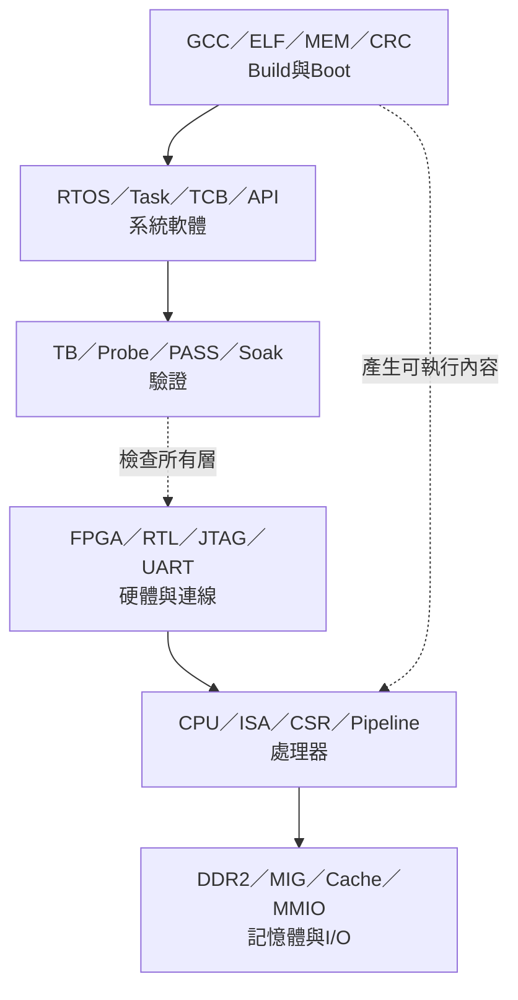

# 專案縮寫與名詞表

> 本頁集中解釋文件、指令與UART輸出中常見的英文縮寫。第一次出現不熟悉的字時先查本頁，不需要靠上下文猜測。

本表按照上圖六個領域分類；先判斷縮寫出現在哪一層，可以避免同一個字在不同上下文被誤解。

## 1. 最容易混淆的同名詞

| 縮寫／詞 | 在哪裡出現 | 正確意思 |
|---|---|---|
| `PC` | 上板、host工具文件 | **Personal Computer**，執行PowerShell與Python的電腦 |
| `PC` | CPU、pipeline文件 | **Program Counter**，CPU目前／下一條指令的位址 |
| `MEM` | `.mem`檔名 | 供UART uploader或testbench載入的32-bit word文字映像 |
| `MEM` | Pipeline階段 | **Memory stage**，五級流水線中的記憶體存取階段 |
| `Monitor` | `run_rtos_app.ps1` | PC端UART終端功能，不是螢幕，也不是FPGA硬體模組 |
| `Probe` | Python工具 | PC端自動測試程式，會主動送命令並判定PASS／FAIL |
| `Loader` | FPGA boot流程 | 接收 `.mem` 並寫入DDR的UART bootloader |
| `Runner` | PowerShell／Python工具 | PC端自動執行build、preflight、upload與marker檢查的工具 |
| `RTOS` | 架構描述 | 作業系統類型；本專案使用的具體實作是FreeRTOS |
| `Task` | FreeRTOS | 由scheduler排程的執行單位，不等於每一個UART byte或每次函式呼叫 |

## 2. 上板、FPGA與連線

| 縮寫 | 英文全名 | 中文與本專案中的作用 |
|---|---|---|
| `FPGA` | Field-Programmable Gate Array | 現場可程式化邏輯閘陣列；下載 `.bit` 後成為本專案的CPU與周邊硬體 |
| `RTL` | Register-Transfer Level | 暫存器傳輸層；以Verilog描述每個clock間資料如何移動與運算 |
| `HDL` | Hardware Description Language | 硬體描述語言；本專案主要使用Verilog |
| `IP` | Intellectual Property Core | 可重用硬體核心；本專案例如DDR2 MIG與Clocking Wizard |
| `XDC` | Xilinx Design Constraints | Xilinx限制檔，定義pin、clock與I/O電氣規格 |
| `JTAG` | Joint Test Action Group | FPGA除錯／配置介面；本專案用它把 `.bit` 寫入FPGA configuration SRAM |
| `USB` | Universal Serial Bus | 電腦與開發板的實體連線；板上同時可能承載JTAG與USB-UART |
| `COM` | Communication Port | Windows序列埠名稱，例如 `COM5`；同一時間只能被一個程式占用 |
| `UART` | Universal Asynchronous Receiver/Transmitter | 非同步序列收發器；負責 `.mem` 上傳、Console、Lua與log |
| `TX` | Transmit | 傳送方向；FPGA TX代表FPGA送到PC |
| `RX` | Receive | 接收方向；FPGA RX代表PC送到FPGA |
| `baud` | Baud Rate | UART傳輸速率；本專案固定使用115200 baud |
| `QSPI` | Quad Serial Peripheral Interface | 四線序列Flash介面；目前流程沒有把bitstream永久寫入QSPI |
| `SRAM` | Static Random-Access Memory | 靜態記憶體；FPGA configuration SRAM斷電後內容消失 |
| `BRAM` | Block RAM | FPGA內部記憶體區塊，常用於Cache陣列或小型buffer |
| `VGA` | Video Graphics Array | 類比影像輸出介面；本專案輸出640×480時序 |
| `LED` | Light-Emitting Diode | 板載發光二極體，用於開機與debug狀態顯示 |

## 3. CPU與RISC-V

| 縮寫 | 英文全名 | 中文與本專案中的作用 |
|---|---|---|
| `CPU` | Central Processing Unit | 中央處理器；執行RISC-V machine code |
| `ISA` | Instruction Set Architecture | 指令集架構，定義指令、register與軟體可見行為 |
| `RISC-V` | Reduced Instruction Set Computer V | 開放的RISC指令集架構 |
| `RV32I` | RISC-V 32-bit Base Integer ISA | 32-bit基礎整數指令集 |
| `RV32M` | RISC-V 32-bit Multiply/Divide Extension | 乘法與除法擴充 |
| `RV32IM` | RV32I + M | 本專案CPU主要支援的整數加乘除指令集合 |
| `Zicsr` | Control and Status Register Extension | CSR讀寫指令擴充，例如 `csrrw`、`csrrs` |
| `PC` | Program Counter | 程式計數器，保存指令位址；不要和Personal Computer混淆 |
| `ALU` | Arithmetic Logic Unit | 算術邏輯單元，執行加減、比較、位元運算與位移 |
| `CSR` | Control and Status Register | 控制與狀態暫存器，保存trap、中斷與machine-mode狀態 |
| `IRQ` | Interrupt Request | 中斷請求，例如machine timer或UART external interrupt |
| `ISR` | Interrupt Service Routine | 中斷服務常式；CPU接受中斷後執行的程式 |
| `IF` | Instruction Fetch | 流水線取指階段 |
| `ID` | Instruction Decode | 流水線解碼與register read階段 |
| `EX` | Execute | 流水線執行階段，例如ALU、分支與MulDiv |
| `MEM` | Memory | 流水線load/store記憶體階段 |
| `WB` | Write Back | 流水線寫回register與提交指令的階段 |
| `PHT` | Pattern History Table | 分支預測表，以2-bit counter記錄分支傾向 |
| `HDU` | Hazard Detection Unit | 危險偵測單元；判斷資料尚未ready、MEM/MulDiv忙碌等情況，產生pipeline stall或bubble控制 |
| Front-end | Instruction-fetch Front End | 從PC、fetch request、I-Cache、response buffer到IF/ID的取指供應路徑 |
| `RAW` | Read After Write | 後一條指令要讀取前一條尚未寫回的值；本CPU主要資料hazard |
| `WAR` | Write After Read | 後一條寫入不能早於前一條讀取；順序五級pipeline通常不形成此hazard |
| `WAW` | Write After Write | 多次寫入的完成順序問題；順序單發射核心通常不形成此hazard |
| `JAL` | Jump And Link | RISC-V直接jump並保存return address的指令 |
| `JALR` | Jump And Link Register | 以register計算目標的jump／return指令 |
| `MIE` | Machine Interrupt Enable | machine-mode中斷enable；依上下文可能指CSR或 `mstatus.MIE` bit |
| `MEIP` | Machine External Interrupt Pending | machine external interrupt pending狀態 |
| `MSIP` | Machine Software Interrupt Pending | machine software interrupt pending狀態 |

## 4. Memory、Cache與MMIO

| 縮寫 | 英文全名 | 中文與本專案中的作用 |
|---|---|---|
| `DDR2` | Double Data Rate 2 SDRAM | 開發板外部主記憶體，保存CPU application與runtime資料 |
| `MIG` | Memory Interface Generator | Xilinx DDR控制器IP，負責DDR2校準與讀寫介面 |
| `L1` | Level 1 Cache | 最靠近CPU的Cache；本專案分成I$與D$ |
| `I$` | Instruction Cache | 指令Cache；`$`在處理器文件中是Cache的簡寫 |
| `D$` | Data Cache | 資料Cache，服務load/store |
| `L2` | Level 2 Cache | I$與D$共用的第二級Cache，向下連接DDR2 |
| `MMIO` | Memory-Mapped Input/Output | 記憶體映射I/O；CPU用load/store存取UART、timer、VGA等周邊 |
| `FIFO` | First In, First Out | 先進先出buffer，用於排隊保存資料 |
| `MMU` | Memory Management Unit | 記憶體管理單元；本專案目前沒有MMU與virtual memory |
| `KiB` | Kibibyte | 1024 bytes |
| `MiB` | Mebibyte | 1024 KiB，也就是1,048,576 bytes |
| `CDC` | Clock Domain Crossing | 不同clock domain之間的訊號傳遞與同步 |
| `MMCM` | Mixed-Mode Clock Manager | Xilinx FPGA內部clock產生與調整硬體 |
| `MUX` | Multiplexer | 多工器，依control signal從多個輸入選一個輸出 |
| valid/ready handshake | Valid/Ready Handshake | 傳送端以valid表示資料有效、接收端以ready表示可接收；只有兩者同時為1才算真正完成一筆傳遞 |
| back-pressure | Back Pressure | 後方暫時不能接收，透過ready=0或stall要求上游保持資料、位址或停止送出新交易 |
| outstanding request | Outstanding Request | 已被接收但response尚未完成的request；目前CPU前端通常只允許一筆fetch outstanding |
| response buffer | Response Buffer | 暫存已回覆但尚未被下一級消耗的資料；目前fetch top使用一格instruction response buffer |

## 5. Build、Boot與傳輸協定

| 縮寫／詞 | 英文全名 | 中文與本專案中的作用 |
|---|---|---|
| `GCC` | GNU Compiler Collection | 將C／Assembly編譯與連結成RISC-V ELF |
| `ABI` | Application Binary Interface | 函式呼叫、register使用、stack與binary介面的規則 |
| `ELF` | Executable and Linkable Format | 含section、symbol與位址資訊的正式執行／除錯檔 |
| `BIN` | Binary Image | 從ELF抽出的連續原始bytes |
| `.mem` | Memory Image | 每行一個32-bit hexadecimal word的文字映像 |
| `MAP` | Linker Map File | 顯示每個section與symbol被放在哪裡 |
| `DIS` | Disassembly | 將machine code反組譯成人類可讀的RISC-V指令 |
| `CRC` | Cyclic Redundancy Check | 循環冗餘檢查，用來偵測傳輸或DDR內容是否損壞 |
| `CRC32` | 32-bit CRC | 使用32-bit結果的CRC；runner與bootloader用它驗證image |
| `ACK` | Acknowledge | 接收端表示封包或image接受成功 |
| `NAK` | Negative Acknowledge | 接收端表示資料錯誤、CRC失敗或無法接受 |
| `ASCII` | American Standard Code for Information Interchange | UART marker與Console常用的文字編碼 |
| `preamble` | Synchronization Preamble | 正式封包前先傳送的一段同步資料，讓bootloader重新取得封包邊界 |
| `marker` | Ready／PASS Marker | Application由UART輸出的唯一文字，供runner判斷是否真的啟動 |
| `bootloader` | Boot Loader | FPGA內接收 `.mem`、寫入DDR、驗證CRC並釋放CPU reset的硬體流程 |
| `preflight` | Pre-flight Test | 目標程式前先跑的短版CPU／FreeRTOS健康檢查 |
| `bitstream` | FPGA Configuration Bitstream | Vivado產生的 `.bit`，描述FPGA要形成的硬體 |

## 6. FreeRTOS與Application

| 縮寫／詞 | 英文全名 | 中文與本專案中的作用 |
|---|---|---|
| `OS` | Operating System | 作業系統的通稱 |
| `RTOS` | Real-Time Operating System | 即時作業系統，重點是可預期的排程與回應時間 |
| `FreeRTOS` | Free Real-Time Operating System | 本專案移植到自製RISC-V CPU上的RTOS kernel |
| `API` | Application Programming Interface | Application呼叫某層功能的函式介面，例如 `xQueueSend()` |
| `pointer`／指標 | Pointer | 保存另一個物件或MMIO register地址的C變數；例如`uint32_t *p`宣告`p`是指標 |
| dereference／解參考 | Pointer Dereference | 使用`*p`前往`p`保存的地址，讀取或寫入該位置內容 |
| `uint32_t` | Unsigned 32-bit Integer Type | `<stdint.h>`定義的無號32-bit整數，常用於RV32資料與MMIO register |
| `volatile` | Volatile Type Qualifier | 要求compiler保留每次實際讀寫；MMIO內容可由硬體改變且存取可能有side effect |
| `Task` | FreeRTOS Task | 可被scheduler切換的執行單位，有自己的stack與priority |
| `TCB` | Task Control Block | Kernel保存Task狀態、stack pointer與priority的控制資料 |
| `IPC` | Inter-Process／Inter-Task Communication | 執行單位間通訊；本專案主要指Task間Queue等機制 |
| `BSP` | Board Support Package | 封裝板級UART、timer、MMIO等硬體介面的支援程式 |
| `LTS` | Long-Term Support | 長期支援版本；本專案使用FreeRTOS LTS來源 |
| `VM` | Virtual Machine | 虛擬機；Lua VM以已編譯的RISC-V程式解讀並執行Lua指令 |
| `REPL` | Read-Eval-Print Loop | 讀取一行、執行、輸出結果並等待下一行的互動環境 |
| `CLI` | Command-Line Interface | 文字命令介面，例如RTOS Console |
| `API FromISR` | API callable from ISR | FreeRTOS專供ISR使用的API版本，名稱通常包含 `FromISR` |

## 7. Verification與結果判定

| 縮寫／詞 | 英文全名 | 中文與本專案中的作用 |
|---|---|---|
| `TB` | Testbench | 在模擬器中驅動與檢查RTL的測試平台 |
| `DUT` | Design Under Test | testbench正在測試的設計模組 |
| `PASS` | Pass | 同時符合預期marker、exit code與無failure條件 |
| `FAIL` | Fail | 任一必要條件不符、timeout或出現failure marker |
| `regression` | Regression Test | 修改後重跑一組既有測試，確認舊功能沒有退化 |
| `smoke test` | Smoke Test | 快速確認系統最基本路徑能啟動與運作 |
| `probe` | Automated Probe | PC端透過UART送測試命令、比對回覆並判定PASS／FAIL的工具 |
| `soak test` | Soak／Endurance Test | 長時間執行以發現偶發、累積或資源耗盡問題 |
| `WNS` | Worst Negative Slack | 最差setup timing slack；負值代表setup timing未通過 |
| `WHS` | Worst Hold Slack | 最差hold timing slack；負值代表hold timing未通過 |

## 8. 上板工具名稱速查

| 工具 | 它在哪裡執行 | 作用 |
|---|---|---|
| `program_board_bitstream.ps1` | PC | 用JTAG燒錄本次Vivado `.bit` |
| `run_rtos_app.ps1` | PC | Build、preflight、UART upload、CRC與target marker整合入口 |
| `rtos_board_runner.py` | PC | `run_rtos_app.ps1`內部呼叫的實際UART runner |
| `uart_send_mem.py` | PC | 手動單階段 `.mem` uploader，只用於除錯 |
| `rtos_console_probe.py` | PC | 自動測試Console命令、Queue與performance輸出 |
| `rtos_platform_probe.py` | PC | 自動測試Platform與interrupt-driven UART |
| `rtos_lua_probe.py` | PC | 自動測試Lua REPL與基本RTOS bridge |
| `rtos_lua_script_probe.py` | PC | 自動測試Lua script上傳、CRC與執行 |
| `run_lua_script.py` | PC | 將 `.lua` 檔送給已在板上運行的Lua firmware |
| `Monitor` | PC runner的一部分 | target啟動後顯示UART輸出，視模式決定是否接收鍵盤 |

## 9. 建議讀法

- 正在上板：先查第2、5、6、8節。
- 正在看CPU pipeline：先查第3、4節。
- 正在寫FreeRTOS application：先查第6節。
- 正在跑測試：先查第7節。
- 遇到不在本表的訊號縮寫：到對應主題文件查看register／signal表，因為部分RTL state名稱只在單一模組有意義。

返回：[文件閱讀中心](README.md) · [上板操作手冊](00-overview/BOARD_OPERATION_GUIDE.md)
