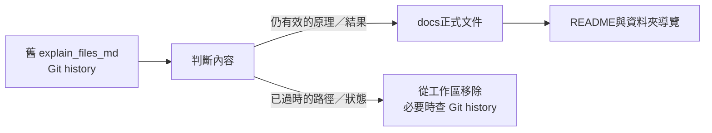

# 舊文件遷移紀錄

> `explain_files_md/` 曾保存早期 bring-up、操作與階段性報告。其有效原理、實測結果與根因已遷移到正式 `docs/`，重複且過時的工作區原稿已移除；需要對照舊報告檔名時，使用本頁或 Git history。

## 1. 遷移原則

遷移不是逐字複製：

- 保留仍有效的技術原理、實測數據、根因與教訓；
- 改成目前source path、runner與FreeRTOS port；
- 已完成的「未來工作」改成目前狀態；
- 舊COM port、bitstream hash、暫存build路徑不當成現行操作；
- 中英文重複報告只保留正式中文文件入口。

## 2. 舊檔到正式文件對照

| 舊文件 | 有效重點 | 正式目的地 | 狀態 |
|---|---|---|---|
| `CPU_RTOS_INTEGRATION_DETAILED_REPORT_zh-TW.md` | Kernel／Port／BSP／Application分層、link-time整合、tick／yield／Queue概念 | [RTOS_CONCEPTS.md](04-freertos/RTOS_CONCEPTS.md)、[FREERTOS_PORT_ARCHITECTURE.md](04-freertos/FREERTOS_PORT_ARCHITECTURE.md)、[CONTEXT_SWITCH.md](04-freertos/CONTEXT_SWITCH.md) | 已遷移並更新為目前官方port |
| `CPU_RTOS_INTEGRATION_DETAILED_REPORT.md` | 上述英文重複內容 | 同上 | 不再作正式入口 |
| `DDR2_UART_DEBUG_NOTES.md` | MIG byte-domain address根因、cross-address memtest、RX FIFO、LED分層 | [FPGA_BRINGUP_CASE_STUDIES.md](06-verification/FPGA_BRINGUP_CASE_STUDIES.md)、[L2_CACHE_DDR2.md](02-memory-io/L2_CACHE_DDR2.md)、[UART_BOOTLOADER.md](03-build-boot/UART_BOOTLOADER.md) | 已遷移 |
| `FREERTOS_BRINGUP_REPORT.md` | RTOS意義、真正RTOS證據、tick／Task／Queue | [RTOS_CONCEPTS.md](04-freertos/RTOS_CONCEPTS.md)、[FREERTOS_PORT_ARCHITECTURE.md](04-freertos/FREERTOS_PORT_ARCHITECTURE.md) | 已遷移；早期能力列表已被Platform取代 |
| `MEMORY_MAP_REPORT.md` | DDR／MMIO／UART地址與clock摘要 | [MEMORY_MAP.md](02-memory-io/MEMORY_MAP.md)、[MMIO.md](02-memory-io/MMIO.md)、[UART.md](02-memory-io/UART.md) | 已遷移 |
| `MMIO_PERFORMANCE_COUNTERS_GUIDE.md` | Counter ABI、snapshot、Console與指標公式 | [PERFORMANCE_MONITORING_ARCHITECTURE.md](02-memory-io/PERFORMANCE_MONITORING_ARCHITECTURE.md)、[PERFORMANCE_COUNTER_REGISTERS.md](02-memory-io/PERFORMANCE_COUNTER_REGISTERS.md) | 已遷移 |
| `OS_C_build_report.md` | ELF→BIN→MEM與build操作 | [BUILD_FLOW.md](03-build-boot/BUILD_FLOW.md)、[MEM_FILE_FORMAT.md](03-build-boot/MEM_FILE_FORMAT.md) | 已遷移 |
| `PERFORMANCE_ANALYSIS_RESULT.md` | 50 MHz實板raw counters、瓶頸與一致性等式 | [PERFORMANCE_BASELINE_ANALYSIS.md](06-verification/PERFORMANCE_BASELINE_ANALYSIS.md) | 已遷移並標記歷史baseline |
| `RTOS_APP_RUNNER_GUIDE.md` | Preflight runner、Monitor與故障判斷 | [BOARD_OPERATION_GUIDE.md](00-overview/BOARD_OPERATION_GUIDE.md)、[RTOS_APP_RUNNER.md](03-build-boot/RTOS_APP_RUNNER.md) | 已遷移 |
| `RTOS_CONSOLE_GUIDE.md` | Console命令、Task／Queue與probe | [CONSOLE_APP.md](05-applications/CONSOLE_APP.md)、[BOARD_OPERATION_GUIDE.md](00-overview/BOARD_OPERATION_GUIDE.md) | 已遷移 |
| `RTOS_DOOM_ARCH_ROADMAP.md` | RTOS-ready／大型軟體／Superscalar方向 | [FUTURE_ROADMAP.md](00-overview/FUTURE_ROADMAP.md) | 已更新；舊檔「CSR／timer尚未完成」已過時 |
| `RTOS_LUA_GUIDE.md` | Lua REPL、script、Task、RTOS API與限制 | [LUA_ARCHITECTURE.md](05-applications/LUA_ARCHITECTURE.md)、[LUA_FREERTOS_BRIDGE.md](05-applications/LUA_FREERTOS_BRIDGE.md)、[LUA_SCRIPT_UPLOAD.md](05-applications/LUA_SCRIPT_UPLOAD.md) | 已遷移 |
| `RTOS_PLATFORM_V1_GUIDE.md` | 大型軟體前置能力、自測與probe | [PLATFORM_APP.md](05-applications/PLATFORM_APP.md)、[FPGA_BOARD_TEST.md](06-verification/FPGA_BOARD_TEST.md) | 已遷移 |
| `RTOS_STAGE_RESULT.md` | Producer→Queue→Renderer VGA demo與展示說法 | [VGA_RTOS_DEMOS.md](05-applications/VGA_RTOS_DEMOS.md) | 已遷移並改用通用runner |
| `RTOS_VGA_DEMO_NOTES.md` | 已知良好timer／driver路徑與早期失敗原因 | [VGA_RTOS_DEMOS.md](05-applications/VGA_RTOS_DEMOS.md)、[FPGA_BRINGUP_CASE_STUDIES.md](06-verification/FPGA_BRINGUP_CASE_STUDIES.md) | 已遷移 |
| `TIMING_CLOSURE_SETUP.md` | Vivado directives、FAST_SYNTH與timing判定 | [TIMING_CLOSURE.md](03-build-boot/TIMING_CLOSURE.md) | 已遷移並補上目前自動檢查 |
| `UART_DEMO_BRINGUP.md` | COM、UART、互動與game輸入 | [BOARD_OPERATION_GUIDE.md](00-overview/BOARD_OPERATION_GUIDE.md)、[UART.md](02-memory-io/UART.md) | 已遷移；舊手動流程非正式入口 |
| `UART_SEND_MEM_GUIDE.md` | 手動uploader、listen／interactive與常見錯誤 | [BOARD_OPERATION_GUIDE.md](00-overview/BOARD_OPERATION_GUIDE.md)、[UART_BOOTLOADER.md](03-build-boot/UART_BOOTLOADER.md) | 已遷移；一般流程改用runner |
| `RTOS_API_USAGE_GUIDE_api.md` | Task、Queue、notification、UART／VGA API 與新增application的早期長篇指南 | [FREERTOS_API_EXAMPLES.md](04-freertos/FREERTOS_API_EXAMPLES.md)、[RTOS_APPLICATION_API_GUIDE.md](05-applications/RTOS_APPLICATION_API_GUIDE.md)、[ADDING_NEW_RTOS_APP.md](05-applications/ADDING_NEW_RTOS_APP.md) | 已拆分、更新並移除重複原稿 |

## 3. 哪些舊說法不要再沿用

| 舊說法／路徑 | 為什麼過時 | 現在應使用 |
|---|---|---|
| CSR、trap、timer仍未完成 | 這些已完成並能執行FreeRTOS | `FEATURE_STATUS`、`CSR_EXCEPTION_INTERRUPT` |
| 自製早期FreeRTOS port檔案 | 主線已使用官方FreeRTOS RISC-V port與目前BSP | `FREERTOS_PORT_ARCHITECTURE` |
| 直接用 `uart_send_mem.py`作一般RTOS上板 | 缺少整合preflight／marker與完整retry | `run_rtos_app.ps1` |
| 固定 `COM7` | COM依每台電腦與USB枚舉而變 | `$Port`或實際 `COM5`等結果 |
| 固定 `build_rtos/`舊產物 | 現在profile集中在`build_rtos_apps/`且可重建 | `build_rtos_app.ps1`／runner |
| 只看UART sync判定成功 | Sync不證明payload或DDR內容正確 | Protocol v2 ACK＋CRC readback＋target marker |
| 單地址DDR memtest足夠 | 地址alias時可能假PASS | Cross-address memtest |
| 一份舊bitstream hash代表目前版本 | 每次使用重新編譯最新硬體 | 記錄當次Git／Vivado設定與生成時間 |

## 4. 清理結果

工作區只保留目前會維護的正式文件。舊報告中的 COM port、build目錄、行號連結與早期能力狀態已不再可靠，因此不繼續當作可點擊的交接文件。如果報告或論文需要引用原稿，可依上表檔名從 Git history 取得；日常使用、修改與驗證應以表中的正式目的地為準。
