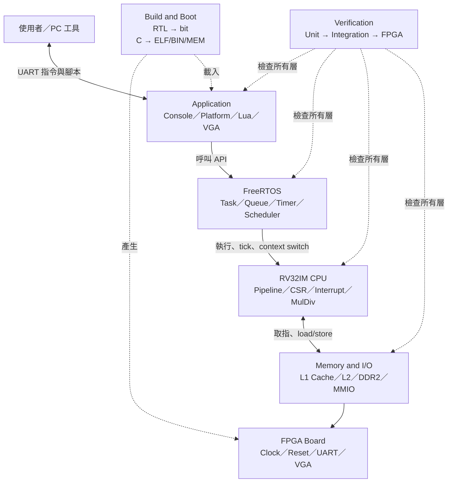
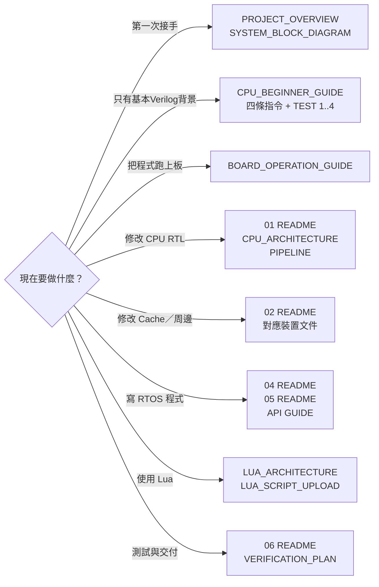

# 文件閱讀中心

> 不需要依檔名把 70 多份文件全部讀完。本頁先說明系統分層、文件階層，以及不同角色應該閱讀哪些內容。

遇到不熟悉的英文縮寫時，先查 [專案縮寫與名詞表](GLOSSARY.md)，特別注意 `PC`、`MEM`、Monitor、Probe、Runner與Loader在不同章節可能代表不同層級。

從早期筆記或舊報告檔名尋找資料時，先查 [舊文件遷移紀錄](LEGACY_DOCUMENT_MIGRATION.md)；舊檔的有效重點已移入`docs/`，原稿只需要時再從 Git history 查閱。

## 1. 先用一張圖理解專案



閱讀原則：先找自己正在處理的那一層，只在需要理解上下游時再打開相鄰層文件。

## 2. 文件採三層閱讀法

| 閱讀層級 | 要看什麼 | 適合情境 |
|---|---|---|
| 第一層：全貌 | 本頁、`00-overview` | 第一次接觸、交接、確認專案能做什麼 |
| 第二層：子系統地圖 | 各資料夾的 `README.md` | 開始修改某個子系統，先建立局部架構 |
| 第三層：實作細節 | 各主題 `.md` | 實際除錯、修改 RTL／C、驗證介面與時序 |

如果只是要上板，不必先讀 CPU、Cache 和 FreeRTOS 全部原理，直接前往 [FPGA 上板操作與指令手冊](00-overview/BOARD_OPERATION_GUIDE.md)。

## 3. 資料夾階層

```text
docs/
├─ README.md                 ← 目前這一頁：整份文件入口
├─ 00-overview/             ← 專案全貌、快速開始、上板操作
├─ 01-architecture/         ← CPU、pipeline、hazard、CSR、MulDiv
├─ 02-memory-io/            ← Cache、DDR2、MMIO、UART、VGA
├─ 03-build-boot/           ← 編譯、link、MEM、bitstream、bootloader
├─ 04-freertos/             ← FreeRTOS port、tick、context、Task API
├─ 05-applications/         ← Console、Platform、Lua、自訂應用程式
└─ 06-verification/         ← RTL、RTOS simulation、實板驗收
```

| 資料夾 | 它回答的核心問題 | 入口 |
|---|---|---|
| `00-overview` | 這是什麼？現在如何開始？ | [Overview 導覽](00-overview/README.md) |
| `01-architecture` | CPU 每個 cycle 如何執行指令？ | [CPU 架構導覽](01-architecture/README.md) |
| `02-memory-io` | 指令、資料與周邊如何被存取？ | [Memory／I/O 導覽](02-memory-io/README.md) |
| `03-build-boot` | 原始碼如何變成板上正在跑的程式？ | [Build／Boot 導覽](03-build-boot/README.md) |
| `04-freertos` | Scheduler、Task、tick 如何運作？ | [FreeRTOS 導覽](04-freertos/README.md) |
| `05-applications` | 如何使用 RTOS API 建立實際功能？ | [Application 導覽](05-applications/README.md) |
| `06-verification` | 如何證明修改沒有破壞系統？ | [Verification 導覽](06-verification/README.md) |

## 4. 依你的目的選閱讀路線



### 第一次接手：30分鐘定向＋後續完整閱讀

1. [PROJECT_OVERVIEW.md](00-overview/PROJECT_OVERVIEW.md)
2. [SYSTEM_BLOCK_DIAGRAM.md](00-overview/SYSTEM_BLOCK_DIAGRAM.md)
3. [FEATURE_STATUS.md](00-overview/FEATURE_STATUS.md)
4. [BOARD_OPERATION_GUIDE.md](00-overview/BOARD_OPERATION_GUIDE.md)

這四份是完整交接路線，不代表30分鐘內逐字讀完。30分鐘定向只需閱讀 `PROJECT_OVERVIEW` 的第1、3、4、7、9、14節，以及 `SYSTEM_BLOCK_DIAGRAM` 第2、5、6、9節；實際上板時再按需要查操作手冊。

### 只有基本Verilog背景、第一次學CPU

1. [CPU_BEGINNER_GUIDE.md](01-architecture/CPU_BEGINNER_GUIDE.md)：先追蹤ADD、Load-use、Store與Branch。
2. 跑完指南中的CPU TEST=1..4。
3. 再進入 [CPU架構導覽](01-architecture/README.md)，不要先讀CSR、L2或FreeRTOS assembly。

### 只需要執行現有功能

1. [QUICK_START.md](00-overview/QUICK_START.md)
2. [BOARD_OPERATION_GUIDE.md](00-overview/BOARD_OPERATION_GUIDE.md)
3. 需要哪個 application，再到 [Application 導覽](05-applications/README.md)

### 要修改或新增功能

先讀目標資料夾的 `README.md`，接著只讀它列出的「修改前必讀」文件，完成後依 [Verification 導覽](06-verification/README.md) 選擇最小測試集合。

### 第一次學習軟體與效能原理

1. [C、FreeRTOS API與RISC-V machine code](03-build-boot/C_TO_RISCV_MACHINE_CODE.md)
2. [RTOS基礎概念](04-freertos/RTOS_CONCEPTS.md)
3. [RTOS軟體 API 如何連到 CPU 與 FPGA 硬體](04-freertos/SOFTWARE_HARDWARE_INTERFACE.md)
4. [Application完整分層](05-applications/APPLICATION_SYSTEM_ARCHITECTURE.md)
5. [Lua執行架構](05-applications/LUA_ARCHITECTURE.md)
6. [效能監測架構](02-memory-io/PERFORMANCE_MONITORING_ARCHITECTURE.md)
7. [實板效能基準分析](06-verification/PERFORMANCE_BASELINE_ANALYSIS.md)

## 5. 圖表的讀法

本文件使用 Mermaid：

- 實線箭頭：實際資料流、控制流或呼叫關係；
- 虛線箭頭：建置、驗證或概念關係，不是 runtime signal；
- 由上往下：通常代表由高階軟體到低階硬體；
- 由左往右：通常代表時間或處理順序。

若 Markdown 預覽器無法顯示 Mermaid，仍可閱讀圖下方的表格；GitHub 能直接顯示這些圖。

## 6. 文件維護規則

新增或修改文件時維持以下順序：

1. 一句話說明本頁回答什麼；
2. 先放架構圖或流程圖；
3. 再放摘要表；
4. 最後才放 RTL、C、register、時序與除錯細節；
5. 把新文件加入所屬資料夾的 `README.md`，不要只靠檔名讓讀者猜。
