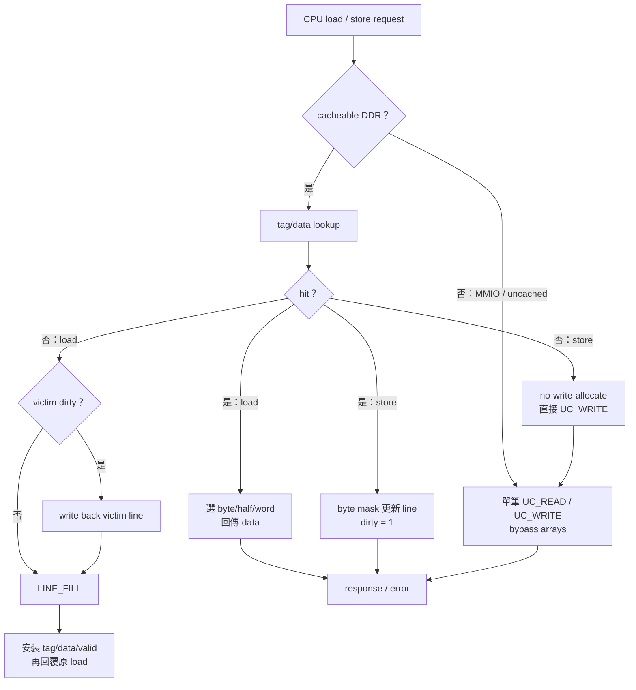

**Blocking DCache 規格書（Spec）**

Version 0.9  |  Date: 2026-02-02

> 閱讀提醒：本檔是原始完整規格／目標組態，不保證每個參數都等於目前實作。現行 RTL 行為、實測組態與限制以 [`docs/02-memory-io/DCACHE.md`](../docs/02-memory-io/DCACHE.md) 為準。

# **1. 目的與範圍**
本文件定義處理器資料快取（DCache, D$）之功能、介面、時序與設計限制。D$ 為 blocking cache：任何 cache miss 期間不接受新的 cacheable 存取請求；對於 uncached/MMIO 請求亦採單筆交易、一次僅允許 1 outstanding。
# **2. 設計目標與基本參數**

| 項目             | 值                   | 備註/說明                                             |
| :--------------- | :------------------- | :---------------------------------------------------- |
| 地址寬度         | 32-bit               | PIPT：使用 Physical Address 做 index/tag              |
| 支援操作         | Load / Store         | LSU 發起，D$ 提供 byte-enable                         |
| 支援尺寸         | byte / half / word   | 依指令 size                                           |
| Unaligned        | 不支援；需 trap      | word: addr[1:0]=00；half: addr[0]=0                   |
| Hit latency 目標 | 2 cycles             | 從 req accept 到 data valid (load)                    |
| Miss 行為        | stall 該筆 memory op | blocking：miss 期間不接受新 cacheable req             |
| Line size        | 64B                  | L2 回覆為 8 beats × 64b                               |
| 容量             | 128KB                | 2-way set associative                                 |
| 相連度           | 2-way                | 每 set 2 lines                                        |
| Replacement      | 1-bit LRU            | 2-way LRU bit 決定 victim way                         |
| Write policy     | Write-back           | store hit 更新 cache line，設 dirty                   |
| Write allocate   | No-write-allocate    | store miss 走 uncached write，不填 line               |
| Outstanding      | 1                    | 一次只允許 1 個 miss/uncached 交易                    |
| Refill 回覆      | streaming beats      | 整條收完才回 CPU                                      |
| Miss 次序        | writeback 再 refill  | victim dirty 時先完整寫回                             |
| Cache type       | PIPT                 | TLB 先做翻譯，D$ 只看物理位址                         |
| 端口             | 單埠                 | 每 way 的 data/tag SRAM 單埠；不支援同周期 read+write |
| Byte-mask        | 支援                 | store/partial write 使用 byte-enable                  |
| ECC              | 無                   | no ECC / no parity                                    |

# **3. Cache 幾何（Derived Geometry）**
由容量/line/相連度推導：

• Sets = 128KB / (64B × 2) = 1024 sets

• Offset bits = log2(64) = 6

• Index bits  = log2(1024) = 10

• Tag bits    = 32 − 6 − 10 = 16
# **4. Address Map 與 Cacheability**
是否走 cache（cached）或直接走 L2（uncached/MMIO）由 SoC address map 決定。建議以可參數化的區間表（base/mask 或 start/end）實作 is\_uncached(pa) 判斷。

常見規則（範例）：

• DRAM/DDR：cached

• MMIO 裝置區：uncached

• 其他保留區：依系統需求
# **5. 介面定義**
## **5.1 CPU/LSU ↔ D$ 介面（建議）**
以下為建議訊號集合，可依既有 top/mem-bridge 命名調整：

• cpu\_req\_valid / cpu\_req\_ready：請求握手

• cpu\_req\_addr[31:0]：Physical Address

• cpu\_req\_is\_store：0=load, 1=store

• cpu\_req\_size[1:0]：00=byte, 01=half, 10=word

• cpu\_req\_wdata[31:0]：store data

• cpu\_rsp\_valid / cpu\_rsp\_ready：回覆握手（load data / store ack）

• cpu\_rsp\_rdata[31:0]：load data

• cpu\_rsp\_exc\_misaligned：misaligned exception 指示（可選；建議由 LSU 在送入 D$ 前先檢查並攔截）。
## **5.2 D$ ↔ L2（或 AXI-like）介面（抽象化）**
一次僅允許 1 outstanding，req 與 rsp 分離握手：

• l2\_req\_valid / l2\_req\_ready

• l2\_req\_cmd：LINE\_FILL / WRITEBACK / UC\_READ / UC\_WRITE

• l2\_req\_addr：對齊到 line 或依 UC size 對齊

• l2\_req\_size：beat size（例：64-bit bus 則為 8B/beat）或 UC size

• l2\_req\_len：burst beats-1（LINE\_FILL/WRITEBACK：7）

• l2\_req\_wdata[63:0] + l2\_req\_wstrb[7:0]：write data/byte-enable（writeback 或 UC\_WRITE）

• l2\_rsp\_valid / l2\_rsp\_ready

• l2\_rsp\_rdata[63:0]：read beats（refill 或 UC\_READ）

• l2\_rsp\_last：burst last beat

• l2\_rsp\_err：bus error（可選）
# **6. 時序與延遲**
## **6.1 Hit 路徑（Load/Store Hit）**
Hit latency 目標 2 cycles（load）：C0 接受請求並送入 tag/data SRAM 讀取；C1 完成 tag compare、選 way、讀出 word；C2 對 CPU 回覆 data valid。

Store hit：與 load hit 對齊固定 2 cycles latency。C0 接受請求並啟動 tag/data 存取；C1 完成 tag compare 與 way 選擇；C2 以 byte-enable（wstrb）更新 data array、設 dirty，並對 CPU 回覆 store ack。由於 data array 必須支援 per-byte 寫入，故不需要 read-modify-write。
## **6.2 Miss 路徑（Load Miss）**
blocking 行為：miss 期間不接受新的 cached 請求；CPU pipeline 需對該筆 memory op 產生 stall。

Load miss 流程（必含 writeback 優先）：

• C0~C1：tag lookup 判定 miss，選 victim way（1-bit LRU）。

• 若 victim.valid && victim.dirty：發出 WRITEBACK（8 beats），完成後才進入 refill。

• 發出 LINE\_FILL（8 beats）。L2 以 streaming beats 回覆；D$ 收滿整條 line 後寫入 data SRAM。

• 更新 tag/valid/dirty=0/LRU；最後才對 CPU 回覆（整條收完才回）。
## **6.3 Store Miss（No-write-allocate）**
Store miss 不配置 cache line：直接發出 UC\_WRITE（依 size 與 byte mask），不進行 refill。若同時有 eviction writeback 需求，仍遵守「先 writeback 再發新交易」與 1 outstanding 的限制。
## **6.4 Uncached / MMIO**
uncached/MMIO 存取依 address map 判定，完全繞過 cache 陣列：UC\_READ/UC\_WRITE 直接走 L2；回覆可為單 beat（len=0）。
# **7. Tag/Data/Metadata**
每 set 每 way 需包含：tag[15:0]、valid、dirty、以及 set-level 的 LRU bit。

LRU 定義（2-way 1-bit，建議）：

• lru=0 代表 way0 為 victim；lru=1 代表 way1 為 victim。

• 每次 hit/fill 後，將 lru 更新為「另一個 way 為 victim」（即命中/填入者成為 MRU）。
# **8. Write Buffer（寫回/寫出緩衝）**
因 write-back 以及 writeback-first 策略，建議配置最少 1 entry 的 write buffer，用於：

• 暫存 eviction 的 dirty line（地址 + 64B data），以便以 burst 方式送往 L2。

• 暫存 store miss 的 UC\_WRITE（地址 + wdata + wstrb + size），避免與 SRAM 更新耦合。

在 1 outstanding 限制下，write buffer 主要用於資料保留與時序解耦，不一定用於允許併行交易。
# **9. Byte Mask 與資料對齊**
Load：依 size 與 addr[1:0] 擷取 byte/half/word，並進行 sign/zero extend（由 LSU 決定）。

Store：產生 byte-enable（wstrb）與對齊後的寫入資料：

• byte：wstrb = 1 << addr[2:0]（若以 64b beat 計）或 1 << addr[1:0]（若以 32b word 計）

• half：需 addr[0]=0；wstrb 覆蓋連續 2 bytes

• word：需 addr[1:0]=00；wstrb 覆蓋 4 bytes
# **10. Reset、錯誤與例外**
Reset：清除所有 valid/dirty；LRU 可初始化為 0。

Unaligned：偵測到不對齊時回報 exception/trap（建議由 LSU 在送入 D$ 前先擋下）。

L2 bus error：若介面提供 err，需定義是否轉為 load/store fault exception（可選）。
## **10.1 Flush/Kill（由 pipeline 控制）**
- D$ 僅提供 backpressure（cpu\_req\_ready / dcache\_stall 等），不直接控制 pipeline flush。
- 若發生 flush/kill 且 D$ 正在處理 miss/uncached 交易：D$ 維持 blocking，完成既有 L2 transaction 後回到 IDLE；上層可依 kill bit 丟棄回覆資料/ack。
- v0.x 不支援中途 abort/取消已送出的 L2 request（避免增加 L2 協議複雜度）。
# **11. 參考 FSM（Blocking D$）**
建議狀態（示意）：

• IDLE：等待 cpu\_req

• LOOKUP：讀 tag/data，比對命中

• HIT\_RESP：回覆 load 或完成 store 更新

• WB\_REQ / WB\_DATA：發出 writeback burst

• REFILL\_REQ / REFILL\_DATA：發出 refill 並收 beats

• REFILL\_COMMIT：寫入 SRAM、更新 metadata

• UC\_REQ / UC\_WAIT：處理 uncached/MMIO 交易

因「整條收完才回 CPU」，REFILL\_DATA 期間僅累積 line buffer，直到 last beat 才進入 REFILL\_COMMIT。
# **12. 驗證建議（Checklist）**
• Hit：load/store byte/half/word（含不同 offset）

• Load miss：clean victim / dirty victim（需 writeback）

• Store hit：partial write byte/half/word 與 dirty bit

• Store miss（no-write-allocate）：確認不產生 valid line，且 UC\_WRITE 正確

• LRU：連續 hit/fill 造成 victim 切換

• uncached/MMIO：UC\_READ/UC\_WRITE、單 beat、對齊與 byte mask

• 1 outstanding：連續發起請求時 ready/valid backpressure 行為

• Reset：invalidate 後首次訪問皆 miss，fill 後 hit

• Unaligned：word/half 不對齊確實觸發 trap/exception
# **13. 設計決策與整合假設（已定案）**
- CPU pipeline 的 stall/flush 機制：由上層（LSU/pipe control）負責 stall/flush/kill；D$ 僅提供 cpu\_req\_ready（或 dcache\_stall）作 backpressure，並維持 blocking 行為。
- Store hit 的 ack 時序：固定 2 cycles latency（與 load hit 對齊），以 data array 的 per-byte write enable（wstrb）完成更新後回覆 store ack，不允許額外的 read-modify-write 延遲。
- L2 介面命令與 size/wstrb 定義：採 LINE\_FILL / WRITEBACK / UC\_READ / UC\_WRITE 四類命令（與 I$ 共用 LINE\_FILL/UC\_READ）；cacheline burst 使用 64-bit/8B beat、len=7；uncached 交易 len=0、wstrb 表示 byte mask。
- Flush/Kill 與 outstanding miss：miss/uncached 期間若收到 flush/kill，D$ 不中止已送出的 L2 request；完成既有 transaction 後回到 IDLE，上層依 kill bit 丟棄回覆。
- （尚待 SoC 整合）Address map 的 cached/uncached 區間表最終版本：由系統整合提供，D$ 以參數化區間表實作 is\_uncached(pa)。
